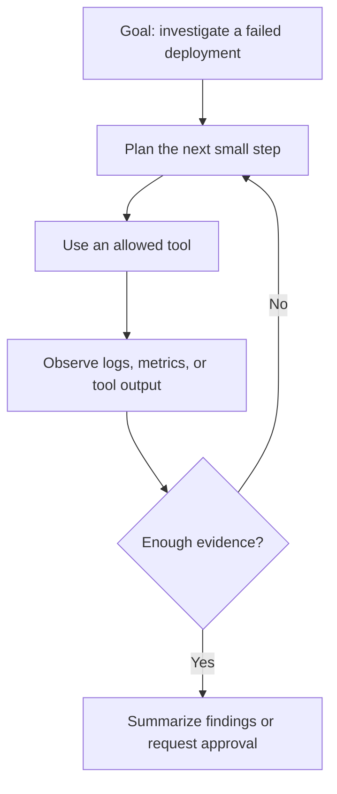
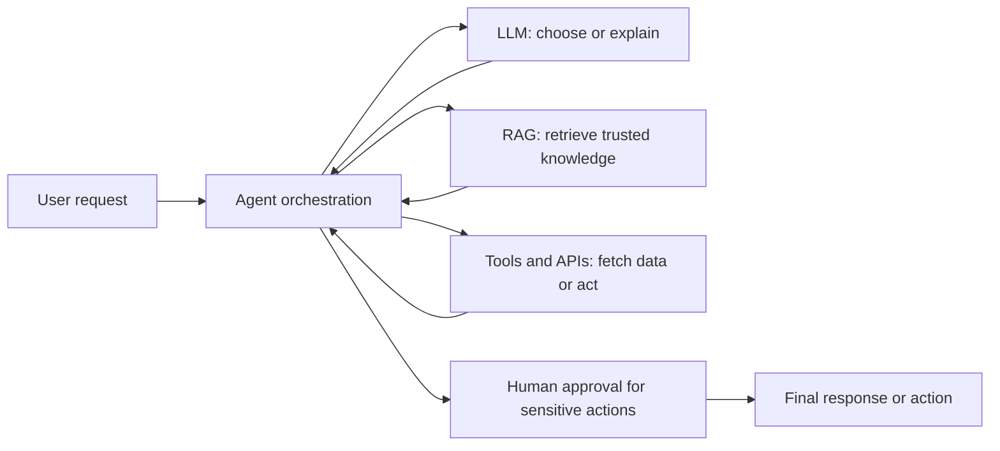

# AI Agents for Automation Workflows

AI Agents are systems that go beyond generating text. Instead of only predicting the next token, they take actions, make decisions, and complete tasks step by step to achieve a goal.

This is the key shift:

- Generative AI → predicts next token
- AI Agents → decide next action

---

## Generative AI vs AI Agents

### Generative AI (Next Token Prediction)

Generative AI models (LLMs) work by predicting the next token in a sequence.

Example:

```text
Input: "The capital of France is"
Output: "Paris"
```

How it works:

1. Break input into tokens
2. Predict probability of next token
3. Select most likely token
4. Repeat until response is complete

Limitations:

- No real goal awareness
- Cannot take actions
- Stateless (each prompt is isolated)
- Can hallucinate

---

### AI Agents (Step-by-Step Decision Making)

AI Agents operate in a loop where they:

1. Understand a goal
2. Plan steps
3. Take actions (tools/APIs)
4. Observe results
5. Adjust and repeat

Example goal:

```text
"Find the best laptop under $1000 and summarize top 3 options"
```

Agent behavior:

- Search web
- Compare products
- Summarize results
- Deliver final answer

---

## Core Difference

| Aspect | Generative AI | AI agent system |
| --- | --- | --- |
| Core function | Generates an output from the supplied context | Coordinates a model, state, and tools across steps |
| Goal-directed loop | No loop by itself | The application can plan, act, observe, and continue |
| Memory or state | Only what the current prompt provides | Can store task state between steps |
| Tool use | Can request a tool when the application supports it | Uses tools as part of a multi-step workflow |
| Reliability | Depends on prompt, context, and checks | Depends on the same factors plus tool controls and evaluation |

---

## Agent Loop

AI Agents follow a reasoning loop:

```text
Goal → Plan → Act → Observe → Reflect → Repeat
```

This loop allows agents to improve results over time instead of generating a single response.



---

## How Agents Use LLMs

Important:

Agents still use LLMs internally.

But instead of using them once, they use them repeatedly to:

- Decide next step
- Choose tools
- Evaluate results

LLM becomes the **brain**, agent becomes the **system**.

---

## Example: Simple Agent

```python
def agent(task):
    if "weather" in task:
        return "Calling weather API..."
    elif "news" in task:
        return "Fetching latest news..."
    else:
        return "Planning next step..."

print(agent("weather today"))
```

---

## Real-World Use Cases

- Research assistants
- Coding agents
- Workflow automation
- Customer support automation
- Data analysis pipelines

---

## Reliability Is Designed, Not Automatic

Generative AI:

- Produces one-shot answers
- No verification
- Can hallucinate

Well-designed agents can:

- Break problems into steps
- Validate intermediate results
- Retry if needed
- Use external data sources

Agents are not automatically safer or more accurate. Their extra steps can improve quality only when tools have limited permissions, results are checked, failures are logged, and risky actions require human approval.

---

## Agent + RAG + Tools

Modern agents combine multiple systems:



## Agent Vocabulary

- **Goal**: the outcome the agent is trying to achieve, such as "summarize the incident."
- **Plan**: a short sequence of proposed steps. A plan can change after new evidence appears.
- **Tool call**: a structured request to a system outside the model, such as a search API or a log query.
- **State**: the task information the agent keeps between steps, such as completed actions and collected evidence.
- **Guardrail**: a boundary that prevents unwanted behavior, such as read-only credentials or an approval requirement.
- **Human in the loop**: a person reviews or approves important decisions before they happen.

See [AI terminology](terminology.md) for retrieval, prompts, hallucinations, evaluation, and other related terms.

---

## Types of Agents

- Reactive Agents → respond immediately
- Planning Agents → create multi-step plans
- Tool-Using Agents → interact with APIs
- Autonomous Agents → operate independently

---

## Common Frameworks

- LangChain Agents
- AutoGen
- CrewAI
- Semantic Kernel

---
