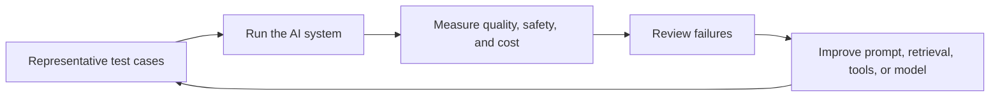

# AI Model Evaluation for Reliable AI Systems

AI model evaluation is the process of measuring how well a model performs against defined objectives. It ensures reliability, accuracy, and usefulness before deploying models in real-world systems.

Evaluation becomes more complex with modern systems like LLMs and RAG because outputs are not always deterministic.



---

## Why Evaluation Matters

- Ensures model correctness
- Detects hallucinations
- Measures performance improvements
- Validates production readiness

Without evaluation, AI systems can produce misleading or harmful results.

---

## Types of Evaluation

### 1. Quantitative Evaluation

Uses numerical metrics.

- Accuracy
- Precision
- Recall
- F1 Score

Best for:

- Classification
- Structured prediction tasks

---

### 2. Qualitative Evaluation

Human judgment-based.

- Response quality
- Relevance
- Clarity
- Helpfulness

Best for:

- Chatbots
- LLM outputs

---

### 3. Benchmark Evaluation

Compare models using standard datasets.

Examples:

- GLUE
- SuperGLUE
- MMLU

---

## Key Metrics Explained

### Accuracy

Percentage of correct predictions.

### Precision

How many predicted positives are actually correct.

### Recall

How many actual positives were captured.

### F1 Score

Balance between precision and recall.

### Groundedness

Whether an answer is supported by the sources supplied to the model. This matters most for RAG systems: a fluent answer is not enough if it cannot be traced back to trusted information.

### Latency

How long a user waits for a response. A highly accurate system can still be unusable if retrieval, tools, or model calls take too long.

### Cost per request

The cost of processing input tokens, output tokens, retrieval, and tool calls for one user request. Track it alongside quality so an improvement remains practical to run.

---

## Evaluating LLMs

LLMs require different strategies because:

- Outputs are probabilistic
- Multiple correct answers exist
- Context matters

### Common Approaches

- Human evaluation
- Reference-based scoring
- LLM-as-a-judge

## A Practical Evaluation Set

Build a small, version-controlled set of real examples before changing a prompt, model, or retrieval pipeline.

| Include | Example |
| --- | --- |
| Normal requests | "How do I rotate this service credential?" |
| Ambiguous requests | "The deployment is broken" |
| Edge cases | A long log with irrelevant errors mixed in |
| Safety cases | A request for a destructive production command |
| Freshness cases | A question that must be answered from current internal documentation |

For every example, record the expected behavior: a correct answer, a cited source, a safe refusal, a clarifying question, or a request for approval. See [AI terminology](terminology.md) for the meaning of terms such as regression, benchmark, and groundedness.

---

## LLM-as-a-Judge

Use one model to evaluate another.

Example:

```python
from ollama import generate

response = generate(
    model="llama3",
    prompt="""
    Evaluate the following answer based on relevance and correctness:

    Question: What is AI?
    Answer: AI is machines thinking like humans.

    Score from 1 to 10 with explanation.
    """
)

print(response["response"])

```
