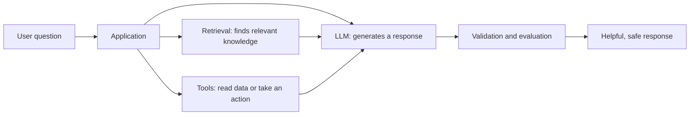
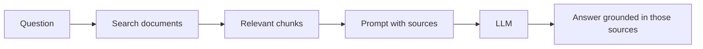

# AI Engineering Guide for DevOps and Platform Teams

AI engineering is the practice of building systems that use models, data, retrieval, tools, and application logic to solve real problems. Modern AI is no longer just about prompting a model. In production systems, it usually involves multiple layers working together:

- A model to generate or classify output
- Retrieval to bring in relevant knowledge
- Tools to take actions
- Guardrails to reduce mistakes
- Evaluation to measure quality over time

This guide gives a practical overview of the major concepts behind modern AI systems so the rest of the section makes more sense.

!!! info "Start with the fundamentals"
    If you are new to LLMs, first read [LLM fundamentals](llm-fundamentals.md) to understand tokens, context windows, and next-token prediction.

    Keep [AI terminology](terminology.md) open while reading. It defines the words used in this guide in plain language.

---

## Why AI Feels Different Now

Earlier software systems followed explicit instructions written by developers. Modern AI systems can generate outputs, reason across context, summarize large documents, search knowledge bases, and interact with external tools.

That shift matters because:

- The output is often probabilistic, not fully deterministic
- Quality depends on prompts, context, retrieval, and evaluation
- Freshness often depends on external data, not only model training
- Safety and correctness become engineering concerns, not just model concerns

!!! info "A useful mental model"
Think of AI engineering as a stack:
    model + context + retrieval + tools + evaluation + application logic



The model is only one part of the system. Retrieval supplies facts, tools connect to live systems, and validation checks whether the result is safe and useful.

---

## The Evolution of AI Systems

### 1. Rule-Based Systems

Early AI-style systems were mostly hardcoded logic and expert rules.

Example:

```python
if "refund" in user_input.lower():
    print("Show refund policy")
```

Strengths:

- Easy to understand
- Predictable behavior
- Good for narrow workflows

Limitations:

- Brittle when wording changes
- Hard to scale across many cases
- No real generalization

Rule-based systems still matter today for validation, safety checks, and business constraints around AI outputs.

---

### 2. Machine Learning, LLMs, and Generative AI

Modern AI systems learn patterns from data rather than relying only on hardcoded rules.

In the current wave of AI, the most visible category is **Generative AI**, especially large language models (LLMs). These models generate text, code, summaries, translations, and structured outputs by predicting the next token based on prior context.

At a basic level:

1. Text is split into tokens.
2. The model reads the available context.
3. The model predicts the next likely token.
4. The new token is added to the response.
5. The process repeats until the response is complete.

Common use cases:

- Chatbots
- Content drafting
- Code generation
- Summarization
- Classification and extraction

Strengths:

- Flexible across many tasks
- Handles natural language well
- Works well with unstructured text

Limitations:

- Can hallucinate facts
- Can be inconsistent across runs
- May not know recent or private information
- Often needs strong prompting and evaluation

!!! tip "Generative AI is powerful but incomplete by itself"
    A model can sound confident without being correct. In production, teams usually combine models with retrieval, tools, and evaluation rather than relying on the model alone.

---

### 3. Retrieval-Augmented Generation (RAG)

RAG improves AI responses by retrieving relevant external information and providing it to the model at runtime.

Instead of asking the model to answer from training data alone, a RAG system:

1. Receives a user question
2. Searches a knowledge source
3. Selects relevant documents or chunks
4. Sends them as context to the model
5. Generates an answer grounded in those materials

This is useful when the answer depends on:

- Company documentation
- Product manuals
- Internal policies
- Support articles
- Frequently updated information

Benefits:

- Better factual grounding
- Better access to private knowledge
- More recent information than model training alone

Risks:

- Poor retrieval can lead to poor answers
- Bad chunking can hide important context
- Irrelevant context can confuse the model

Example flow:

```text
User question -> Retriever -> Relevant documents -> Model -> Grounded response
```

RAG is often the first serious step from demo AI toward production AI.



---

### 4. Tool Use and Model Context Protocol (MCP)

Many tasks require more than text generation. They need the AI system to take actions or read live data.

Examples:

- Query a database
- Read a file
- Call an API
- Send an email
- Check a calendar
- Run code

That is where **tool use** becomes important. The model decides when a tool is needed, the system executes it safely, and the result is returned to the model for the next step.

**Model Context Protocol (MCP)** is a standard way to connect models to external tools and context providers in a structured manner.

You can think of it as:

```text
Model <-> MCP <-> Tools / Data Sources / Apps
```

Why this matters:

- It makes integrations more standardized
- It separates model logic from tool wiring
- It supports safer and more controlled external actions

Without tools, a model can only talk. With tools, it can actually help complete tasks.

---

### 5. Agentic AI

AI agents go beyond a single prompt-response interaction. They work toward a goal through repeated decision-making.

A typical agent loop looks like this:

1. Understand the goal
2. Decide the next step
3. Use a tool or retrieve information
4. Observe the result
5. Adjust the plan
6. Continue until the task is completed

Examples:

- Research and summarize competitors
- Triage support tickets
- Investigate incidents from logs and dashboards
- Generate a report from multiple sources
- Perform multi-step coding or operational tasks

Strengths:

- Can handle multi-step tasks
- Can combine reasoning, retrieval, and tools
- Can adapt when intermediate results change

Risks:

- More moving parts means more failure modes
- Tool misuse can create bad side effects
- Longer loops may drift or waste tokens
- Evaluation becomes harder than simple prompt testing

!!! warning "Agents increase capability and complexity together"
    Agents are not just bigger chatbots. They require careful design around permissions, monitoring, validation, and failure handling.

---

## How the Pieces Fit Together

A useful way to think about the progression is:

- **Rule-based systems** decide with explicit logic
- **Generative AI** produces flexible natural-language outputs
- **RAG** adds relevant knowledge at runtime
- **Tool use and MCP** let systems interact with the outside world
- **Agents** coordinate all of the above across multiple steps

In practice, many real systems combine several of these patterns at once.

Example:

- A support assistant uses an LLM
- RAG retrieves policy documents
- Tools fetch ticket details from a helpdesk system
- An agent decides whether to summarize, escalate, or draft a reply

That is much closer to modern AI engineering than a single prompt in a chat box.

---

## Common AI System Patterns

### Prompt-only assistant

Best for:

- Brainstorming
- Drafting
- General Q&A

Weakness:

- Limited freshness and grounding

### RAG assistant

Best for:

- Internal knowledge search
- Documentation Q&A
- Support systems

Weakness:

- Quality depends heavily on retrieval design

### Tool-using assistant

Best for:

- Operational workflows
- Productivity automation
- Business system integrations

Weakness:

- Requires stronger safety controls

### Agentic workflow

Best for:

- Multi-step goals
- Research tasks
- Long-running business processes

Weakness:

- Harder to test, debug, and control

---

## What Makes AI Systems Hard in Production

A demo can look impressive quickly. Production systems are harder because they need:

- Reliability
- Permission boundaries
- Monitoring and logging
- Cost control
- Response quality evaluation
- Defenses against hallucination and unsafe actions
- Better UX when the model is uncertain or fails

Teams often underestimate that the hard part is not only the model. It is the full system around the model.

---

## Practical Risks to Watch

- **Hallucination**: The model invents facts or sources
- **Stale knowledge**: The model lacks current or internal data
- **Prompt injection**: Untrusted content tries to manipulate instructions
- **Tool misuse**: The model triggers the wrong action or unsafe sequence
- **Cost creep**: Large prompts, long contexts, and repeated calls increase spend
- **Evaluation gaps**: Systems seem good in demos but fail on real edge cases

---

## Good Engineering Habits for AI Teams

- Start with a narrow, well-defined use case
- Measure quality with real evaluation datasets
- Log prompts, retrieval results, tool calls, and outcomes
- Use retrieval when freshness or private knowledge matters
- Add approval steps for sensitive actions
- Prefer least-privilege tool access
- Design graceful fallback behavior when the model is uncertain
- Re-evaluate regularly as prompts, models, and data change

---

## FAQ

### What is AI engineering?

AI engineering is the practice of building reliable systems around models. It includes prompts, retrieval, tools, agents, evaluation, observability, security, and user experience.

### What is the difference between an LLM and an AI agent?

An LLM predicts text from context. An AI agent uses a model inside a loop that can plan steps, call tools, inspect results, and continue toward a goal. Start with [LLM fundamentals](llm-fundamentals.md), then read [AI agents](ai-agents.md).

### What is RAG used for?

Retrieval-augmented generation connects a model to external knowledge, such as documentation or internal data, so answers can be grounded in relevant context.

### Why does AI evaluation matter?

Evaluation helps teams measure quality, regressions, safety, and usefulness with real examples instead of relying only on demos. See [AI model evaluation](ai-evaluation.md).

### Do I need an agent for every AI feature?

No. Start with the simplest pattern that solves the problem. A prompt-only assistant may be enough for drafting; use RAG when answers need trusted documents; add tools for live data or actions; use an agent only when the work genuinely needs multiple decisions and steps.

## Related Learning

- [LLM fundamentals](llm-fundamentals.md)
- [AI agents for automation workflows](ai-agents.md)
- [AI model evaluation](ai-evaluation.md)
- [AI terminology in plain English](terminology.md)

## Where to Go Next

This overview connects to the deeper topics in this section:

- [LLM Fundamentals](llm-fundamentals.md)
- [AI Agents](ai-agents.md)
- [AI Model Evaluation](ai-evaluation.md)

If you are new to this space, a helpful learning sequence is:

1. Understand tokens, context, and next-token prediction
2. Understand the difference between prompts, retrieval, tools, and agents
3. Learn how agent systems make decisions across multiple steps
4. Learn how evaluation works so quality can be measured instead of guessed

That combination gives you a much stronger foundation for building AI systems that are useful, reliable, and maintainable.
