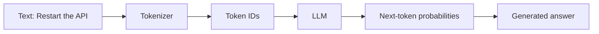
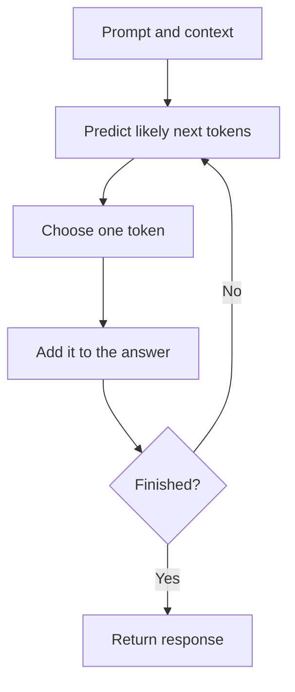

# LLM Fundamentals: Tokens, Context, and Next-Token Prediction

Large Language Models (LLMs) are AI models trained to work with language-like sequences. They can write text, summarize documents, answer questions, generate code, classify content, and reason across context because they learn patterns from huge amounts of text and code.

The most important idea is simple:

> An LLM predicts the next token based on the tokens it has already seen.

It does this again and again until a full response is produced.

---

## What Is a Token?

A **token** is a small unit of text that the model can process. A token can be:

- A full word
- Part of a word
- A punctuation mark
- A space or formatting marker
- A piece of code syntax

Example:

```text
Input text:
Kubernetes is powerful.

Possible tokens:
["Kubernetes", " is", " powerful", "."]
```

Tokenization is not always the same as splitting by words. A long or uncommon word may become multiple tokens.

Example:

```text
Input text:
observability

Possible tokens:
["observ", "ability"]
```

!!! tip "Why tokens matter"
    Model cost, speed, context length, and output size are usually measured in tokens, not words.

---

## What Is Tokenization?

**Tokenization** is the step where input text is converted into tokens before the model processes it.

Flow:

```text
User text -> Tokenizer -> Tokens -> Model
```

The model does not directly see words the way humans do. It sees token IDs. Each token maps to a number in the model vocabulary.



Example:

```text
"pod"       -> token ID 14132
" service" -> token ID 2534
" yaml"    -> token ID 61571
```

The exact IDs depend on the tokenizer used by the model.

---

## How Next-Token Prediction Works

When you ask an LLM a question, the model receives your prompt as tokens. It then predicts which token is most likely to come next.

Example:

```text
Prompt:
The capital of France is

Likely next token:
 Paris
```

After choosing `Paris`, the model predicts the next token again:

```text
The capital of France is Paris

Likely next token:
 .
```

This loop continues until the response is complete.

```text
Prompt tokens -> Predict next token -> Append token -> Predict again -> Final response
```



---

## Probability, Not Certainty

An LLM does not usually produce one fixed answer internally. It calculates probabilities for many possible next tokens.

Example:

```text
Prompt:
Kubernetes is used for

Possible next tokens:
 container    42%
 managing     24%
 deploying    18%
 running       9%
 other         7%
```

The system then selects one token based on decoding settings.

Common settings:

- **Temperature**: Higher values make output more varied; lower values make output more focused.
- **Top-p**: Limits selection to a smaller group of likely tokens.
- **Max tokens**: Controls the maximum response length.

This is why the same prompt can sometimes produce slightly different answers.

---

## What Is Context?

**Context** is the information the model can see while generating an answer.

Context can include:

- The system instructions
- The user prompt
- Previous chat messages
- Retrieved documents in a RAG system
- Tool results
- Code snippets or logs pasted into the prompt

The model uses all visible context to predict the next token.

```text
System instruction
+ user question
+ previous messages
+ retrieved docs
+ tool output
= context used for prediction
```

!!! warning "Context is not permanent memory"
    If information is not in the current context or available through a connected tool, the model may not use it reliably.

---

## What Is a Context Window?

The **context window** is the maximum amount of text the model can consider at one time.

If the context window is too small, older or less important information may be left out. If the context is too large, cost and latency can increase.

Practical impact:

- Long logs may need summarization before sending to the model.
- Large documents may need retrieval instead of pasting everything.
- Important instructions should be clear and close to the task.
- Repeated chat history can consume useful space.

---

## Why LLMs Can Hallucinate

Hallucination happens when the model generates text that sounds plausible but is not correct.

Common causes:

- The answer is not present in the context.
- The retrieved documents are irrelevant or outdated.
- The prompt asks for a fact the model cannot verify.
- The model continues a pattern that looks likely but is wrong.

For production systems, reduce hallucination by:

- Providing grounded context
- Using retrieval for private or changing knowledge
- Asking the model to cite or point to provided sources
- Adding validation checks
- Using tools for live data instead of relying on memory

---

## How This Applies to DevOps and SRE

LLMs are useful in infrastructure work when they are grounded in the right context.

Good use cases:

- Summarizing incident timelines
- Explaining Kubernetes errors
- Drafting runbooks
- Reviewing Terraform or Ansible snippets
- Searching internal docs with RAG
- Turning logs into investigation steps

Risky use cases without validation:

- Running generated commands directly in production
- Trusting invented root causes
- Accepting security advice without review
- Letting tools make destructive changes without approval

!!! note "Practical rule"
    Use LLMs to accelerate understanding and drafting. Use automation, tests, reviews, and approvals to control production changes.

---

## Simple Mental Model

Think of an LLM as a prediction engine:

```text
Tokens in -> Pattern matching and reasoning -> Next token out
```

A useful AI system adds more around that model:

```text
Prompt + context + retrieval + tools + validation + monitoring
```

That full system is what turns a language model into a reliable engineering assistant.

## Terms to Know Before Moving On

| Term | Plain-English meaning | Why it matters |
| --- | --- | --- |
| **Prompt** | The instructions and information you send to the model. | Clear prompts reduce ambiguity. |
| **Inference** | The time when a trained model generates an answer. | This is the request you pay for and wait for. |
| **Model** | The trained prediction system behind the assistant. | Models differ in capability, speed, cost, and context size. |
| **Vocabulary** | The token pieces a model knows how to represent. | It determines how text and code are split into tokens. |
| **Embedding** | A numeric representation of meaning used for similarity search. | RAG uses embeddings to find relevant content. |
| **Grounding** | Giving the model reliable source material before it answers. | It reduces invented or outdated claims. |

For the wider vocabulary, see [AI terminology in plain English](terminology.md).
