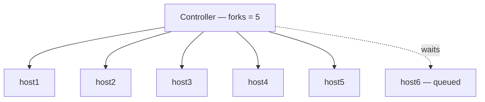
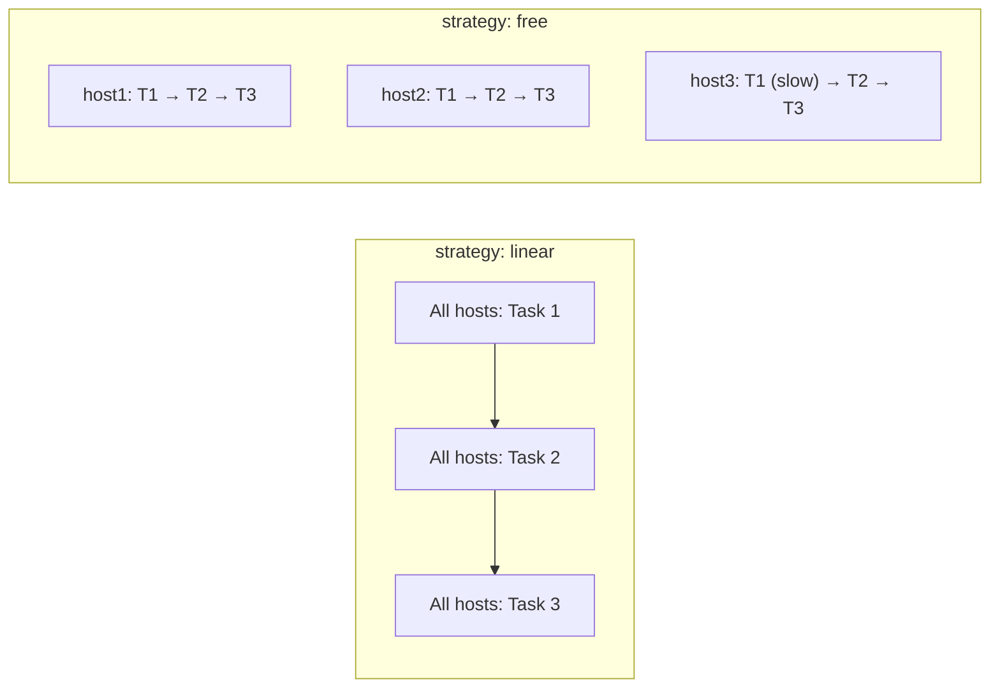
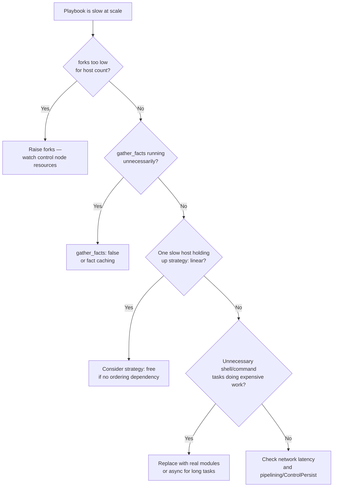

# Forks, Serial, Strategy, and Throttle

Four keywords, frequently confused with each other, that all sound like "how parallel is this." They control four genuinely different things.

## What You'll Learn

- What `forks` actually limits, and what it doesn't
- The difference between `strategy: linear` and `strategy: free`
- What `serial` and `throttle` add on top of forks, and why they solve different problems
- How to reason about a playbook that's slow across hundreds of hosts

## Forks: The Parallelism Ceiling

`forks` is the maximum number of hosts Ansible works on **at the same time**, for a single task. Default is 5.



With 100 hosts and `forks: 5`, Ansible processes them in batches of 5 for **each task** — host 6 doesn't start task 1 until one of the first 5 finishes it. Raise the ceiling:

```ini title="ansible.cfg"
[defaults]
forks = 20
```

```bash
ansible-playbook site.yml --forks 20
```

Higher forks means more simultaneous SSH connections and more simultaneous load on the control node (memory, file descriptors) and on whatever the tasks themselves hit (a package mirror, a database). It is **not** free — raising `forks` past what the control node or the target infrastructure can absorb makes things slower, not faster.

## Strategy: How Hosts Move Through the Task List

```yaml
- hosts: web
  strategy: linear   # default
  tasks: ...
```

- **`linear`** (default) — every host must finish the current task before **any** host moves to the next one. A slow host holds up the whole batch, task by task.
- **`free`** — each host runs through the entire task list independently, as fast as it can, with no per-task synchronization across hosts.



`free` is faster in aggregate when hosts have meaningfully different task durations and there's no cross-host ordering dependency in the play. It is **wrong** the moment a later task assumes an earlier task already completed on *every* host (a common pattern: "wait for all web servers to be updated before touching the load balancer") — `linear` is what makes that assumption safe.

## Serial: Batching a Rollout, Not Parallelism

```yaml
- hosts: web
  serial: 2
  tasks: ...
```

`serial` limits how many hosts go through the **entire play** at once — a canary/rolling-deployment control, independent of `forks`. `serial: 2` on 20 hosts means: run the whole play against 2 hosts, then the next 2, and so on — never touching the other 18 until the first batch is done.

```yaml
- hosts: web
  serial: [1, 5, "100%"]
```

A stepped list canaries a rollout: one host first, then five, then everyone else — each batch only starts once the previous one fully succeeds. This is the standard pattern for any change that could plausibly break a host.

**`forks` vs. `serial`, precisely:** `forks` bounds simultaneous connections *within* whatever batch is currently running; `serial` decides how big that batch is in the first place. `serial: 2` with `forks: 20` still only ever touches 2 hosts, because `serial` is the tighter constraint.

## Throttle: A Per-Task Ceiling Inside a Play

```yaml
- name: Call a rate-limited external API
  ansible.builtin.uri:
    url: "https://api.example.com/register"
  throttle: 3
```

`throttle` caps parallelism for **one specific task**, even if `forks`/`serial` would otherwise allow more — useful when only one task in an otherwise-fine play needs to be gentler (a rate-limited third-party API, a database that can't take 20 simultaneous migration connections).

## `run_once` and `delegate_to`

Related, but answering a different question — "should this run on every host at all" rather than "how many at once." Covered in [Delegation and Become](../playbook-engineering/04-delegation-and-become.md).

## Putting It Together at Scale

| Keyword | Controls | Default |
|---|---|---|
| `forks` | Max simultaneous hosts, per task | 5 |
| `strategy` | Whether hosts stay in lockstep per task | `linear` |
| `serial` | Batch size for the whole play (rollout control) | unset (all hosts at once) |
| `throttle` | Max simultaneous hosts, for one specific task | unset (inherits `forks`) |

## Diagnosing a Slow Playbook Across Many Hosts



## Common Mistakes

- Raising `forks` far past what the control node or target systems can absorb, making things slower, not faster.
- Using `strategy: free` on a play where a later task silently assumes every host finished an earlier one.
- Confusing `serial` with `forks` — `serial` doesn't make anything faster; it deliberately trades speed for a smaller blast radius during rollout.
- Applying `throttle` globally via `forks` when only one specific rate-limited task actually needs the lower ceiling.

## Interview Questions

- What's the difference between `forks` and `serial`?
- When would `strategy: free` be actively wrong for a play, not just unnecessary?
- You manage 5,000 hosts and a playbook run is taking two hours — what's your investigation process?

See [Interview Prep: Architecture & Performance](../interview-prep/02-architecture-and-performance-questions.md) and the full scenario in [Interview Prep: Scenario-Based Questions](../interview-prep/03-scenario-based-questions.md) for the complete reasoning walkthrough.

## Next

Continue to [Fact Caching](02-fact-caching.md) — the next lever once forks/strategy/serial are already tuned.
