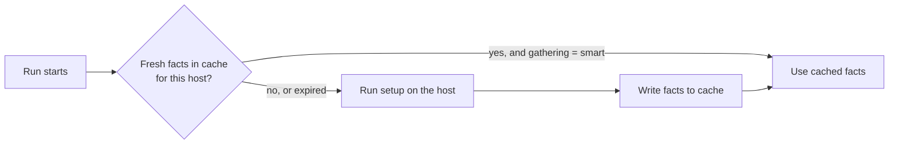

# Fact Caching

## What You'll Learn

- What fact caching stores, and when Ansible reads from it
- How to configure the `jsonfile` and `redis` backends
- How `gathering = smart` decides whether to contact a host for facts
- The staleness trade-off, and how to clear the cache

## Why This Exists

Fact gathering is a real remote execution step (the implicit `setup` module call) with real cost, repeated at the start of nearly every play — fact caching lets a run reuse facts gathered recently instead of re-gathering them every single time.

On a few hosts that cost is invisible. On a thousand hosts, gathering can take minutes of every run, and it's also what lets `hostvars` see facts for hosts that aren't in the current play.

## Mental Model

> Without a cache, facts live in memory and vanish when `ansible-playbook` exits. With a cache, every gathered fact is **also written to a store**, keyed by hostname, with an expiry. Later runs can load facts from the store instead of — or in addition to — contacting the host.



## Configuring the jsonfile Backend

```ini title="ansible.cfg"
[defaults]
gathering = smart
fact_caching = ansible.builtin.jsonfile
fact_caching_connection = .ansible_fact_cache
fact_caching_timeout = 7200
```

- `fact_caching_connection` is a **directory**; Ansible writes one JSON file per host.
- `fact_caching_timeout` is in seconds. `0` means never expire.
- Add the directory to `.gitignore` — facts include IP addresses, hostnames, and other details you don't want in a repository.

Run once, then look:

```bash
ansible-playbook site.yml
ls .ansible_fact_cache/
# db01  web01  web02
jq '.ansible_distribution, .ansible_default_ipv4.address' .ansible_fact_cache/web01
```

## Gathering Policies

| `gathering` (ansible.cfg) | Behavior |
|---|---|
| `implicit` (default) | Gather at the start of every play unless it sets `gather_facts: false` |
| `explicit` | Never gather unless a play sets `gather_facts: true` |
| `smart` | Gather only for hosts with no facts in the current run or in a fresh cache entry |

`smart` is what turns a cache into a speed-up. With `implicit`, Ansible still gathers every time and merely *writes* the cache.

!!! note "`smart` is an ansible.cfg setting"
    The play keyword `gather_facts` only accepts true or false. Smart gathering is configured with `gathering = smart` (or `ANSIBLE_GATHERING=smart`).

## Configuring the Redis Backend

`jsonfile` is local to one machine. When playbooks run from several CI runners or controllers, they each keep separate caches. A shared Redis fixes that:

```bash
ansible-galaxy collection install community.general
pip install redis
```

```ini title="ansible.cfg"
[defaults]
gathering = smart
fact_caching = community.general.redis
fact_caching_connection = redis.internal.example.com:6379:0
fact_caching_prefix = ansible_facts_
fact_caching_timeout = 7200
```

The connection string is `host:port:db`. Secure it like any other shared service: facts describe your whole fleet.

| Backend | Plugin | Good for |
|---|---|---|
| `jsonfile` | `ansible.builtin.jsonfile` | One control node or a persistent runner; simplest |
| `redis` | `community.general.redis` | Many runners or controllers sharing one cache |
| `memcached` | `community.general.memcached` | Same idea, where memcached is already standard |
| `memory` | `ansible.builtin.memory` | The default: in-process only, nothing persists |

## Caching Your Own Values

```yaml
- name: Persist the detected cluster role across runs
  ansible.builtin.set_fact:
    cluster_role: "{{ 'primary' if is_leader else 'replica' }}"
    cacheable: true
```

See [set_fact and combine](../variables-and-data/06-set-fact-and-combine.md).

## Using the Cache for Cross-Host Lookups

A common reason to add a cache isn't speed but `hostvars`. With a warm cache, this works even under `--limit web`, because `db01`'s facts load from the cache:

```jinja
DATABASE_HOST={{ hostvars['db01']['ansible_facts']['default_ipv4']['address'] }}
```

Keep the cache warm with a scheduled fact-gathering run:

```bash
ansible all -m ansible.builtin.setup > /dev/null   # populates the configured cache
```

## Staleness: The Trade-Off

A cached fact is a snapshot. If a host's IP address, disk layout, or installed kernel changes within the timeout, playbooks see the old value.

| Environment | Reasonable timeout |
|---|---|
| Long-lived VMs and bare metal | Hours to a day |
| Autoscaled or frequently rebuilt instances | Minutes, or no cache |
| Right after hardware or network changes | Flush first |

Force fresh facts when you know something changed:

```bash
ansible-playbook site.yml --flush-cache
```

```yaml
- name: Re-gather after changing network configuration
  ansible.builtin.setup:
    gather_subset: [network]
```

## Common Mistakes

- Enabling fact caching with a long timeout on hosts whose facts genuinely change often (autoscaled infrastructure), then debugging "wrong" values that are actually just stale.
- Using `jsonfile` caching across multiple CI runners that don't share a filesystem — each runner gets its own cache, defeating the point.
- Configuring a cache but leaving `gathering = implicit`, so every run still gathers facts and nothing gets faster.
- Writing `gather_facts: smart` in a play, which isn't a valid value.
- Committing the `jsonfile` cache directory to Git.

## Interview Questions

- What problem does fact caching solve, and what's the trade-off against always gathering fresh?
- Why would a team choose `redis` fact caching over `jsonfile`?
- What does `gathering = smart` do, and why does a cache not speed anything up without it?
- How can a fact cache make `hostvars` work under `--limit`?

## Next

Continue to [Connection Plugins](03-connection-plugins.md).
