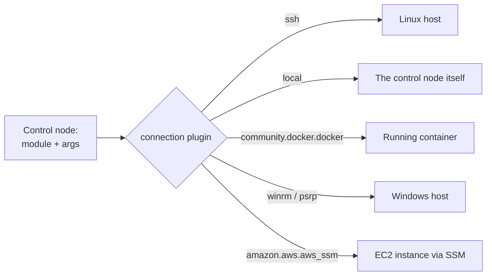

# Connection Plugins

## What You'll Learn

- What a connection plugin does, and how Ansible picks one per host
- The plugins you'll actually use: `ssh`, `local`, `docker`, `winrm`/`psrp`, and a few cloud ones
- How **pipelining** and **ControlPersist** make SSH runs dramatically faster
- The `requiretty` caveat that bites when you turn pipelining on

## Why This Exists

`ssh` is the default and covers most cases, but Ansible's connection layer is pluggable — the same modules and JSON contract work over a completely different transport when the target isn't a normal SSH-reachable Linux box.

## Mental Model

> A connection plugin answers one question: **how do bytes get to the target and back?** It must be able to put a file, run a command, and fetch a file. Modules don't care which plugin carried them — a `copy` task works the same over SSH, into a container, or over WinRM.



## Choosing a Plugin

Set it per host or group with `ansible_connection`, per play with `connection:`, or per task:

```ini title="inventory.ini"
[web]
web01 ansible_host=10.0.1.11

[containers]
checkout-dev ansible_connection=community.docker.docker

[windows]
win-build01 ansible_host=10.0.3.20

[windows:vars]
ansible_connection=winrm
ansible_winrm_transport=kerberos
ansible_port=5986
```

| Plugin | Use it when | Needs |
|---|---|---|
| `ssh` (default) | Linux/Unix hosts | OpenSSH client on the control node; see [SSH and Connectivity](../getting-started/05-ssh-and-connectivity.md) |
| `local` | Tasks that should run on the control node itself (API calls, rendering files locally) | Nothing |
| `community.docker.docker` | Configuring or testing inside a running container, without SSH in the image | `community.docker` collection, Docker access |
| `kubernetes.core.kubectl` | Running tasks inside a pod | `kubernetes.core` collection, `kubectl` |
| `winrm` / `psrp` | Windows hosts over WinRM | `pywinrm` or `pypsrp` on the control node, WinRM configured on Windows |
| `amazon.aws.aws_ssm` | EC2 instances with no inbound SSH | `amazon.aws` collection, SSM agent, an S3 bucket for file transfer |
| `paramiko_ssh` | Rare cases where the OpenSSH binary can't be used | `paramiko` Python library |

Windows can also be managed over SSH (`ansible_connection=ssh`, `ansible_shell_type=powershell`) now that OpenSSH ships with Windows.

## `local`: No Network Hop

```yaml
- name: Talk to APIs from the control node
  hosts: localhost
  connection: local
  gather_facts: false
  tasks:
    - name: Create a DNS record
      community.general.cloudflare_dns:
        zone: example.com
        record: shop
        type: A
        value: 203.0.113.10
        api_token: "{{ cloudflare_api_token }}"
```

For a single task inside a remote play, `delegate_to: localhost` is usually clearer; see [Delegation and Become](../playbook-engineering/04-delegation-and-become.md).

## `docker`: Tasks Inside a Container

```yaml
- name: Check a dev container's config without SSH
  hosts: containers
  gather_facts: false
  tasks:
    - name: Show the rendered app config
      ansible.builtin.command: cat /app/config.yml
      changed_when: false
```

Useful for container debugging and Molecule-style tests. Don't use it to configure production containers — rebuild the image instead.

## Pipelining: The Biggest Free Speed-Up

By default, running a module over SSH is several round trips: create a temp directory, upload the module file, make it executable, run it, delete it. **Pipelining** sends the module straight into the remote Python interpreter's stdin, in one SSH operation.

```ini title="ansible.cfg"
[ssh_connection]
pipelining = True
```

On typical playbooks, this cuts the number of SSH operations per task sharply, and it also avoids the temporary-file permission problem when becoming a non-root user.

### The requiretty caveat

Some older sudo configurations contain:

```text
Defaults    requiretty
```

That tells sudo to refuse commands without a terminal, which pipelining doesn't allocate. Symptoms: `become` tasks fail with sudo errors right after enabling pipelining. Fix it on the managed nodes, ideally just for the automation user:

```text title="/etc/sudoers.d/ansible"
Defaults:deploy !requiretty
```

Modern RHEL, Debian, and Ubuntu defaults don't set `requiretty`. See [Become and Permission Problems](../troubleshooting/02-become-and-permission-problems.md).

## ControlPersist: Reuse One SSH Connection

Without multiplexing, every SSH operation repeats the key exchange and authentication. `ControlPersist` keeps a master connection open and reuses it:

```ini title="ansible.cfg"
[ssh_connection]
pipelining = True
ssh_args = -C -o ControlMaster=auto -o ControlPersist=60s
control_path_dir = ~/.ansible/cp
```

Ansible's default `ssh_args` already include `ControlMaster=auto -o ControlPersist=60s`. If you override `ssh_args` for another reason (a jump host, custom options), **re-include** these, or you silently lose multiplexing:

```ini
ssh_args = -C -o ControlMaster=auto -o ControlPersist=60s -o ProxyJump=bastion.example.com
```

If you see `ControlPath too long` errors, shorten `control_path_dir`.

## Measuring the Difference

```bash
time ansible-playbook site.yml                        # baseline
ANSIBLE_PIPELINING=True time ansible-playbook site.yml
```

Pair these settings with fork and strategy tuning from [Forks, Serial, Strategy, and Throttle](01-forks-serial-strategy-throttle.md) and the broader list in [Performance](../production-engineering/05-performance.md).

## Common Mistakes

- Not enabling pipelining, leaving real performance on the table for free.
- Overriding `ssh_args` for a bastion and accidentally dropping `ControlMaster`/`ControlPersist`.
- Assuming `winrm` needs no extra setup — it requires `pip install pywinrm` and Windows-side configuration, unlike SSH which is on by default on most Linux distributions.
- Using the short name `docker` for the connection plugin after it moved to `community.docker`, without the collection installed.
- Forgetting `become: false` on `connection: local` plays that inherit `become: true`, so the control node prompts for sudo.

## Interview Questions

- What does pipelining change about how a module reaches the managed node, and what can break when you enable it?
- Why would you use the `docker` connection plugin instead of `ssh`?
- What does ControlPersist save, and how can a custom `ssh_args` accidentally disable it?
- How would you manage EC2 instances that have no inbound SSH port open?

## Next

Continue to [Lookup and Filter Plugins](04-lookup-and-filter-plugins.md).
