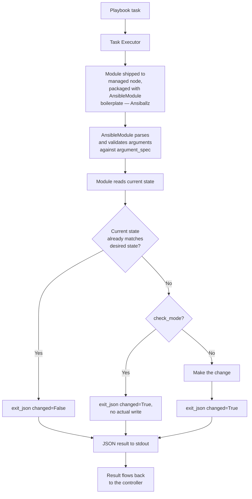

# Build a Custom Module

## What You'll Learn

- Why you'd write a module instead of reaching for `command`/`shell`
- The full lifecycle: playbook → task → module → argument parsing → remote operation → idempotency check → `exit_json()` → JSON result
- A complete, realistic module — not a "hello world" — with check mode, diff mode, and correct idempotency

## Why Custom Modules

Every playbook is ultimately a sequence of module calls. When a real operation has no purpose-built module — an internal tool's config format, a proprietary API, a niche file format — the choice is between an unsafe `command`/`shell` workaround and a proper module that gets check mode, idempotency, and `ansible-doc` support for free, the same as any built-in.

## The Module Lifecycle



## The Module: `json_kv`

A module that ensures a top-level key in a JSON config file has a specific value — genuinely useful (plenty of internal tools and services use flat JSON config with no purpose-built Ansible module), and small enough to read in full.

```python title="library/json_kv.py"
#!/usr/bin/python
from __future__ import annotations

DOCUMENTATION = r"""
---
module: json_kv
short_description: Ensure a top-level key in a JSON file has a specific value
description:
  - Reads a JSON file, checks whether a given top-level key already has the
    desired value, and writes the file only if a change is needed.
  - Creates the file (as C({}) plus the new key) if it does not exist yet.
options:
  path:
    description: Path to the JSON file.
    type: str
    required: true
  key:
    description: Top-level JSON key to set.
    type: str
    required: true
  value:
    description: Desired value for the key. May be a string, number, bool, list, or dict.
    type: raw
    required: true
author:
  - Your Name (@yourhandle)
"""

EXAMPLES = r"""
- name: Ensure feature flag is enabled
  json_kv:
    path: /etc/app/config.json
    key: feature_new_dashboard
    value: true

- name: Set a nested-looking value (still a top-level key)
  json_kv:
    path: /etc/app/config.json
    key: retry_policy
    value:
      max_attempts: 5
      backoff_seconds: 2
"""

RETURN = r"""
changed:
  description: Whether the file was created or the key's value was changed.
  type: bool
  returned: always
previous_value:
  description: The key's value before this task ran, or null if it didn't exist.
  returned: always
  type: raw
"""

import json
import os

from ansible.module_utils.basic import AnsibleModule


def read_config(path):
    if not os.path.exists(path):
        return {}
    with open(path, "r", encoding="utf-8") as f:
        content = f.read().strip()
        if not content:
            return {}
        return json.loads(content)


def write_config(path, data):
    with open(path, "w", encoding="utf-8") as f:
        json.dump(data, f, indent=2, sort_keys=True)
        f.write("\n")


def main():
    module = AnsibleModule(
        argument_spec={
            "path": {"type": "str", "required": True},
            "key": {"type": "str", "required": True},
            "value": {"type": "raw", "required": True},
        },
        supports_check_mode=True,
    )

    path = module.params["path"]
    key = module.params["key"]
    desired_value = module.params["value"]

    try:
        config = read_config(path)
    except (OSError, json.JSONDecodeError) as exc:
        module.fail_json(msg=f"Could not read {path} as JSON: {exc}")

    previous_value = config.get(key)
    changed = previous_value != desired_value

    result = {
        "changed": changed,
        "previous_value": previous_value,
    }

    if module._diff:
        result["diff"] = {
            "before": {key: previous_value},
            "after": {key: desired_value},
        }

    if not changed:
        module.exit_json(**result)

    if module.check_mode:
        # Report what WOULD happen, without writing anything.
        module.exit_json(**result)

    config[key] = desired_value
    try:
        write_config(path, config)
    except OSError as exc:
        module.fail_json(msg=f"Could not write {path}: {exc}")

    module.exit_json(**result)


if __name__ == "__main__":
    main()
```

## Using It From a Playbook

```yaml
- name: Enable the new dashboard feature flag
  hosts: app
  tasks:
    - name: Set feature_new_dashboard
      json_kv:
        path: /etc/app/config.json
        key: feature_new_dashboard
        value: true
```

Dropping a module into a project's `library/` directory (next to the playbook, or at the path `library:` in `ansible.cfg` points to) makes it callable by its bare filename — no FQCN, because it isn't part of an installed collection yet. See [Build a Collection From Zero](03-build-a-collection-from-zero.md) for turning it into `your_namespace.your_collection.json_kv`.

## Walking Through the Contract

- **`argument_spec`** declares every parameter's type and required-ness — `AnsibleModule` validates the task's arguments against it *before* your code runs, and the same spec is what generates `ansible-doc json_kv` output from the `DOCUMENTATION` string.
- **`supports_check_mode=True`** plus checking `module.check_mode` explicitly is what makes `--check` safe — the module still does its comparison, reports what *would* change, but skips the `write_config` call.
- **`module._diff`** (set when `--diff` is passed) is checked explicitly to only build the `diff` payload when it's actually wanted.
- **Idempotency is check-then-act, done by hand here**: `previous_value != desired_value` is the entire idempotency logic — run this module twice with the same arguments, and the second run reports `changed: false`, no write.
- **`fail_json`**, not a raised exception, is how a module reports failure — an uncaught exception would produce a confusing traceback instead of a clean, playbook-readable error message.

## Common Mistakes

- Always returning `changed: True` regardless of whether anything actually changed — breaks idempotency and silently breaks handler `notify:` behavior for every consumer of the module.
- Declaring `supports_check_mode=True` but never checking `module.check_mode` in the code — the module then writes for real even during a `--check` dry run, which is worse than not supporting check mode at all, because it looks safe and isn't.
- Swallowing an exception instead of calling `fail_json` with a clear message, producing a confusing downstream failure instead of an actionable one.
- Forgetting `RETURN`/`DOCUMENTATION` — `ansible-doc` and IDE tooling both depend on them, and an undocumented module is much harder for a future maintainer (including future you) to trust.

## Interview Questions

- What does a module have to do, specifically, to correctly support check mode — not just declare it?
- How does `argument_spec` relate to both input validation and `ansible-doc`'s generated documentation?
- Why is the check-then-act pattern central to writing an idempotent module, and where exactly does that logic belong?

See [Interview Prep: Roles, Collections & Modules](../interview-prep/04-roles-collections-and-modules-questions.md) for more.

## Next

Continue to [ArgumentSpec, Check Mode, Idempotency, and Diff](02-argumentspec-checkmode-idempotency-diff.md) for each piece of this contract in more depth.
