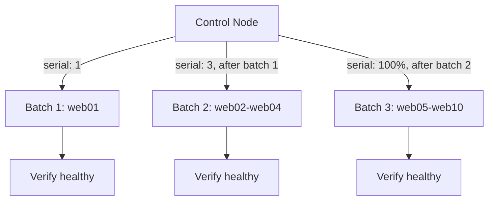

# Case Study: Rolling Nginx Deployment

## Problem

Deploy nginx with a new configuration to 10 web servers behind a load balancer, without ever taking all 10 down at once, and without manually SSHing into each one.

## Requirements

- Install and configure nginx identically across all 10 servers
- Roll out in batches, not all at once — a bad config should only ever affect a small slice of capacity
- Verify each batch is healthy before proceeding to the next
- Safe to re-run

## Architecture



## Repository Structure

```text
ansible-project/
├── inventories/production/hosts.ini
├── playbooks/deploy_nginx.yml
├── roles/
│   └── nginx/
│       ├── tasks/main.yml
│       ├── handlers/main.yml
│       ├── defaults/main.yml
│       └── templates/nginx.conf.j2
```

## Inventory

```ini title="inventories/production/hosts.ini"
[web]
web01 ansible_host=10.0.1.11
web02 ansible_host=10.0.1.12
web03 ansible_host=10.0.1.13
web04 ansible_host=10.0.1.14
web05 ansible_host=10.0.1.15
web06 ansible_host=10.0.1.16
web07 ansible_host=10.0.1.17
web08 ansible_host=10.0.1.18
web09 ansible_host=10.0.1.19
web10 ansible_host=10.0.1.20
```

## Role

```yaml title="roles/nginx/defaults/main.yml"
nginx_worker_connections: 1024
nginx_http_port: 80
```

```yaml title="roles/nginx/tasks/main.yml"
---
- name: Install nginx
  ansible.builtin.package:
    name: nginx
    state: present

- name: Deploy nginx configuration
  ansible.builtin.template:
    src: nginx.conf.j2
    dest: /etc/nginx/nginx.conf
  notify: Restart nginx

- name: Ensure nginx is enabled and running
  ansible.builtin.service:
    name: nginx
    state: started
    enabled: true
```

```yaml title="roles/nginx/handlers/main.yml"
---
- name: Restart nginx
  ansible.builtin.service:
    name: nginx
    state: restarted
```

## Playbook — the Rollout Itself

```yaml title="playbooks/deploy_nginx.yml"
---
- name: Roll out nginx across web fleet
  hosts: web
  become: true
  serial:
    - 1
    - 3
    - "100%"

  roles:
    - nginx

  post_tasks:
    - name: Verify nginx responds locally on this host
      ansible.builtin.uri:
        url: "http://localhost"
        status_code: 200
      retries: 3
      delay: 2
      register: health_check
      until: health_check.status == 200
```

## Execution

```bash
ansible-playbook -i inventories/production/hosts.ini playbooks/deploy_nginx.yml --check --diff
ansible-playbook -i inventories/production/hosts.ini playbooks/deploy_nginx.yml
```

## Expected Output (Abbreviated)

```text
PLAY [Roll out nginx across web fleet] ***

TASK [nginx : Install nginx] ***
changed: [web01]

TASK [nginx : Deploy nginx configuration] ***
changed: [web01]

RUNNING HANDLER [nginx : Restart nginx] ***
changed: [web01]

TASK [Verify nginx responds locally on this host] ***
ok: [web01]

PLAY RECAP ***
web01 : ok=5 changed=3 unreachable=0 failed=0

PLAY [Roll out nginx across web fleet] ***
[... batch of 3: web02, web03, web04 ...]

PLAY [Roll out nginx across web fleet] ***
[... remaining 6 hosts ...]
```

Three distinct plays run in sequence because of `serial: [1, 3, "100%"]` — the second batch never starts until the first batch's tasks (including the health check) fully succeed on `web01`.

## Failure Scenario

A teammate ships a syntactically valid but logically broken `nginx.conf.j2` — it renders fine, but sets `worker_connections` to a value the target kernel's file-descriptor limit can't support, so nginx fails to start.

```text
TASK [nginx : Ensure nginx is enabled and running] ***
fatal: [web01]: FAILED! => {"changed": false, "msg": "Unable to start service nginx: ..."}
```

Because the failure happens in **batch 1** (`serial: 1`, just `web01`), the rollout stops there automatically — `web02` through `web10` never receive the broken config, and the load balancer still has 9 healthy servers serving traffic. This is the entire point of the stepped `serial` list: the blast radius of a bad change is exactly one host, not the whole fleet.

## Troubleshooting

```bash
ansible-playbook ... --limit web01 -vvv
```

narrows the retry to the single failed host and shows the exact systemd error underneath Ansible's summary. Once the template is fixed, re-running the same playbook is safe — `web01` reconverges, and the stepped `serial` restarts the rollout from the beginning of the (now-fixed) batch sequence.

## Production Hardening

- Add a `pre_tasks` step that checks the load balancer already has other healthy backends before taking any host out of rotation for the deploy.
- Use [Molecule](../production-engineering/07-molecule-testing.md) to test the `nginx` role's idempotence and config validity before it ever reaches this playbook.
- Move `nginx_worker_connections` validation into a `assert` task, failing fast with a clear message instead of letting the service fail to start.

## Interview Questions

- Why does `serial: [1, 3, "100%"]` limit the blast radius of a bad deployment better than a flat `serial: 3`?
- What would you add to this playbook to make it stop the *entire* rollout, not just the current batch, on a health check failure?

## What You Learned

`serial` isn't about speed — it's a deliberate blast-radius control, and pairing it with a real post-deploy health check (not just "the task didn't fail") is what makes a rollout actually safe to run unattended.
