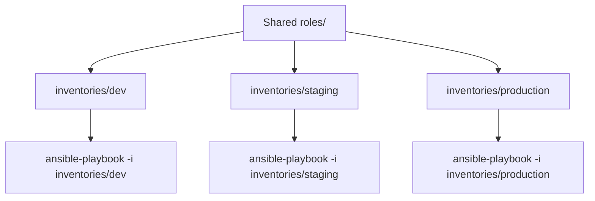

# Case Study: Multi-Environment Inventory

## Problem

Three environments — dev, staging, production — need the same roles applied with different variables (different database hosts, different replica counts, different feature flags), and a mistake in one environment must not be able to reach another.

## Requirements

- One set of roles, reused unmodified across all three environments
- Environment-specific variables cleanly separated
- Structurally impossible (not just "please be careful") to target production by accident

## Architecture



## Repository Structure

```text
ansible-project/
├── inventories/
│   ├── dev/
│   │   ├── hosts.ini
│   │   └── group_vars/all.yml
│   ├── staging/
│   │   ├── hosts.ini
│   │   └── group_vars/all.yml
│   └── production/
│       ├── hosts.ini
│       └── group_vars/all.yml
├── playbooks/site.yml
└── roles/app/
```

## Inventory and Variables Per Environment

```ini title="inventories/dev/hosts.ini"
[app]
dev-app01 ansible_host=10.10.1.10
```

```yaml title="inventories/dev/group_vars/all.yml"
env_name: dev
db_host: dev-db.internal
replica_count: 1
feature_new_dashboard: true
```

```ini title="inventories/production/hosts.ini"
[app]
prod-app01 ansible_host=10.20.1.10
prod-app02 ansible_host=10.20.1.11
prod-app03 ansible_host=10.20.1.12
```

```yaml title="inventories/production/group_vars/all.yml"
env_name: production
db_host: prod-db.internal
replica_count: 3
feature_new_dashboard: false
```

Notice `dev-app01` and `prod-app01` are different hostnames in entirely separate files — there is no shared inventory with an `env:` variable to get wrong.

## Playbook (Identical Across Every Environment)

```yaml title="playbooks/site.yml"
---
- name: Configure application servers
  hosts: app
  become: true
  roles:
    - app
```

## Execution

```bash
# Dev — safe to run freely
ansible-playbook -i inventories/dev/hosts.ini playbooks/site.yml

# Production — same playbook, same roles, different inventory
ansible-playbook -i inventories/production/hosts.ini playbooks/site.yml --check --diff
ansible-playbook -i inventories/production/hosts.ini playbooks/site.yml
```

## Expected Output

```text
$ ansible-playbook -i inventories/production/hosts.ini playbooks/site.yml --check --diff
PLAY [Configure application servers] ***
TASK [app : Deploy application config] ***
--- before: /etc/app/config.yml
+++ after: config.yml.j2
@@ -1,3 +1,3 @@
-db_host: dev-db.internal
+db_host: prod-db.internal
changed: [prod-app01]
```

`--check --diff` against production shows exactly what would change — including confirming `db_host` resolved to the **production** database, not dev's, before anything is actually applied.

## Failure Scenario (Near Miss, Caught)

An engineer means to test a change against dev and runs:

```bash
ansible-playbook -i inventories/dev/hosts.ini playbooks/site.yml --limit app01
```

`--limit app01` matches nothing — `app01` doesn't exist in the dev inventory (it's `dev-app01`) — so Ansible reports zero hosts matched and the run does nothing, rather than silently matching a same-named host in a different environment. Compare this to a single shared inventory using generic hostnames like `app01` across environments distinguished only by a variable: the same typo there could easily have matched a host in the *wrong* environment and applied a change silently.

## Troubleshooting

```bash
ansible-inventory -i inventories/production/hosts.ini --graph
```

confirms exactly which hosts a given inventory file resolves to, before running anything against it — the fastest sanity check before any production run.

## Production Hardening

- Add a CI gate requiring `--check --diff` output to be reviewed (as a PR comment or artifact) before any production apply is allowed to run.
- Name hosts with an environment prefix (`dev-`, `prod-`) even though they already live in separate files — a second layer of defense against a copy-pasted `--limit` pattern.
- Restrict which CI credentials/runners can even reach the production inventory's target network, so a wrong `-i` flag fails at the network layer too, not just the inventory layer.

## Interview Questions

- Why is separate inventory directories per environment safer than one inventory with an `env:` variable?
- What would `ansible-playbook -i inventories/dev/hosts.ini site.yml --limit app01` do if `app01` doesn't exist in that inventory, and why is that the safe behavior?

## What You Learned

Environment isolation that depends on "remembering to pass the right flag" is not isolation — structuring inventory so the wrong flag simply can't match a real host is.
