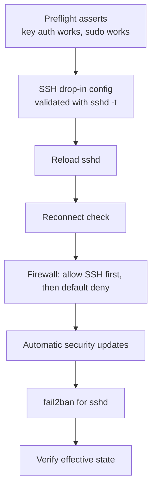

# Case Study: Linux Server Hardening

## Problem

A fresh fleet of servers needs a consistent security baseline applied before anything else touches them — SSH lockdown, a default-deny firewall, automatic security updates, and brute-force protection.

## Requirements

- Works on both Ubuntu 24.04 and Rocky Linux 9 from one role
- Key-only SSH, no root login — **without ever locking the automation user out**
- Default-deny inbound firewall; only SSH plus ports a host's own roles declare
- Automatic installation of security updates
- Brute-force protection for SSH
- A verification step that checks effective state, not just task results
- Safe to re-run: a second run reports zero changes

## Architecture



## Repository Structure

```text
ansible-project/
├── playbooks/harden.yml
└── roles/hardening/
    ├── defaults/main.yml
    ├── handlers/main.yml
    ├── tasks/
    │   ├── main.yml
    │   ├── preflight.yml
    │   ├── ssh.yml
    │   ├── firewall.yml
    │   ├── updates.yml
    │   ├── fail2ban.yml
    │   └── verify.yml
    ├── templates/
    │   ├── 00-hardening.conf.j2
    │   └── jail.local.j2
    └── vars/
        ├── Debian.yml
        └── RedHat.yml
```

## Role Interface

```yaml title="roles/hardening/defaults/main.yml"
---
hardening_ssh_port: 22
hardening_ssh_allow_groups: [sshusers]
hardening_firewall_allowed_ports: []        # e.g. [{port: 443, proto: tcp}]
hardening_fail2ban_maxretry: 5
hardening_fail2ban_bantime: 1h
```

```yaml title="roles/hardening/vars/Debian.yml"
---
__hardening_ssh_service: ssh
__hardening_update_packages: [unattended-upgrades]
```

```yaml title="roles/hardening/vars/RedHat.yml"
---
__hardening_ssh_service: sshd
__hardening_update_packages: [dnf-automatic]
```

```yaml title="roles/hardening/tasks/main.yml"
---
- name: Load OS family variables
  ansible.builtin.include_vars: "{{ ansible_facts['os_family'] }}.yml"

- ansible.builtin.import_tasks: preflight.yml
- ansible.builtin.import_tasks: ssh.yml
- ansible.builtin.import_tasks: firewall.yml
- ansible.builtin.import_tasks: updates.yml
- ansible.builtin.import_tasks: fail2ban.yml
- ansible.builtin.import_tasks: verify.yml
```

## Step 1 — Preflight: Prove You Won't Lock Yourself Out

```yaml title="roles/hardening/tasks/preflight.yml"
---
- name: Check the automation user has an authorized key
  ansible.builtin.stat:
    path: "/home/{{ ansible_user }}/.ssh/authorized_keys"
  register: automation_keys

- name: Refuse to disable password auth without key auth in place
  ansible.builtin.assert:
    that:
      - automation_keys.stat.exists
      - automation_keys.stat.size > 0
    fail_msg: "{{ ansible_user }} has no authorized_keys on {{ inventory_hostname }} — hardening SSH now would lock Ansible out."

- name: Make sure the SSH allow group exists
  ansible.builtin.group:
    name: "{{ item }}"
    state: present
  loop: "{{ hardening_ssh_allow_groups }}"

- name: Put the automation user in the SSH allow group before restricting access
  ansible.builtin.user:
    name: "{{ ansible_user }}"
    groups: "{{ hardening_ssh_allow_groups }}"
    append: true
```

The second task is the one most hardening playbooks forget: `AllowGroups` locks out every user not in those groups — including the account Ansible is using.

## Step 2 — SSH Lockdown With a Validated Drop-In

Modern Ubuntu and RHEL include `/etc/ssh/sshd_config.d/*.conf`. For most settings, **sshd uses the first value it reads**, and cloud images often ship a `50-cloud-init.conf` that sets `PasswordAuthentication yes`. A `00-` prefix makes our file win.

```jinja title="roles/hardening/templates/00-hardening.conf.j2"
# Managed by Ansible (hardening role)
Port {{ hardening_ssh_port }}
PermitRootLogin no
PasswordAuthentication no
KbdInteractiveAuthentication no
PubkeyAuthentication yes
AllowGroups {{ hardening_ssh_allow_groups | join(' ') }}
MaxAuthTries 3
LoginGraceTime 30
X11Forwarding no
```

```yaml title="roles/hardening/tasks/ssh.yml"
---
- name: Deploy hardened sshd settings, syntax-checking the drop-in before writing
  ansible.builtin.template:
    src: 00-hardening.conf.j2
    dest: /etc/ssh/sshd_config.d/00-hardening.conf
    owner: root
    group: root
    mode: "0600"
    validate: /usr/sbin/sshd -t -f %s
  notify: Reload sshd

- name: Test the complete sshd config, with every include merged
  ansible.builtin.command: /usr/sbin/sshd -t
  changed_when: false

- name: Apply the SSH change now, while we can still verify it
  ansible.builtin.meta: flush_handlers

- name: Confirm Ansible can still open a fresh connection
  ansible.builtin.wait_for_connection:
    timeout: 30
```

```yaml title="roles/hardening/handlers/main.yml"
---
- name: Reload sshd
  ansible.builtin.service:
    name: "{{ __hardening_ssh_service }}"
    state: reloaded

- name: Restart fail2ban
  ansible.builtin.service:
    name: fail2ban
    state: restarted
```

!!! note "validate and drop-in files"
    `validate` must contain `%s` (Ansible refuses the task otherwise), and it receives the path of the **temporary** file before it's moved into place. That checks the drop-in's own syntax. The next task then runs `sshd -t` against the complete configuration, with the new drop-in merged in, **before** the handler reloads sshd. If that check fails, the play stops and the running sshd keeps its old config. For a first rollout, stage the change on one host with `serial: 1` anyway.

!!! warning "Changing the SSH port on Ubuntu 24.04"
    Ubuntu 22.10 and later start sshd through **socket activation**: systemd's `ssh.socket` owns the listening port, not the sshd process. On 24.04 a systemd generator copies `Port` from `sshd_config` into the socket, but only when systemd reloads, so reloading sshd alone leaves it listening on the old port. After changing `hardening_ssh_port`, open the new port in the firewall first, then run:

    ```yaml
    - name: Move the SSH listener (Ubuntu socket activation)
      ansible.builtin.systemd_service:
        name: ssh.socket
        state: restarted
        daemon_reload: true
      when: ansible_facts['distribution'] == 'Ubuntu'
    ```

    On RHEL-family systems sshd still owns the port directly, and SELinux must also allow it: `semanage port -a -t ssh_port_t -p tcp 2222`.

`reload` rather than `restart` keeps existing sessions — including Ansible's own ControlPersist connection — alive while new connections use the new settings. `wait_for_connection` then proves a **new** connection still works before anything else runs.

## Step 3 — Firewall: Allow SSH First, Then Deny

```yaml title="roles/hardening/tasks/firewall.yml"
---
- name: Debian family firewall (ufw)
  when: ansible_facts['os_family'] == 'Debian'
  block:
    - name: Install ufw
      ansible.builtin.apt:
        name: ufw
        state: present

    - name: Allow SSH before enabling anything restrictive
      community.general.ufw:
        rule: limit
        port: "{{ hardening_ssh_port | string }}"
        proto: tcp

    - name: Allow role-declared ports
      community.general.ufw:
        rule: allow
        port: "{{ item.port | string }}"
        proto: "{{ item.proto }}"
      loop: "{{ hardening_firewall_allowed_ports }}"

    - name: Default deny inbound, allow outbound, and enable
      community.general.ufw:
        state: enabled
        direction: "{{ item.direction }}"
        default: "{{ item.policy }}"
      loop:
        - { direction: incoming, policy: deny }
        - { direction: outgoing, policy: allow }

- name: RedHat family firewall (firewalld)
  when: ansible_facts['os_family'] == 'RedHat'
  block:
    - name: Install and start firewalld
      ansible.builtin.dnf:
        name: firewalld
        state: present

    - name: Enable firewalld
      ansible.builtin.service:
        name: firewalld
        state: started
        enabled: true

    - name: Allow SSH permanently and immediately
      ansible.posix.firewalld:
        port: "{{ hardening_ssh_port }}/tcp"
        permanent: true
        immediate: true
        state: enabled

    - name: Allow role-declared ports
      ansible.posix.firewalld:
        port: "{{ item.port }}/{{ item.proto }}"
        permanent: true
        immediate: true
        state: enabled
      loop: "{{ hardening_firewall_allowed_ports }}"
```

Order is the safety mechanism: the SSH allow rule exists before the default policy becomes deny. firewalld's default `public` zone already rejects unlisted inbound traffic.

## Step 4 — Automatic Security Updates

```yaml title="roles/hardening/tasks/updates.yml"
---
- name: Install the automatic update tooling
  ansible.builtin.package:
    name: "{{ __hardening_update_packages }}"
    state: present

- name: Enable unattended security upgrades (Debian family)
  ansible.builtin.copy:
    dest: /etc/apt/apt.conf.d/20auto-upgrades
    content: |
      APT::Periodic::Update-Package-Lists "1";
      APT::Periodic::Unattended-Upgrade "1";
    mode: "0644"
  when: ansible_facts['os_family'] == 'Debian'

- name: Apply security updates automatically (RedHat family)
  when: ansible_facts['os_family'] == 'RedHat'
  block:
    - name: Configure dnf-automatic for security updates only
      community.general.ini_file:
        path: /etc/dnf/automatic.conf
        section: commands
        option: "{{ item.option }}"
        value: "{{ item.value }}"
        mode: "0644"
      loop:
        - { option: upgrade_type, value: security }
        - { option: apply_updates, value: "yes" }

    - name: Enable the dnf-automatic timer
      ansible.builtin.systemd_service:
        name: dnf-automatic.timer
        state: started
        enabled: true
```

Automatic updates don't reboot. Track pending kernel reboots (`/var/run/reboot-required` on Ubuntu, `needs-restarting -r` on RHEL) and schedule them with a separate, rolling `ansible.builtin.reboot` playbook.

## Step 5 — fail2ban

```jinja title="roles/hardening/templates/jail.local.j2"
[DEFAULT]
bantime  = {{ hardening_fail2ban_bantime }}
findtime = 10m
maxretry = {{ hardening_fail2ban_maxretry }}

[sshd]
enabled = true
port    = {{ hardening_ssh_port }}
backend = systemd
```

```yaml title="roles/hardening/tasks/fail2ban.yml"
---
- name: Enable EPEL for fail2ban (RedHat family)
  ansible.builtin.dnf:
    name: epel-release
    state: present
  when: ansible_facts['os_family'] == 'RedHat'

- name: Install fail2ban
  ansible.builtin.package:
    name: fail2ban
    state: present

- name: Configure the sshd jail
  ansible.builtin.template:
    src: jail.local.j2
    dest: /etc/fail2ban/jail.local
    mode: "0644"
  notify: Restart fail2ban

- name: Start fail2ban
  ansible.builtin.service:
    name: fail2ban
    state: started
    enabled: true
```

## Step 6 — Verify Effective State

`ok` on every task means the files are what Ansible wrote. It doesn't prove the running services agree. Check what's **effective**:

```yaml title="roles/hardening/tasks/verify.yml"
---
- name: Read the effective sshd configuration
  ansible.builtin.command: /usr/sbin/sshd -T
  register: sshd_effective
  changed_when: false

- name: Assert SSH is really locked down
  ansible.builtin.assert:
    that:
      - "'passwordauthentication no' in sshd_effective.stdout_lines"
      - "'permitrootlogin no' in sshd_effective.stdout_lines"
    fail_msg: "sshd's effective config doesn't match the hardening baseline — check for an earlier drop-in overriding it"

- name: Read the fail2ban sshd jail status
  ansible.builtin.command: fail2ban-client status sshd
  register: jail_status
  changed_when: false

- name: Assert the sshd jail is active
  ansible.builtin.assert:
    that: "'Currently banned' in jail_status.stdout"
```

`sshd -T` prints the configuration sshd will actually use after all includes are merged, which is what catches the `50-cloud-init.conf` override.

## Playbook and Execution

```yaml title="playbooks/harden.yml"
---
- name: Apply the security baseline
  hosts: all
  become: true
  serial:
    - 1
    - "25%"
    - "100%"
  roles:
    - hardening
```

```bash
ansible-playbook -i inventories/production playbooks/harden.yml --check --diff --limit web01
ansible-playbook -i inventories/production playbooks/harden.yml
ansible-playbook -i inventories/production playbooks/harden.yml   # second run: expect changed=0
```

## Failure Scenario

On a new cloud image, the verify step fails on the first host:

```text
TASK [hardening : Assert SSH is really locked down] ***
fatal: [web01]: FAILED! => {"assertion": "'passwordauthentication no' in sshd_effective.stdout_lines",
  "msg": "sshd's effective config doesn't match the hardening baseline — check for an earlier drop-in overriding it"}
```

Every earlier task was `ok`/`changed`. The cause: the image shipped `/etc/ssh/sshd_config.d/00-cloudimg.conf` with `PasswordAuthentication yes`, which sorts before `00-hardening.conf`. Because `serial` starts with one host, only `web01` is affected, and its settings are merely not hardened yet — nothing is locked out.

## Fix

Rename the template destination to sort first (`/etc/ssh/sshd_config.d/00-00-hardening.conf`), or remove known conflicting drop-ins in `ssh.yml`:

```yaml
- name: Remove image-provided SSH overrides that re-enable passwords
  ansible.builtin.file:
    path: "/etc/ssh/sshd_config.d/{{ item }}"
    state: absent
  loop: [00-cloudimg.conf, 50-cloud-init.conf]
  notify: Reload sshd
```

Re-run, and the verify step passes.

## Production Hardening

- Map controls to a benchmark (CIS, DISA STIG) and tag tasks with control IDs, so auditors can trace each one.
- Run the role in `--check` mode on a schedule and alert on drift.
- Add auditd rules, time synchronization, and log forwarding as separate focused roles, composed in the same playbook.
- Test the role with [Molecule](../production-engineering/07-molecule-testing.md) on both distributions — including the second-run idempotence check.
- Align secrets and privilege handling with [Security](../production-engineering/04-security.md).

## Interview Questions

- What's the safe order of operations for hardening SSH remotely, without risking a lockout?
- How would you verify a hardening playbook actually achieved its intended state, not just that tasks reported `ok`?
- Why can a drop-in file in `/etc/ssh/sshd_config.d/` fail to take effect?
- Why `reload` sshd instead of `restart` during remote hardening?

## What You Learned

Hardening remotely is mostly about **order and verification**: prove access first, validate before writing, apply and reconnect before continuing, open the door before closing the others, and check effective state instead of trusting task status.

## Next

Continue to [User and SSH Access](04-user-and-ssh-access.md).
