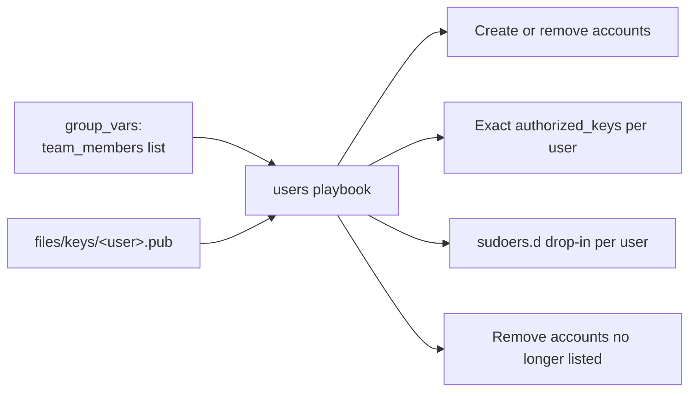

# Case Study: User and SSH Access

## Problem

A team of engineers needs individual, auditable SSH access to a fleet of servers — no shared accounts, no shared keys — and offboarding someone should be a one-line inventory change, not a manual per-server cleanup.

## Requirements

- One Linux account and one set of SSH keys per engineer
- Access granted per host group (`web` engineers don't automatically get `db`)
- Least-privilege sudo, reviewable per person
- **Revoking** access is a single change to inventory plus a re-run
- Keys that were removed from inventory are removed from servers, not just left behind
- Safe to re-run

## Architecture



## Repository Structure

```text
ansible-project/
├── inventories/production/
│   ├── hosts.ini
│   └── group_vars/
│       ├── all.yml
│       ├── web.yml
│       └── db.yml
├── playbooks/users.yml
└── roles/team_access/
    ├── defaults/main.yml
    ├── files/keys/
    │   ├── alice.pub
    │   ├── bob.pub
    │   └── carol.pub
    ├── tasks/main.yml
    └── templates/sudoers.j2
```

## Data Model

```yaml title="inventories/production/group_vars/web.yml"
---
team_members:
  - name: alice
    uid: 2001
    sudo: full
  - name: bob
    uid: 2002
    sudo: [/usr/bin/systemctl restart checkout, /usr/bin/journalctl -u checkout*]
```

```yaml title="inventories/production/group_vars/db.yml"
---
team_members:
  - name: alice
    uid: 2001
    sudo: full
  - name: carol
    uid: 2003
    sudo: none
```

Fixed `uid` values keep file ownership consistent across hosts, which matters for NFS mounts and restored backups.

A public key file can contain several keys (one per line) — for example, a laptop key and a hardware security key.

## Role

```yaml title="roles/team_access/defaults/main.yml"
---
team_access_group: engineers
team_access_shell: /bin/bash
```

```yaml title="roles/team_access/tasks/main.yml"
---
- name: Ensure the managed engineers group exists
  ansible.builtin.group:
    name: "{{ team_access_group }}"
    state: present

- name: Create an account per engineer
  ansible.builtin.user:
    name: "{{ item.name }}"
    uid: "{{ item.uid }}"
    groups: "{{ team_access_group }}"
    append: true
    shell: "{{ team_access_shell }}"
    password: "!"                     # locked password: key-only login
    update_password: on_create
    state: present
  loop: "{{ team_members }}"
  loop_control:
    label: "{{ item.name }}"

- name: Set each engineer's authorized keys exactly
  ansible.posix.authorized_key:
    user: "{{ item.name }}"
    key: "{{ lookup('ansible.builtin.file', 'keys/' ~ item.name ~ '.pub') }}"
    exclusive: true                   # remove any key not in the file
    state: present
  loop: "{{ team_members }}"
  loop_control:
    label: "{{ item.name }}"

- name: Grant sudo per engineer
  ansible.builtin.template:
    src: sudoers.j2
    dest: "/etc/sudoers.d/team-{{ item.name }}"
    owner: root
    group: root
    mode: "0440"
    validate: /usr/sbin/visudo -cf %s
  loop: "{{ team_members | rejectattr('sudo', 'equalto', 'none') | list }}"
  loop_control:
    label: "{{ item.name }}"

- name: Remove sudo for engineers who shouldn't have it
  ansible.builtin.file:
    path: "/etc/sudoers.d/team-{{ item.name }}"
    state: absent
  loop: "{{ team_members | selectattr('sudo', 'equalto', 'none') | list }}"
  loop_control:
    label: "{{ item.name }}"

# ---- Revocation: anyone in the managed group but no longer listed ----

- name: Read current members of the managed group
  ansible.builtin.getent:
    database: group
    key: "{{ team_access_group }}"

- name: Work out which accounts must be removed
  ansible.builtin.set_fact:
    team_access_to_remove: >-
      {{ (ansible_facts['getent_group'][team_access_group][2] | default('')).split(',')
         | reject('equalto', '')
         | difference(team_members | map(attribute='name')) }}

- name: Remove sudo for departed engineers
  ansible.builtin.file:
    path: "/etc/sudoers.d/team-{{ item }}"
    state: absent
  loop: "{{ team_access_to_remove }}"

- name: Remove departed engineers' accounts and home directories
  ansible.builtin.user:
    name: "{{ item }}"
    state: absent
    remove: true
    force: true                       # also kills their running processes
  loop: "{{ team_access_to_remove }}"
```

```jinja title="roles/team_access/templates/sudoers.j2"
# Managed by Ansible — do not edit by hand

{{ item.name }} ALL=(ALL) ALL


{{ item.name }} ALL=(root) {{ cmd }}


```

Engineers keep a password prompt for sudo (`ALL`, not `NOPASSWD: ALL`) and commands are limited where full root isn't needed. The **automation** account's sudo rules are managed separately — see the note in [Become and Permission Problems](../troubleshooting/02-become-and-permission-problems.md) about why command-restricted sudo doesn't work for Ansible itself.

## Playbook and Execution

```yaml title="playbooks/users.yml"
---
- name: Manage engineer access
  hosts: all
  become: true
  roles:
    - team_access
```

```bash
ansible-playbook -i inventories/production playbooks/users.yml --check --diff
ansible-playbook -i inventories/production playbooks/users.yml
```

## Offboarding: A One-Line Change

Bob leaves. Delete his entry from `group_vars/web.yml` (and his key file), open a pull request, merge, run:

```text
TASK [team_access : Work out which accounts must be removed] ***
ok: [web01]
ok: [web02]

TASK [team_access : Remove sudo for departed engineers] ***
changed: [web01] => (item=bob)
changed: [web02] => (item=bob)

TASK [team_access : Remove departed engineers' accounts and home directories] ***
changed: [web01] => (item=bob)
changed: [web02] => (item=bob)
```

The Git history of `group_vars/` is now the audit trail of who had access, when, and who approved it.

## Failure Scenario

A new engineer, dave, is added to `web.yml`, but nobody commits `files/keys/dave.pub`:

```text
TASK [team_access : Set each engineer's authorized keys exactly] ***
fatal: [web01]: FAILED! => {"msg": "An unhandled exception occurred while running the lookup plugin 'ansible.builtin.file'. ... could not locate file in lookup: keys/dave.pub"}
```

The account was created in the previous task but has no key. Because the key task failed before revocation logic ran, nobody else lost access — but a half-applied run is still untidy.

## Fix

Validate inputs before changing anything:

```yaml
- name: Check every engineer has a key file
  ansible.builtin.assert:
    that: lookup('ansible.builtin.fileglob', role_path ~ '/files/keys/' ~ item.name ~ '.pub') | length > 0
    fail_msg: "Missing files/keys/{{ item.name }}.pub"
    quiet: true
  loop: "{{ team_members }}"
  loop_control:
    label: "{{ item.name }}"
  delegate_to: localhost
  run_once: true
  become: false
```

Place it first in `tasks/main.yml`, and add the same check to CI so the pull request fails before merge.

## Production Hardening

- **Guard the automation account.** Never put the Ansible user in `team_members` or the managed group, so a revocation bug can't remove it.
- **Protect against an empty list.** A typo that empties `team_members` would remove everyone; assert a minimum length before the revocation tasks.
- **Consider SSH certificates** (a CA signing short-lived user certificates) or an identity provider integration (SSSD/LDAP) for larger organizations, where per-host `authorized_keys` doesn't scale.
- **Run on a schedule**, so manual changes (a key added by hand) are reverted by `exclusive: true`.

## Interview Questions

- How would you design this playbook so revoking one engineer's access is a single, safe re-run?
- Why individual accounts and keys instead of one shared "deploy" account for a whole team?
- What does `exclusive: true` on `authorized_key` change, and what's the risk?
- How do you make sure a revocation bug can't lock out the account Ansible uses?

## What You Learned

Idempotent **setup** is easy; idempotent **teardown** needs a way to discover what's on the host but no longer in the source of truth. A managed group plus `getent` and `difference` gives you that, and inventory in Git becomes an access audit log.

## Next

Continue to [Vault Secrets Case Study](05-vault-secrets-case-study.md).
