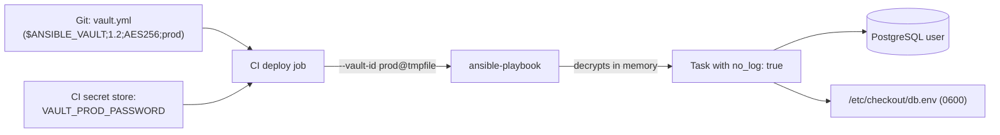

# Case Study: Vault Secrets

## Problem

A database password needs to reach a production playbook without ever existing in plaintext in the repository, in shell history, or in CI logs.

## Requirements

- The `checkout` application's database password is stored encrypted in Git
- Staging and production use **different** vault passwords
- Engineers can run staging locally; only the CI deploy job can decrypt production
- The password never appears in `-vvv` output, CI logs, or process listings
- Rotating the password is a documented, repeatable procedure

## Architecture



## Repository Structure

```text
ansible-project/
├── ansible.cfg
├── inventories/
│   ├── staging/group_vars/all/
│   │   ├── vars.yml
│   │   └── vault.yml          # vault ID: staging
│   └── production/group_vars/all/
│       ├── vars.yml
│       └── vault.yml          # vault ID: prod
├── playbooks/checkout_db.yml
├── roles/checkout_db/
│   ├── tasks/main.yml
│   └── templates/db.env.j2
└── .github/workflows/deploy.yml
```

## Step 1 — Create the Encrypted Files

Generate a strong password without it touching shell history, and encrypt it under the environment's vault ID:

```bash
openssl rand -base64 32 | tr -d '\n' | \
  ansible-vault encrypt_string --vault-id prod@prompt --stdin-name vault_checkout_db_password \
  > /tmp/prod-secret.yml
```

Create the production vault file and paste the value in (or encrypt the whole file):

```bash
ansible-vault create --vault-id prod@prompt inventories/production/group_vars/all/vault.yml
```

```yaml title="inventories/production/group_vars/all/vault.yml (as seen in ansible-vault view)"
---
vault_checkout_db_password: "Zq8m...generated...Rk="
```

The plaintext `vars.yml` wires it to the name roles use:

```yaml title="inventories/production/group_vars/all/vars.yml"
---
checkout_db_name: checkout
checkout_db_user: checkout
checkout_db_password: "{{ vault_checkout_db_password }}"
```

Repeat with `--vault-id staging@prompt` for staging. What Git stores:

```text
$ANSIBLE_VAULT;1.2;AES256;prod
39386531653762363937363866383830316235373066313466613037393065653864626162333162
...
```

## Step 2 — Configure Vault IDs

```ini title="ansible.cfg"
[defaults]
vault_id_match = True
```

Engineers keep the staging password in a local file readable only by them:

```bash
install -m 600 /dev/null ~/.vault/staging.txt
$EDITOR ~/.vault/staging.txt
ansible-playbook -i inventories/staging playbooks/checkout_db.yml --vault-id staging@~/.vault/staging.txt
```

Running against production without the `prod` password fails immediately and safely:

```text
ERROR! Attempting to decrypt but no vault secrets found matching vault ID 'prod'
```

## Step 3 — The Role: Use the Secret Without Leaking It

```yaml title="roles/checkout_db/tasks/main.yml"
---
- name: Create the application database user
  community.postgresql.postgresql_user:
    name: "{{ checkout_db_user }}"
    password: "{{ checkout_db_password }}"
    login_unix_socket: /var/run/postgresql
  become: true
  become_user: postgres
  no_log: true

- name: Render the application's database environment file
  ansible.builtin.template:
    src: db.env.j2
    dest: /etc/checkout/db.env
    owner: checkout
    group: checkout
    mode: "0600"
  no_log: true
  notify: Restart checkout
```

```jinja title="roles/checkout_db/templates/db.env.j2"
DATABASE_URL=postgresql://{{ checkout_db_user }}:{{ checkout_db_password | urlencode }}@db01.internal:5432/{{ checkout_db_name }}
```

`no_log: true` on the template task also hides the `--diff` output, which would otherwise print the rendered secret.

## Step 4 — Prove Nothing Leaks

Run the playbook at maximum verbosity against staging and search the output:

```bash
ansible-playbook -i inventories/staging playbooks/checkout_db.yml \
  --vault-id staging@~/.vault/staging.txt --diff -vvv 2>&1 | tee /tmp/run.log

ansible-vault view --vault-id staging@~/.vault/staging.txt \
  inventories/staging/group_vars/all/vault.yml | awk -F'"' '/password/ {print $2}' > /tmp/secret.txt

grep -F -f /tmp/secret.txt /tmp/run.log && echo "LEAKED" || echo "clean"
shred -u /tmp/secret.txt /tmp/run.log
```

The protected tasks show:

```text
TASK [checkout_db : Create the application database user] ***
changed: [db01] => {"censored": "the output has been hidden due to the fact that 'no_log: true' was specified for this result", "changed": true}
```

Make this check part of reviewing any new task that touches secrets.

## Step 5 — CI Deploy Without Exposure

```yaml title=".github/workflows/deploy.yml"
name: Deploy production
on:
  workflow_dispatch:

jobs:
  deploy:
    runs-on: [self-hosted, production-network]
    environment: production              # requires approval; holds the secrets
    steps:
      - uses: actions/checkout@v5

      - name: Install toolchain
        run: |
          pip install -r requirements-ci.txt
          ansible-galaxy collection install -r collections/requirements.yml -p ./collections

      - name: Run the playbook
        env:
          VAULT_PROD_PASSWORD: ${{ secrets.VAULT_PROD_PASSWORD }}
        run: |
          umask 077
          vault_file="$(mktemp)"
          trap 'rm -f "$vault_file"' EXIT
          printf '%s' "$VAULT_PROD_PASSWORD" > "$vault_file"
          ansible-playbook -i inventories/production playbooks/checkout_db.yml \
            --vault-id "prod@$vault_file"
```

Why each detail matters:

- The password goes through an **environment variable into a file**, never onto the command line, where any process on the runner could read it from the process list.
- `umask 077` and `mktemp` make the file private; `trap` deletes it even if the playbook fails.
- The `production` environment gates the job behind approval, and pull-request workflows can't read its secrets.
- CI log masking also redacts the secret if something prints it — a safety net, not the design.

## Failure Scenario

A teammate adds a debugging task while investigating a connection problem:

```yaml
- name: Show connection string
  ansible.builtin.debug:
    msg: "{{ lookup('ansible.builtin.template', 'db.env.j2') }}"
```

The CI log masks the exact password string, but the local staging run prints it in full to the terminal and shell scrollback, and the task gets committed.

## Fix

- Remove the task, then **rotate the staging password** — exposure in a terminal or log counts as a leak.
- Add an `ansible-lint` custom rule or a CI grep that rejects `debug` tasks referencing `*_password`, `*_token`, or `vault_*` variables.
- Debug connectivity with non-secret parts of the configuration (host, port, user) instead.

## Rotation Procedure

1. Generate a new password and update `vault.yml` with `ansible-vault edit --vault-id prod@...`.
2. Merge the change and run the deploy — `postgresql_user` sets the new password, the template updates `db.env`, the handler restarts the app.
3. Confirm the application is healthy.
4. If the **vault password** itself was exposed, `ansible-vault rekey` the files and update the CI secret — and remember old ciphertext in Git history remains decryptable with the old vault password, so rotate the secrets it protected too.

## Production Hardening

- Move toward an external secret manager and fetch values at run time; see [Lookup and Filter Plugins](../advanced-execution/04-lookup-and-filter-plugins.md#pulling-secrets-at-run-time). Then the only secret in Ansible Vault is the credential to reach that manager.
- Use PostgreSQL SCRAM authentication and TLS for the application connection.
- Add a pre-commit hook that refuses any `vault.yml` not starting with `$ANSIBLE_VAULT`.
- Full reference: [Secrets and Vault](../production-engineering/03-secrets-and-vault.md).

## Interview Questions

- How would you structure vault passwords so a staging compromise can't expose production secrets?
- Where does the vault password itself live in a CI pipeline, if it can't be committed?
- Why is `no_log: true` needed on a `template` task that renders a secret, even if the task has no secret arguments?
- A secret appeared in a log. What do you do, in order?

## What You Learned

Encryption at rest is only one of three problems. The other two — **how the key reaches the run** and **what the run prints** — are where secrets actually leak, and each needs its own control.

## Next

Continue to [Dynamic Inventory Case Study](06-dynamic-inventory-case-study.md).
