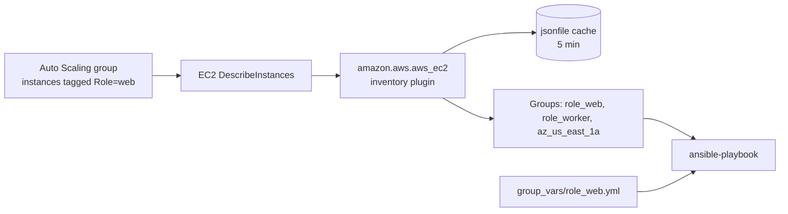

# Case Study: Dynamic Inventory

## Problem

An autoscaling web tier means a static inventory file is stale within hours — inventory needs to be sourced live from AWS, grouped by tag, every run.

## Requirements

- Include only **running** instances tagged `Environment=production`
- Build Ansible groups automatically from the `Role` tag (`role_web`, `role_worker`)
- Connect over private IPs through the VPC, not public IPs
- Keep hand-written group variables (`group_vars/role_web.yml`) working unchanged
- Read-only AWS credentials, no long-lived keys in the repository
- Avoid calling the AWS API on every single run

## Architecture



## Repository Structure

```text
ansible-project/
├── ansible.cfg
├── inventories/production/
│   ├── aws_ec2.yml               # filename MUST end in aws_ec2.yml or aws_ec2.yaml
│   └── group_vars/
│       ├── all.yml
│       ├── role_web.yml
│       └── role_worker.yml
└── playbooks/site.yml
```

## Prerequisites

```bash
ansible-galaxy collection install amazon.aws
pip install boto3 botocore
aws sts get-caller-identity       # confirm which credentials the control node is using
```

## The Inventory Config, Field by Field

```yaml title="inventories/production/aws_ec2.yml"
plugin: amazon.aws.aws_ec2

regions:
  - us-east-1

filters:
  tag:Environment: production
  instance-state-name: running

hostnames:
  - tag:Name
  - private-dns-name

keyed_groups:
  - key: tags.Role
    prefix: role
  - key: placement.availability_zone
    prefix: az

groups:
  canary: "'canary' in (tags.Deployment | default(''))"

compose:
  ansible_host: private_ip_address
  ec2_instance_type: instance_type

cache: true
cache_plugin: ansible.builtin.jsonfile
cache_connection: ~/.ansible/inventory_cache
cache_timeout: 300
```

| Field | What it does |
|---|---|
| `plugin` | Selects the plugin; the file name must also end in `aws_ec2.yml` for auto-detection |
| `regions` | Limits API calls to listed regions (otherwise every region is queried) |
| `filters` | EC2 API filters, applied server-side — excluded instances never reach Ansible |
| `hostnames` | Inventory name preference: the `Name` tag, then private DNS as fallback |
| `keyed_groups` | Creates a group per distinct value: `Role=web` becomes `role_web` |
| `groups` | Conditional groups from a Jinja2 expression on instance data |
| `compose` | Sets host variables from instance data; here, connect via the private IP |
| `cache*` | Stores results for 5 minutes, shared across runs on this control node |

## Verify What the Plugin Resolved

Always look before running a playbook:

```bash
ansible-inventory -i inventories/production/aws_ec2.yml --graph
```

```text
@all:
  |--@ungrouped:
  |--@aws_ec2:
  |  |--web-7f3a
  |  |--web-91c2
  |  |--worker-2b8e
  |--@role_web:
  |  |--web-7f3a
  |  |--web-91c2
  |--@role_worker:
  |  |--worker-2b8e
  |--@az_us_east_1a:
  |  |--web-7f3a
  |  |--worker-2b8e
  |--@az_us_east_1b:
  |  |--web-91c2
```

Check the variables Ansible will use for one host, including `group_vars` merged in:

```bash
ansible-inventory -i inventories/production --host web-7f3a | jq '{ansible_host, ec2_instance_type, nginx_worker_processes}'
```

Pointing `-i` at the **directory** loads both the plugin file and `group_vars/`.

## Playbook

```yaml title="playbooks/site.yml"
---
- name: Configure web instances
  hosts: role_web
  become: true
  serial: "30%"
  roles:
    - nginx
    - app_checkout

- name: Configure workers
  hosts: role_worker
  become: true
  roles:
    - app_worker
```

```bash
ansible-playbook -i inventories/production playbooks/site.yml
```

Tag a new Auto Scaling group `Role=web`, and its instances are configured on the next run with no inventory edit.

## Least-Privilege IAM

The plugin only reads. Give the control node's role exactly that:

```json title="iam-policy-ansible-inventory.json"
{
  "Version": "2012-10-17",
  "Statement": [
    {
      "Sid": "AnsibleInventoryReadOnly",
      "Effect": "Allow",
      "Action": [
        "ec2:DescribeInstances",
        "ec2:DescribeRegions"
      ],
      "Resource": "*"
    }
  ]
}
```

Attach it to an **instance profile** on a controller, or to a CI role assumed through OIDC. Never commit access keys, and don't reuse the credentials that Terraform uses to create infrastructure — an inventory credential that can terminate instances is a needless risk.

## Caching Behavior

- The first run calls the API and writes the cache; runs within 5 minutes read the cache instead.
- New instances launched within that window are missed until the cache expires.
- Force a refresh when you know the fleet just changed:

```bash
ansible-playbook -i inventories/production playbooks/site.yml --flush-cache
```

## Failure Scenario

The playbook suddenly matches no hosts:

```text
[WARNING]: Could not match supplied host pattern, ignoring: role_web
PLAY [Configure web instances] ***
skipping: no hosts matched
```

`--graph` shows the instances under `@aws_ec2` but no `@role_web` group. A new Auto Scaling launch template set the tag as `role=web` (lowercase key). Tag keys are case-sensitive, so `tags.Role` is undefined for those instances, and `keyed_groups` silently skips them.

## Fix

Make the problem loud instead of silent:

```yaml
keyed_groups:
  - key: tags.Role | default('missing')
    prefix: role
strict: false
```

Instances without the tag now appear in `role_missing`. Add a CI or scheduled check that fails if that group is non-empty:

```bash
ansible-inventory -i inventories/production/aws_ec2.yml --list | jq -e '.role_missing.hosts | length == 0'
```

And enforce the tag at the source with an AWS Config rule or tag policy, so the launch template can't be created without `Role`.

## Production Hardening

- Use **SSM Session Manager** (`amazon.aws.aws_ssm` connection) where instances have no SSH ingress; see [Connection Plugins](../advanced-execution/03-connection-plugins.md).
- Combine with static inventory for non-AWS hosts by placing both files in the same inventory directory.
- Cover multi-account estates with `iam_role_arn` per account, or one inventory file per account.
- Background on inventory plugins: [Dynamic Inventory](../advanced-execution/05-dynamic-inventory.md).

## Interview Questions

- How does `keyed_groups` turn an EC2 tag into an Ansible inventory group automatically?
- What IAM permissions does a dynamic inventory plugin actually need, and why should they be read-only?
- What's the trade-off of inventory caching in an autoscaling environment?
- A playbook matches no hosts after a tagging change. How do you diagnose and prevent it?

## What You Learned

Dynamic inventory moves the source of truth from a file to your cloud's metadata — which makes **tag hygiene** part of your configuration management. Verify what the plugin resolved, and make missing tags visible instead of silently ignored.

## Next

Continue to [API Automation with URI](07-api-automation-with-uri.md).
