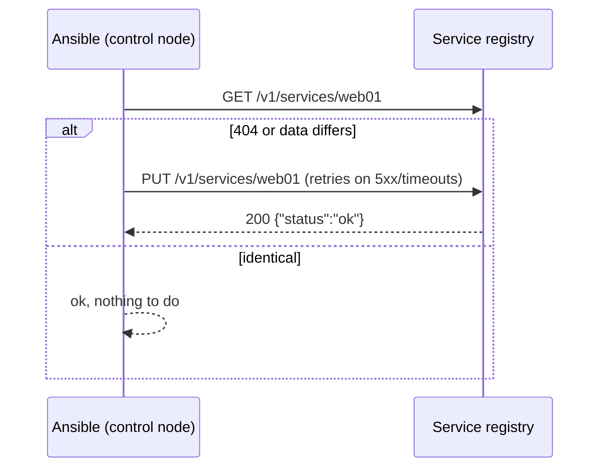

# Case Study: API Automation with URI

## Problem

Every newly deployed host needs to register itself with an internal service registry over HTTP as the last step of provisioning, and deregister cleanly on decommission.

## Requirements

- Register the host, its role, and its address with the registry's REST API
- **Idempotent**: re-running doesn't create duplicates or report `changed` when nothing changed
- Tolerate brief registry outages without failing the whole deploy
- Treat an HTTP 200 with an error in the JSON body as a failure
- Keep the API token out of logs
- Deregister on decommission, and treat "already gone" as success

## The Registry API

```text
GET    /v1/services/{host}     200 → registration JSON, 404 → not registered
PUT    /v1/services/{host}     create or replace; 200/201 → {"status": "ok"|"error", ...}
DELETE /v1/services/{host}     204 → removed, 404 → wasn't registered
```

Some failures return HTTP 200 with `{"status": "error", "message": "..."}` — a real-world quirk the playbook must handle.

## Architecture



## Repository Structure

```text
ansible-project/
├── playbooks/
│   ├── register.yml
│   └── deregister.yml
└── roles/registry_client/
    ├── defaults/main.yml
    └── tasks/
        ├── register.yml
        └── deregister.yml
```

## Role

```yaml title="roles/registry_client/defaults/main.yml"
---
registry_url: https://registry.internal.example.com
registry_token: "{{ vault_registry_token }}"
registry_retries: 5
registry_delay: 6
registry_payload:
  host: "{{ inventory_hostname }}"
  address: "{{ ansible_facts['default_ipv4']['address'] }}"
  role: "{{ group_names | select('match', '^role_') | first | default('unassigned') }}"
  environment: "{{ deploy_environment }}"
```

```yaml title="roles/registry_client/tasks/register.yml"
---
- name: Read the current registration
  ansible.builtin.uri:
    url: "{{ registry_url }}/v1/services/{{ inventory_hostname }}"
    method: GET
    headers:
      Authorization: "Bearer {{ registry_token }}"
    status_code: [200, 404]
    timeout: 10
  register: registry_current
  delegate_to: localhost
  become: false
  no_log: true
  retries: "{{ registry_retries }}"
  delay: "{{ registry_delay }}"
  until: registry_current.status in [200, 404]

- name: Decide whether the registration needs updating
  ansible.builtin.set_fact:
    registry_needs_update: >-
      {{ registry_current.status == 404
         or (registry_current.json | default({}) | dict2items
             | selectattr('key', 'in', registry_payload.keys()) | items2dict) != registry_payload }}

- name: Register or update this host
  ansible.builtin.uri:
    url: "{{ registry_url }}/v1/services/{{ inventory_hostname }}"
    method: PUT
    headers:
      Authorization: "Bearer {{ registry_token }}"
    body_format: json
    body: "{{ registry_payload }}"
    status_code: [200, 201]
    timeout: 10
  register: registry_put
  delegate_to: localhost
  become: false
  no_log: true
  retries: "{{ registry_retries }}"
  delay: "{{ registry_delay }}"
  until: registry_put.status in [200, 201] and (registry_put.json.status | default('ok')) == 'ok'
  failed_when: >-
    registry_put.status not in [200, 201]
    or (registry_put.json.status | default('ok')) != 'ok'
  changed_when: true
  when: registry_needs_update | bool

- name: Show a non-secret summary
  ansible.builtin.debug:
    msg: "{{ inventory_hostname }} registered as {{ registry_payload.role }} at {{ registry_payload.address }}"
  when: registry_needs_update | bool
```

How the requirements map to the code:

- **Idempotency** — `GET` first; the `PUT` only runs when the host is missing or differs. Only the keys we manage are compared, so server-added fields (timestamps, IDs) don't cause false changes.
- **Transient outages** — `retries`/`until` repeat the request on connection errors and unexpected status codes, up to 5 × 6 s = 30 s.
- **Errors in a 200 body** — `failed_when` checks both the HTTP status and the body's own `status` field.
- **Secrets** — `no_log: true` on every task that carries the `Authorization` header, because `uri` returns request details in its result.
- **Where it runs** — `delegate_to: localhost` calls the registry from the control node, which has network access to it; the managed hosts don't need to.

```yaml title="roles/registry_client/tasks/deregister.yml"
---
- name: Remove this host from the registry
  ansible.builtin.uri:
    url: "{{ registry_url }}/v1/services/{{ inventory_hostname }}"
    method: DELETE
    headers:
      Authorization: "Bearer {{ registry_token }}"
    status_code: [204, 404]
    timeout: 10
  register: registry_delete
  delegate_to: localhost
  become: false
  no_log: true
  retries: "{{ registry_retries }}"
  delay: "{{ registry_delay }}"
  until: registry_delete.status in [204, 404]
  changed_when: registry_delete.status == 204
```

`404` counts as success but not as a change: the desired state, "not registered," already holds.

## Playbooks

```yaml title="playbooks/register.yml"
---
- name: Register hosts with the service registry
  hosts: all
  gather_facts: true
  tasks:
    - name: Register
      ansible.builtin.include_role:
        name: registry_client
        tasks_from: register
```

```yaml title="playbooks/deregister.yml"
---
- name: Deregister decommissioned hosts
  hosts: "{{ target }}"
  gather_facts: false
  tasks:
    - name: Deregister
      ansible.builtin.include_role:
        name: registry_client
        tasks_from: deregister
```

```bash
ansible-playbook -i inventories/production playbooks/register.yml
ansible-playbook -i inventories/production playbooks/deregister.yml -e target=web-91c2
```

## Expected Output (Second Run)

```text
TASK [registry_client : Read the current registration] ***
ok: [web01]
ok: [web02]

TASK [registry_client : Register or update this host] ***
skipping: [web01]
skipping: [web02]

PLAY RECAP ***
web01 : ok=3 changed=0 unreachable=0 failed=0 skipped=2
web02 : ok=3 changed=0 unreachable=0 failed=0 skipped=2
```

## Proving the Token Stays Hidden

```bash
ansible-playbook -i inventories/staging playbooks/register.yml -vvv 2>&1 | grep -c "Bearer" || true
# 0
```

With `no_log`, the task results are replaced by a censored message, so neither the header nor the response body appears even at `-vvv`.

## Failure Scenario

During a registry deploy, requests return `503` for about 20 seconds. The first version of this role had no retries, and 40 web hosts in the middle of a rolling deployment all failed their final step — leaving them configured and serving traffic, but missing from the registry, so the load balancer that reads the registry never sent them traffic.

## Fix

The `retries`/`until` shown above absorb the outage. Two more safeguards:

- Put the registration in an [`always:` section](../playbook-engineering/01-blocks-rescue-always.md) or a final play that runs even if an earlier post-deploy check fails, so hosts aren't left half-registered.
- Add a scheduled reconciliation run of `register.yml` — because it's idempotent, running it every 15 minutes repairs any host that missed registration for any reason.

## Production Hardening

- Validate the registry's TLS certificate (`validate_certs` defaults to true — never disable it); supply an internal CA with `ca_path`.
- Prefer a short-lived token fetched at run time from a secret manager over a long-lived Vault-encrypted token.
- If the API becomes complex (pagination, auth refresh), write a small custom module — see [Build a Custom Module](../build-your-own/01-build-a-custom-module.md).
- `uri` fundamentals are in [URI and API Automation](../modules/04-uri-and-api-automation.md).

## Interview Questions

- How would you make an API-registration task resilient to a brief, transient outage of the target service?
- Why check the response body's own status field in addition to the HTTP status code?
- How do you make a `PUT`-based registration report `changed` only when something actually changed?
- Why does a `uri` task sending an auth header need `no_log`?

## What You Learned

HTTP automation needs the same idempotency discipline as file management: **read, compare, write only on difference**. Resilience comes from retries plus periodic reconciliation, not from hoping the API is always up.

## Next

Continue to [Troubleshooting](../troubleshooting/index.md).
