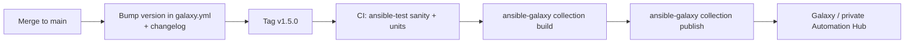

# Publishing Collections

## What You'll Learn

- How to build a release artifact from a collection directory
- How to publish to public Galaxy or a private Automation Hub
- How to version a collection so other teams can pin to it safely
- A CI pipeline that tests, builds, and publishes on every tag

## Why This Exists

A collection other teams depend on needs the same release discipline as any library: tested builds, meaningful version numbers, a changelog, and a publishing process that doesn't depend on one person's laptop.

## The Release Flow



## 1. Build

From the collection root (where `galaxy.yml` lives):

```bash
ansible-galaxy collection build --output-path dist/
# Created collection for acme.platform at dist/acme-platform-1.5.0.tar.gz
```

The tarball contains everything not excluded by `build_ignore`, plus a generated `MANIFEST.json` and `FILES.json` with checksums. Inspect it before publishing the first time:

```bash
tar -tzf dist/acme-platform-1.5.0.tar.gz | head -30
```

Test the artifact exactly as a consumer would:

```bash
ansible-galaxy collection install dist/acme-platform-1.5.0.tar.gz -p /tmp/verify-install --force
ANSIBLE_COLLECTIONS_PATH=/tmp/verify-install ansible-doc acme.platform.feature_flag
```

## 2. Test Before Publishing

`ansible-test` must run from inside an `ansible_collections/<namespace>/<name>` path:

```bash
mkdir -p /tmp/src/ansible_collections/acme
cp -r . /tmp/src/ansible_collections/acme/platform
cd /tmp/src/ansible_collections/acme/platform

ansible-test sanity --docker default
ansible-test units --docker default
```

Sanity tests check module documentation, argument specs, Python compatibility, and import errors — the same checks Automation Hub certification runs. Wire them into pull requests too; see [CI/CD and Linting](../production-engineering/06-cicd-and-linting.md).

## 3. Publish

### To public Galaxy

1. Sign in to [galaxy.ansible.com](https://galaxy.ansible.com/), create or claim your namespace, and generate an API token.
2. Publish:

```bash
ansible-galaxy collection publish dist/acme-platform-1.5.0.tar.gz --token "$GALAXY_API_TOKEN"
```

### To a private Automation Hub

```ini title="ansible.cfg"
[galaxy]
server_list = private_hub

[galaxy_server.private_hub]
url = https://hub.example.com/api/galaxy/content/inbound-acme/
```

```bash
export ANSIBLE_GALAXY_SERVER_PRIVATE_HUB_TOKEN="$HUB_TOKEN"
ansible-galaxy collection publish dist/acme-platform-1.5.0.tar.gz --server private_hub
```

Private Automation Hub typically puts uploads into an approval queue before they appear in the published repository consumers install from. Artifact repositories such as Pulp-based hubs, and some Nexus or Artifactory setups, can also host collection indexes.

| | Public Galaxy | Private Automation Hub |
|---|---|---|
| Audience | Anyone | Your organization |
| Access control | Public read; namespace owners publish | Per-namespace, per-user permissions |
| Approval workflow | None | Optional review before publish |
| Good for | Open-source content | Internal modules and roles, mirrored certified content |

!!! warning "Versions are immutable"
    Once `1.5.0` is published it can't be replaced. A broken release is fixed by publishing `1.5.1`, which is exactly why testing the built artifact first matters.

## 4. Version Deliberately

Consumers pin ranges like `>=1.4.0,<2.0.0`, trusting that anything below `2.0.0` won't break them.

| Change | Bump |
|---|---|
| Remove a module or parameter; rename; change a default that changes behavior | **Major** |
| New module, new optional parameter, new role | **Minor** |
| Bug fix, docs fix | **Patch** |
| Planning a removal | Deprecate in a minor release via `meta/runtime.yml`, remove in the next major |

Keep a changelog consumers can scan. Many collections generate it from small fragment files with `antsibull-changelog`:

```yaml title="changelogs/fragments/42-feature-flag-owner.yml"
minor_changes:
  - feature_flag - add the optional ``owner`` parameter.
```

## 5. Publish From CI

```yaml title=".github/workflows/release.yml"
name: Release collection
on:
  push:
    tags: ["v*"]

jobs:
  release:
    runs-on: ubuntu-latest
    defaults:
      run:
        working-directory: ansible_collections/acme/platform
    steps:
      - uses: actions/checkout@v7
        with:
          path: ansible_collections/acme/platform

      - uses: actions/setup-python@v7
        with:
          python-version: "3.12"

      - name: Install ansible-core
        run: pip install ansible-core

      - name: Check the tag matches galaxy.yml
        run: |
          version=$(python -c "import yaml; print(yaml.safe_load(open('galaxy.yml'))['version'])")
          test "v${version}" = "${GITHUB_REF_NAME}"

      - name: Sanity tests
        run: ansible-test sanity --docker default

      - name: Build
        run: ansible-galaxy collection build --output-path dist/

      - name: Publish
        run: ansible-galaxy collection publish dist/*.tar.gz --token "${{ secrets.GALAXY_API_TOKEN }}"
```

The tag check prevents the common mistake of tagging `v1.5.0` while `galaxy.yml` still says `1.4.0`.

The full build-from-zero workflow, including a custom module and role packaged together, is in [Build a Collection From Zero](../build-your-own/03-build-a-collection-from-zero.md).

## Common Mistakes

- Publishing a breaking module argument change as a patch version instead of a major version bump.
- No CI validation (`ansible-test sanity`) before publishing — see [CI/CD and Linting](../production-engineering/06-cicd-and-linting.md).
- Running `ansible-test` outside an `ansible_collections/<namespace>/<name>` directory and getting confusing path errors.
- Publishing from a laptop with a personal token, so nobody else can release and nothing records what was built.
- Tagging a release without bumping `version` in `galaxy.yml`.

## Interview Questions

- How would you version a collection so consumers can safely pin to a major version?
- What's the difference between publishing to public Galaxy and a private Automation Hub?
- A published version has a bug. What are your options?
- What does `ansible-test sanity` check, and why run it before every release?

## Next

Continue to [Build Your Own](../build-your-own/index.md).
