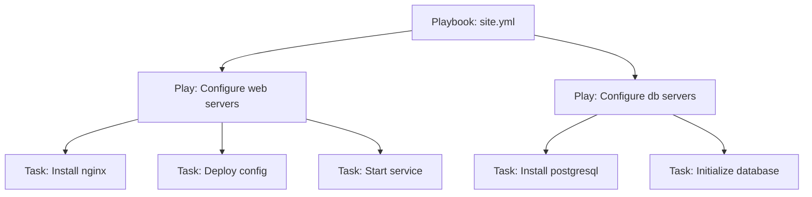

# Playbooks, Plays, and Tasks

## What You'll Learn

- The three-level structure: playbook → play(s) → task(s)
- The keywords that decide what runs, on which hosts, in what order
- How this scales past a single flat task list

## Mental Model



- A **playbook** is a YAML file containing one or more plays.
- A **play** maps a group of hosts to a set of tasks (and optionally roles) — it's the unit that has its own `hosts:`, `become:`, and `vars:`.
- A **task** calls exactly one module with specific arguments.

## Minimal Example

```yaml
---
- name: Configure web servers
  hosts: web
  become: true
  tasks:
    - name: Install nginx
      ansible.builtin.package:
        name: nginx
        state: present
```

## Practical Example — Multiple Plays, Ordering Keywords

```yaml
---
- name: Preflight checks on every host
  hosts: all
  tasks:
    - name: Refuse to continue if / has less than 2 GB free
      ansible.builtin.assert:
        that: (ansible_facts['mounts'] | selectattr('mount', 'equalto', '/') | first).size_available > 2 * 1024**3
        fail_msg: "Less than 2 GB free on / — clean up before deploying"

- name: Configure web servers
  hosts: web
  become: true
  pre_tasks:
    - name: Refresh the apt cache if it's older than an hour
      ansible.builtin.apt:
        update_cache: true
        cache_valid_time: 3600
      when: ansible_facts['os_family'] == 'Debian'
  roles:
    - nginx
  post_tasks:
    - name: Confirm nginx responds
      ansible.builtin.uri:
        url: "http://localhost"
        status_code: 200

- name: Configure database servers
  hosts: db
  become: true
  roles:
    - postgresql
```

- The preflight play checks a real condition and fails with a clear message. Running `df -h` and registering the output would never stop anything.
- `pre_tasks` / `post_tasks` run before/after `roles:`, regardless of what's inside the role — useful for "always check X before this role runs" logic that shouldn't live inside the role itself.
- `update_cache` belongs to the distribution-specific module (`apt`, `dnf`). The generic `package` module only installs and removes packages.
- Plays run **in order**, top to bottom, each against its own `hosts:` pattern.
- Within a play, by default (the `linear` strategy), Ansible runs each task on **all** targeted hosts before moving to the next task — not host-by-host sequentially. See [Forks, Serial, Strategy](../advanced-execution/01-forks-serial-strategy-throttle.md).

## Key Play-Level Keywords

| Keyword | Purpose |
|---|---|
| `hosts` | Target pattern (see [Inventory](01-inventory.md)) |
| `become` | Escalate privilege for this play's tasks |
| `vars` | Play-scoped variables |
| `gather_facts` | Whether to run the implicit `setup` module first (default: `true`) |
| `pre_tasks` / `tasks` / `post_tasks` | Ordered task groups around `roles:` |
| `serial` | Batch size for rolling execution — see [Advanced Execution](../advanced-execution/index.md) |
| `strategy` | `linear` (default) vs. `free` — see [Advanced Execution](../advanced-execution/index.md) |

## Common Mistakes

- Assuming tasks run host-by-host from top to bottom — the default is task-by-task, across the whole batch of hosts, which surprises people used to imperative scripting.
- Putting everything in one giant play instead of splitting by host group and responsibility.
- Setting `gather_facts: true` (the default) on plays that never use facts — wasted time on every run at scale. See [Performance](../production-engineering/05-performance.md).

## Interview Questions

- What's the difference between a playbook, a play, and a task?
- What do `pre_tasks` and `post_tasks` let you do that `tasks` alone can't?
- Does Ansible run task-by-task or host-by-host by default?

## Next

Continue to [Modules](04-modules.md) — the thing every task actually calls.
