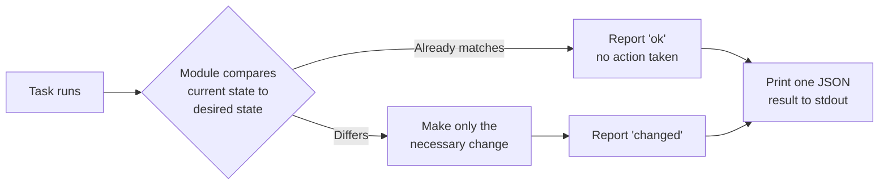

# Modules

## What You'll Learn

- What a module actually is, mechanically
- The check-then-act contract that makes idempotency possible
- Why fully-qualified module names (FQCNs) matter

## Mental Model

A task is a call to exactly one module with arguments. The module is where all the real work happens — a playbook is just an ordered list of module calls plus control flow around them.



This **check-then-act** pattern is the entire mechanism behind idempotency (see [Idempotency](11-idempotency.md) for the full mental model) — and it's implemented per-module, not by the playbook. A task calling a module that doesn't check first (`command`, `shell`) is *not* automatically idempotent just because it's inside a playbook.

## Minimal Example

```yaml
- name: Install nginx
  ansible.builtin.package:
    name: nginx
    state: present
```

`ansible.builtin.package` is the **fully qualified collection name (FQCN)** — `namespace.collection.module`. `ansible.builtin` ships as part of `ansible-core` itself.

## Why FQCNs, Not Short Names

```yaml
# Ambiguous — which "copy" is this, if multiple collections define one?
- copy:
    src: app.conf
    dest: /etc/app.conf

# Unambiguous, and what production playbooks should use
- ansible.builtin.copy:
    src: app.conf
    dest: /etc/app.conf
```

As more collections get installed, short names can collide or resolve to the wrong implementation depending on collection search order. FQCNs are explicit, self-documenting in a diff, and unaffected by what else happens to be installed — always prefer them in anything meant to run in CI or be reviewed by a teammate.

## Module Categories You'll Reach for Constantly

| Category | Examples |
|---|---|
| Package management | `ansible.builtin.package`, `apt`, `dnf`, `yum` |
| Service management | `ansible.builtin.service`, `systemd_service` |
| Files | `copy`, `template`, `file`, `stat`, `lineinfile`, `blockinfile` |
| Users | `user`, `group`, `authorized_key` |
| Execution | `command`, `shell`, `raw`, `script` — see the [dedicated comparison](../modules/01-command-vs-shell-vs-raw-vs-script.md) |
| Networking/API | `uri`, `get_url` |
| Debugging | `debug`, `assert`, `fail` |

Full category-by-category reference: [Modules](../modules/index.md).

## Common Mistakes

- Reaching for `shell`/`command` out of habit for something a purpose-built module already does — see the decision guide in [Module Decision Trees](../modules/02-module-decision-trees.md).
- Assuming every module reports `changed` accurately by default — a poorly written third-party module can lie about this; verify with `--check` on anything unfamiliar.
- Using short module names in shared playbooks instead of FQCNs.

## Interview Questions

- What is the check-then-act pattern, and which layer of Ansible implements it — the playbook or the module?
- Why does Ansible recommend fully-qualified collection names for modules?

## Next

Continue to [Variables (Overview)](05-variables-overview.md).
