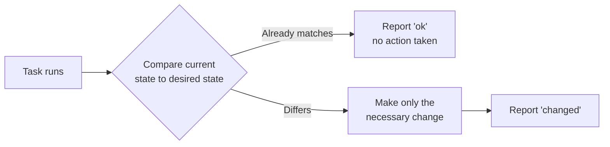

# Part 5 — Declarative vs. Imperative

This is the single most important mental model in the entire series. Idempotency, reconciliation, and "safe to re-run" all trace back to the declarative/imperative distinction covered here.

## What You Will Learn

- The difference between imperative, declarative, and procedural automation
- What "idempotent" actually means, in terms you can check by running something twice
- Why Ansible modules — not playbooks — are where idempotency is actually implemented
- How to spot a non-idempotent task on sight, and fix it

## Theory

### Why This Exists

Almost every confusing Ansible behavior a beginner hits — "why didn't this task change anything the second time?", "why does my playbook say `changed` every single run?" — is really a declarative-model question in disguise. Get this mental model right once, and a large fraction of Ansible's behavior stops being surprising.

### Mental Model

> **Imperative** automation says *"do these steps, in this order."* **Declarative** automation says *"make the system look like this"* — and lets the tool figure out what, if anything, needs to change to get there.

A useful way to hold both ideas at once: imperative automation is a recipe. Declarative automation is a photograph of the finished dish — run it once, or run it a hundred times, you just keep getting the same dish.

Three related terms worth pinning down precisely:

- **Desired state** — the declarative target description itself ("package `nginx` is present, service `nginx` is running").
- **Idempotency** — running the same operation multiple times produces the same end state as running it once, with no unwanted side effects on repeat runs.
- **State reconciliation** — the loop of *compare current state to desired state, then act only on the difference* — the mechanism that makes idempotency possible in the first place.

**Procedural** automation is a related but distinct axis — control flow (loops, conditionals, functions) that can exist inside either an imperative or a declarative system. Ansible playbooks are declarative *at the task level* (each task describes a desired state) while still offering procedural constructs (`loop`, `when`) to control which tasks run and how many times.

### How It Works

Imperative shell scripting was the default automation style because it's how programming already worked — a sequential list of commands. Declarative configuration management (starting with CFEngine's "promise theory" in 1993) was a deliberate departure that took years to become mainstream operational practice, because it requires each unit of work to know how to check its own state before acting, not just execute blindly.

That's exactly what an Ansible **module** does. Most modules follow a **check-then-act** pattern:



This is why **modules**, not playbooks, are where idempotency is actually implemented. A playbook just lists which modules to call with which arguments — whether a given call is safe to re-run depends entirely on whether that module does the check in the diagram above.

Two other tools worth contrasting, since the site covers both elsewhere:

- **Terraform** — a state file plus plan/apply diffing against a provider API is a *stronger, more explicit* reconciliation model than Ansible's per-task, stateless checks: Terraform can tell you *before* you apply exactly what will change.
- **Kubernetes** — continuous reconciliation via controllers/operators watching a desired-state object (a `Deployment` spec) and constantly correcting drift — declarative *and* continuously enforced, unlike Ansible's run-on-demand model.

| | Model | When it reconciles |
|---|---|---|
| Shell script | Imperative | Never — it just re-executes the same steps |
| Ansible | Declarative, per-task | Only when you run the playbook |
| Terraform | Declarative, whole-plan | When you run `plan`/`apply` |
| Kubernetes | Declarative, continuous | Constantly, via a running controller |

## Example

Here is the same intent — "make sure this line exists in a config file" — written two ways. Both are real, both run.

**Non-idempotent (`shell`):**

```yaml
# minimal-shell.yml
- name: Add a max_connections setting (naively)
  hosts: web
  tasks:
    - name: Append max_connections to app config
      ansible.builtin.shell: echo "max_connections = 100" >> /etc/app/app.conf
```

**Idempotent (`lineinfile`):**

```yaml
# minimal-lineinfile.yml
- name: Ensure max_connections setting is present
  hosts: web
  tasks:
    - name: Ensure max_connections line exists in app config
      ansible.builtin.lineinfile:
        path: /etc/app/app.conf
        line: "max_connections = 100"
        create: true
```

## Line-by-Line Explanation

`minimal-shell.yml`:

- `ansible.builtin.shell` runs its argument as a literal shell command on the managed node, every single time the task executes — Ansible has no way to know what `echo ... >> file` is "supposed" to accomplish, so it can't check anything first.
- `>>` appends. Run this playbook twice and the line appears twice; run it ten times and it appears ten times.

`minimal-lineinfile.yml`:

- `ansible.builtin.lineinfile` is a real module with a contract: "ensure a line matching this content exists in this file." Before writing anything, it reads the file and checks whether that exact line is already present.
- `path` — the file to manage.
- `line` — the exact line content that should exist. `lineinfile` also supports a `regexp` argument to *replace* an existing line that merely matches a pattern, rather than only appending — not needed here, but worth knowing it exists.
- `create: true` — create the file if it doesn't exist yet, instead of failing.

## Expected Output

Running `minimal-shell.yml` twice:

```text
$ ansible-playbook minimal-shell.yml
TASK [Append max_connections to app config] ***
changed: [web1]

$ ansible-playbook minimal-shell.yml
TASK [Append max_connections to app config] ***
changed: [web1]        # ← changed again! the line is now duplicated
```

Running `minimal-lineinfile.yml` twice:

```text
$ ansible-playbook minimal-lineinfile.yml
TASK [Ensure max_connections line exists in app config] ***
changed: [web1]

$ ansible-playbook minimal-lineinfile.yml
TASK [Ensure max_connections line exists in app config] ***
ok: [web1]              # ← nothing to do, state already matches
```

That single word — `changed` versus `ok` on the second run — is the entire declarative model made visible in one line of terminal output.

## Practical

Picture a real onboarding task: three new web servers need a `max_connections` tuning value added to an existing, hand-edited `/etc/app/app.conf` that's slightly different on each host. A teammate wrote the `shell` version above, ran it during a maintenance window, and it worked. Two weeks later, a second engineer — not knowing the first run happened — re-runs "the same playbook" to add a *different* setting, using the same append-only pattern. Now some hosts have the line once, some have it twice, and nobody notices until a config parser starts rejecting duplicate keys in production.

The `lineinfile` version has no such failure mode: it can be run during every maintenance window, by anyone, for the rest of the project's life, and it will only ever change a host that doesn't already match.

## Common Mistakes

- Assuming `shell`/`command` module tasks are automatically idempotent — they are not. They run every time, unconditionally, unless you add a guard yourself.
- Writing playbooks that only work correctly the *first* time they're run, then quietly breaking on every re-run afterward.
- Using `creates:`/`removes:` on a `shell`/`command` task as an idempotency workaround, but pointing it at the wrong file — the task silently stops running at all instead of running safely.

## Troubleshooting

**Symptom:** A task reports `changed` on every single run, even when nothing about the target host has actually changed.

- **Cause:** the task is using `shell`/`command` (or another action that doesn't check state first) to do something a real module already handles.
- **Diagnose:** run the playbook twice in a row and compare the two outputs. If the second run still says `changed`, the task isn't idempotent.
- **Fix:** replace the `shell`/`command` task with the equivalent purpose-built module (`lineinfile`, `copy`, `template`, `package`, …) that implements the check-then-act pattern for you.
- **Prevention:** treat any `shell`/`command` task in review as something that needs a one-line justification for why no module could do the job — most of the time, one exists.

## Production Best Practices

- Write playbooks so they are safe to re-run in production: avoid `command`/`shell` tasks that aren't naturally idempotent, and reach for `creates`/`removes` guards or `changed_when` only when a real module genuinely doesn't exist for the job.
- Treat a playbook's *second* run as a real test, not an afterthought — `--check` mode (Volume 2) and a genuine re-run both surface non-idempotent tasks before production does.

## Practice

### Warm-up

Write a playbook with one `ansible.builtin.shell` task that appends a line to a file. Run it twice against a local test host and confirm the file now has the line twice.

### Core

Rewrite the same task using `ansible.builtin.lineinfile`. Run it twice and confirm the second run reports `ok`, not `changed`.

### Stretch

A teammate needs to ensure a small *block* of three related lines exists in an nginx config, not just one line. Rewrite the task using `ansible.builtin.blockinfile` instead of `lineinfile`, and confirm it's still idempotent on a second run.

### Production Challenge

Wrap the `blockinfile` version in a role: put the target file path and the block content in `defaults/main.yml` so the role can be reused across projects, and add a handler that reloads the service only when the block actually changes.

## Interview Questions

- What does idempotency mean in the context of configuration management, and why does it matter operationally?
- How does Ansible's approach to state reconciliation differ from Terraform's or Kubernetes'?
- Give an example of a non-idempotent Ansible task and how you'd fix it.
- What's the difference between `lineinfile` and `blockinfile`, and when would you reach for each?

## Summary

Declarative, idempotent automation is what makes "just run the playbook again" a safe default instead of a gamble. Ansible modules — not playbooks — are where that safety is actually implemented, via a check-then-act pattern: compare current state to desired state, and only change what differs. This principle underlies almost every other design choice covered in the rest of this series.

## Next Lesson

Continue to [Part 6 — Installing Ansible](06-installing-ansible.md).
