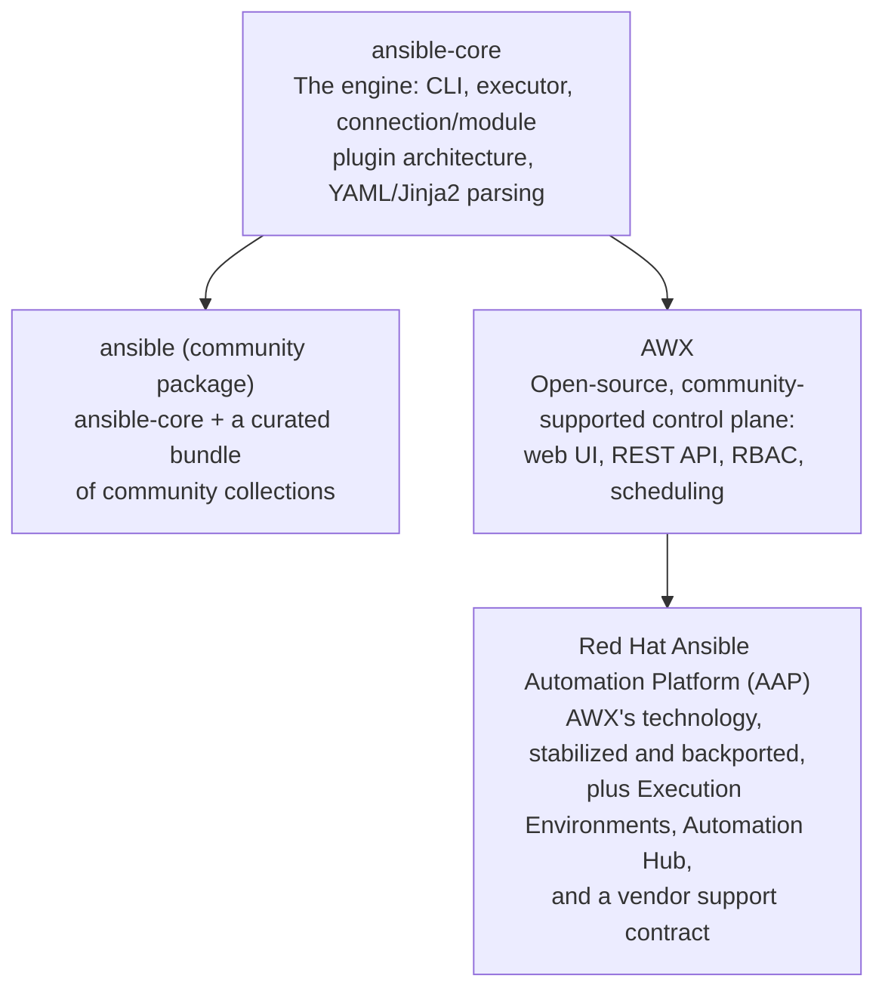
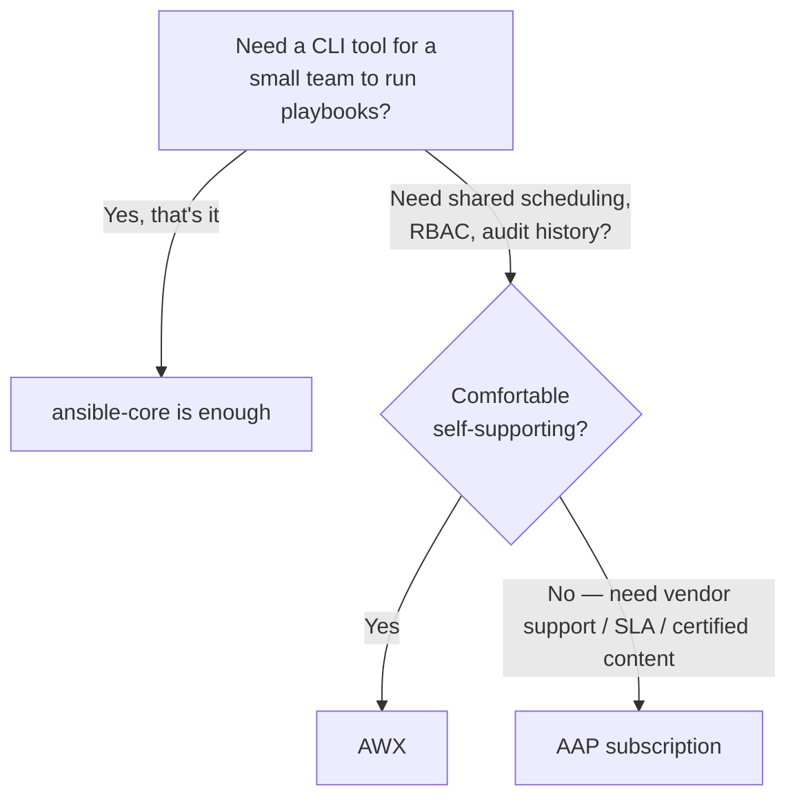

# ansible-core vs. ansible vs. AAP

## What You'll Learn

- Four distinct things people mean when they say "Ansible," disambiguated precisely
- Where AWX fits relative to Red Hat Ansible Automation Platform
- How to decide which layer a project actually needs

## Why This Matters

Job postings, vendor pitches, and casual conversation all say "Ansible" to mean four genuinely different things. Someone asked to "set up Ansible" for a team could reasonably end up running `pip install ansible-core`, or provisioning a full AAP cluster with role-based access control and a scheduling UI — wildly different scopes of work, and the word alone doesn't disambiguate which one was meant.

## The Four Layers

- **`ansible-core`** — the engine itself: the CLI tools, the task execution engine, the connection/module/plugin architecture, YAML and Jinja2 parsing. Everything in [Getting Started](../getting-started/index.md) through [Build Your Own](../build-your-own/index.md) is entirely `ansible-core`.
- **`ansible` (the community package)** — `ansible-core` plus a curated bundle of community collections, installed together for convenience. Most beginners who `pip install ansible` (rather than `ansible-core`) get this — see [Installing Ansible](../getting-started/04-installing-ansible.md).
- **AWX** — the open-source, community-supported web UI/API control plane. Job scheduling, RBAC, credential storage, and a REST API sit in front of the same `ansible-core` engine underneath. No formal vendor support or backport guarantees.
- **Red Hat Ansible Automation Platform (AAP)** — the same Controller technology as AWX, stabilized and backported onto a supported release cadence, packaged with Execution Environments and Automation Hub (certified content), and backed by a Red Hat support contract.

**AWX is to AAP roughly what Fedora is to RHEL** — the fast-moving open-source upstream that AAP's Controller is a stabilized, commercially supported downstream of. AWX gets new features first; AAP gets long-term support and vendor SLAs.

## A Decision Framework

## Common Mistakes

- Describing a project as "using Ansible" without specifying which layer — leads to mismatched expectations about UI, RBAC, or support availability before a single playbook is even discussed.
- Assuming AAP (or AWX) replaces the need to understand `ansible-core` and playbooks — it's a control plane **around** the same playbooks covered throughout the rest of this documentation, not a replacement for writing them.
- Assuming AWX and AAP are functionally interchangeable long-term — AWX moves faster and doesn't carry the backport/support guarantees that matter for regulated or mission-critical environments; see [Licensing and Adoption](04-licensing-and-adoption.md).

## Interview Questions

- What's the difference between `ansible-core` and the `ansible` package?
- What's the relationship between AWX and Ansible Automation Platform?
- If a company says they "use Ansible," what follow-up questions would clarify what they actually mean?

## Next

Continue to [Automation Controller and Automation Mesh](02-automation-controller-and-mesh.md).
