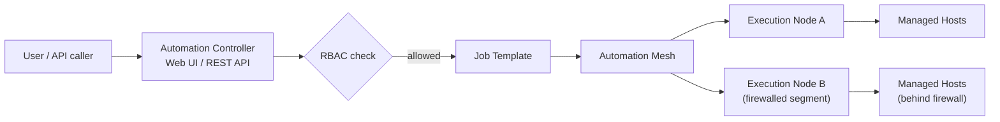

# Automation Controller and Automation Mesh

## What You'll Learn

- What Automation Controller adds on top of bare `ansible-playbook`
- What a Job Template and a Workflow are, concretely
- What problem Automation Mesh solves that a single control node can't

## Why This Exists

CLI-only Ansible has no built-in concept of who is allowed to run what against which hosts, no shared execution history, and no good story for reaching infrastructure that isn't directly network-reachable from one control node. As a team grows past "everyone SSHes into the same box and runs playbooks," those three gaps become real operational problems — Controller and Mesh exist specifically to close them.

## Automation Controller

A web UI and REST API sitting in front of the same `ansible-core` engine covered throughout the rest of this documentation — it doesn't replace playbooks, it adds a managed layer around running them.

- **Job Templates** — a saved combination of a playbook (from a Project, typically a Git repo), an inventory, and a credential. Optionally expose a **Survey** — a form-based prompt for run-time variables — so a non-technical requester can trigger a run without touching YAML.
- **Workflows** — chaining multiple Job Templates together with success/failure/always branches, conceptually similar to [Blocks, Rescue, and Always](../playbook-engineering/01-blocks-rescue-always.md) but at the orchestration level, across entire playbook runs rather than individual tasks.
- **RBAC** — Organizations, Teams, Users, and fine-grained object-level permissions (who can launch this Job Template, who can edit that inventory).
- **Credentials** — a dedicated secrets subsystem that keeps passwords, API keys, and SSH keys out of playbook source entirely, referenced by Job Templates rather than committed anywhere.

## Automation Mesh

A peer-to-peer overlay network of **control** and **execution** nodes that lets a job run close to its target infrastructure — including inside a firewalled network segment — while still being centrally managed from Controller. It's the successor to an older, more rigid "isolated nodes" model, and it's what makes Controller usable against infrastructure spread across multiple networks, clouds, or air-gapped zones, not just whatever one control node can directly reach over SSH.

## Common Mistakes

- Storing credentials inside playbooks or plain variables instead of Controller's Credential objects — this defeats the entire RBAC/audit benefit of adopting Controller in the first place.
- Treating Mesh as purely a networking feature and not accounting for it when designing execution node placement relative to firewalled targets — placement directly affects job latency.
- Modeling RBAC loosely ("everyone gets admin to get started") instead of matching it to real organizational structure from day one.

## Interview Questions

- What does a Job Template represent, and what does a Workflow add on top of it?
- What problem does Automation Mesh solve that a single control node can't?
- How does Controller keep secrets out of playbook source code?

## Next

Continue to [Execution Environments and Automation Hub](03-execution-environments-and-hub.md).
