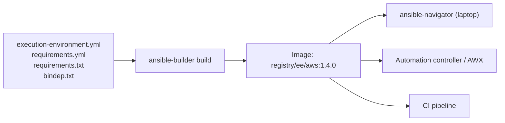

# Execution Environments and Automation Hub

## What You'll Learn

- What an Execution Environment (EE) is, and the drift problem it solves
- How to define and build one with `ansible-builder`
- How to run playbooks inside it locally with `ansible-navigator`
- How Automation Hub differs from Galaxy, and how the two fit into EE builds
- How to scope, version, and maintain EEs over time

## Why This Exists

A traditional control node accumulates whatever Python packages and collections were `pip install`ed and `ansible-galaxy install`ed on it over time, by whoever had access — with no reproducibility guarantee. Real playbooks depend on specific libraries (`boto3` for AWS modules, `pywinrm` for Windows) and specific collection versions; drift between one engineer's machine, another's, and CI is a constant source of "works for me" failures. Execution Environments exist to end that permanently.

## Mental Model

> An Execution Environment is **a container image that is your control node**: a pinned `ansible-core`, `ansible-runner`, Python libraries, system packages, and collections, built from version-controlled files. Automation controller, `ansible-navigator`, and CI all run the playbook *inside* that image, so every run uses exactly the same toolchain.



## Defining an EE

```text
ee-aws/
├── execution-environment.yml
├── requirements.yml        # collections
├── requirements.txt        # Python packages
└── bindep.txt              # system packages
```

```yaml title="execution-environment.yml"
---
version: 3

images:
  base_image:
    name: quay.io/centos/centos:stream9

dependencies:
  python_interpreter:
    package_system: python3.12
    python_path: /usr/bin/python3.12
  ansible_core:
    package_pip: ansible-core==2.19.3
  ansible_runner:
    package_pip: ansible-runner==2.4.1
  galaxy: requirements.yml
  python: requirements.txt
  system: bindep.txt

additional_build_steps:
  append_final:
    - RUN git config --system --add safe.directory '*'
```

```yaml title="requirements.yml"
collections:
  - name: amazon.aws
    version: "9.4.0"
  - name: community.aws
    version: "9.2.0"
  - name: ansible.posix
    version: "2.0.0"
```

```text title="requirements.txt"
boto3==1.40.31
botocore==1.40.31
```

```text title="bindep.txt"
git [platform:rpm]
openssh-clients [platform:rpm]
```

Collections often declare their own Python and system dependencies; `ansible-builder` merges those in automatically, so you mostly list extras here.

Red Hat customers typically start from a supported base such as `ee-minimal-rhel9` from `registry.redhat.io` instead of a CentOS Stream image.

## Build and Push

```bash
pip install ansible-builder
ansible-builder build \
  --tag registry.example.com/ee/aws:1.4.0 \
  --file execution-environment.yml \
  --container-runtime podman

podman push registry.example.com/ee/aws:1.4.0
```

Inspect what you built:

```bash
podman run --rm registry.example.com/ee/aws:1.4.0 ansible --version
podman run --rm registry.example.com/ee/aws:1.4.0 ansible-galaxy collection list
```

## Running Playbooks in an EE Locally

`ansible-navigator` runs `ansible-playbook` inside the image, mounting your project directory:

```bash
pip install ansible-navigator
ansible-navigator run site.yml \
  -i inventories/staging \
  --execution-environment-image registry.example.com/ee/aws:1.4.0 \
  --mode stdout
```

Or set it once for the project:

```yaml title="ansible-navigator.yml"
---
ansible-navigator:
  execution-environment:
    image: registry.example.com/ee/aws:1.4.0
    pull:
      policy: missing
  mode: stdout
  playbook-artifact:
    enable: false
```

Both `ansible-builder` and `ansible-navigator` (for running against the resulting image) ship together in [ansible-dev-tools](../production-engineering/08-ansible-dev-tools.md).

## Automation Hub vs. Galaxy

| | Ansible Galaxy | Red Hat Automation Hub (console.redhat.com) | Private Automation Hub |
|---|---|---|---|
| Content | Community collections and roles | Red Hat **Certified** and **Validated** content | Your internal collections, plus synced certified/community content and EE images |
| Support | Community | Red Hat and partner support with an AAP subscription | Your organization |
| Access | Public | Subscription required | Self-hosted, access-controlled |
| Typical use | Learning, open-source content | Supported production automation | Controlled internal source of truth for all content |

Point `ansible-builder` at your hub so EE builds pull approved content only:

```ini title="ansible.cfg (copied into the build context)"
[galaxy]
server_list = private_hub

[galaxy_server.private_hub]
url = https://hub.example.com/api/galaxy/content/published/
```

Provide the token at build time as a build secret or environment variable, never baked into the image.

Collection publishing and namespaces are covered in [Publishing Collections](../collections/03-publishing-collections.md).

## Designing and Maintaining EEs

- **Scope by domain.** An `aws` EE, a `network` EE, a `windows` EE — not one image with every dependency. Smaller images pull faster, have fewer CVEs, and a dependency upgrade for one team can't break another's jobs.
- **Version-control the definition** and review changes like application code; the definition decides what runs with production credentials.
- **Tag immutably.** `ee/aws:1.4.0`, never only `latest`. Controllers and CI reference an exact tag.
- **Rebuild on a schedule** (for example monthly) even with no changes, to pick up base image security patches, and scan images in the registry.
- **Test before promoting.** Run the playbooks that use an EE against staging with the new tag before switching production job templates.
- **Track provenance.** Know which collections in an EE are certified (supported) and which are community (not).

## Common Mistakes

- Treating an EE as a one-time build instead of a maintained, periodically rebuilt artifact — a stale EE silently drifts from current collection and security patches.
- Mixing Automation Hub (certified) and Galaxy (community) content in the same EE without tracking which pieces carry vendor support and which don't.
- Building one giant EE for every team, so any dependency change is risky for everyone.
- Referencing `:latest` in job templates, so a rebuild silently changes production automation.
- Baking hub tokens or cloud credentials into image layers.

## Interview Questions

- What problem do Execution Environments solve that a shared control node doesn't?
- What's the difference between Ansible Galaxy and Automation Hub?
- Walk through the files that define an EE and what each contributes.
- How would you roll out an updated EE without risking production jobs?

## Next

Continue to [Licensing and Adoption](04-licensing-and-adoption.md).
