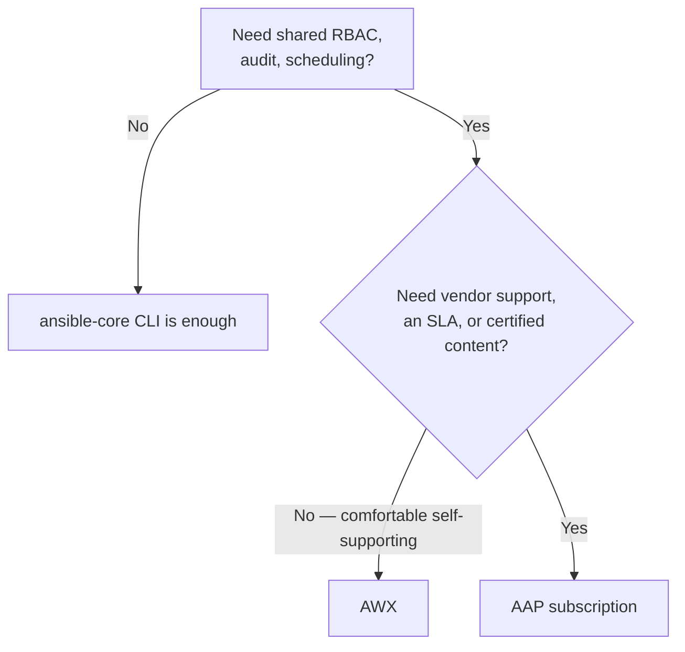

# Licensing and Adoption

## What You'll Learn

- How AWX and AAP relate on the support/stability spectrum
- A concrete framework for deciding between them
- Why this is an organizational decision, not a purely technical one

## AWX Is the Upstream, AAP Is the Supported Downstream

**AWX** is the open-source project Automation Controller is built from — the same relationship Fedora has to RHEL. AWX gets new features first, with no formal long-term support guarantees or backports. **AAP** is the same underlying Controller technology, stabilized and backported onto a supported release cadence, bundled with [Execution Environments and Automation Hub](03-execution-environments-and-hub.md), and backed by a Red Hat support contract. Red Hat's subscription model is typically **node-based** (counted by managed hosts under automation) rather than per-seat — always confirm exact terms against Red Hat's current published pricing rather than assuming, since commercial terms change independently of the technology.

## A Decision Framework

A pragmatic path many teams take: pilot on AWX first to validate the Controller/Workflow model organizationally, before committing budget to an AAP subscription — especially if support/SLA guarantees aren't yet a hard requirement.

## Making the Business Case

The technical case for AAP (Controller, Mesh, Execution Environments) is only half the decision. Engineers frequently make a correct technical recommendation that stalls because the licensing and support conversation wasn't part of the pitch. Worth stating explicitly in an adoption proposal:

- **Vendor-backed CVE response and patch SLAs** — a genuine security argument for AAP over self-supported AWX in regulated environments.
- **Right-sizing subscription scope** to actual managed-node count, rather than over-provisioning "just in case."
- **Mesh topology and Execution Environment strategy have real cost implications at scale** — the licensing and architecture conversations need to happen together, not sequentially.

## Common Mistakes

- Assuming AWX and AAP are functionally identical long-term — AWX moves faster and drops the support guarantees that matter for regulated or mission-critical environments.
- Treating the licensing conversation as separate from the architecture conversation.

## Interview Questions

- What's the relationship between AWX and Ansible Automation Platform?
- What factors would push an organization toward a paid AAP subscription instead of self-supporting AWX?

## Next

Continue to [Case Studies](../case-studies/index.md), or back to [Enterprise Platform](index.md).
