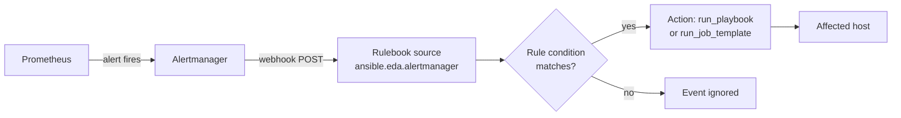

# Event-Driven Ansible

**Event-Driven Ansible (EDA)** runs automation in response to events instead of waiting for a person or a schedule. A **rulebook** listens to an event source (an Alertmanager webhook, a Kafka topic, a file change), matches each event against conditions, and runs a playbook or a job template when one matches.

## What You'll Learn

- How a rulebook is structured: sources, rules, conditions, and actions
- A complete, working example: Prometheus alerts trigger an automatic service restart
- How to stop an automated fix from turning into an automated outage
- How EDA runs in production inside Ansible Automation Platform

## Why This Exists

Most runbooks start the same way: an alert fires, someone gets paged, and they run the same few commands they ran last time. When the fix is well understood and safe to repeat, the page is wasted human time and the delay is wasted uptime. EDA lets the alert trigger the fix directly and keeps a record of what ran, while people handle the problems that actually need judgment.

## Mental Model

> A playbook answers **"what should change?"** A rulebook answers **"when should which playbook run?"** EDA doesn't replace playbooks; it's a trigger layer in front of the ones you already have.



## Install and Run Locally

```bash
pip install ansible-rulebook ansible-core
ansible-galaxy collection install ansible.eda
java -version        # ansible-rulebook needs a Java 17+ runtime for its rules engine
```

## Example: Restart nginx When It Goes Down

### 1. The alert

A Prometheus rule fires when nginx stops answering, and Alertmanager forwards it to the rulebook's webhook. Give each target a `host` label that matches its Ansible inventory name, so EDA knows which host to act on:

```yaml title="prometheus/alerts.yml"
groups:
  - name: web
    rules:
      - alert: NginxDown
        expr: probe_success{job="blackbox-http", service="nginx"} == 0
        for: 2m
        labels:
          severity: page
          remediation: auto        # opt-in: only these alerts reach the rulebook's rule
        annotations:
          summary: "nginx on {{ $labels.host }} is not answering"
```

```yaml title="alertmanager.yml (excerpt)"
route:
  receiver: oncall
  routes:
    - matchers: [remediation="auto"]
      receiver: eda
      continue: true               # still page a human as well

receivers:
  - name: eda
    webhook_configs:
      - url: http://eda.internal.example.com:5000/alerts
        send_resolved: false
  - name: oncall
    # pager configuration
```

### 2. The rulebook

```yaml title="rulebooks/web_remediation.yml"
---
- name: Web tier auto-remediation
  hosts: web
  sources:
    - ansible.eda.alertmanager:
        host: 0.0.0.0
        port: 5000
        data_host_path: labels.host      # which label names the affected host

  rules:
    - name: Restart nginx when it stops answering
      condition: >-
        event.alert.labels.alertname == "NginxDown"
        and event.alert.status == "firing"
      throttle:
        once_within: 15 minutes          # never loop restarts on a host
        group_by_attributes:
          - event.meta.hosts
      action:
        run_playbook:
          name: playbooks/remediate_nginx.yml
```

The `alertmanager` source turns each alert in a webhook payload into one event, and sets `event.meta.hosts` from the `host` label. `run_playbook` limits the playbook to those hosts automatically.

### 3. The remediation playbook

Keep it narrow, and make it verify its own result:

```yaml title="playbooks/remediate_nginx.yml"
---
- name: Bring nginx back
  hosts: all
  become: true
  gather_facts: false
  tasks:
    - name: Validate the config before touching the service
      ansible.builtin.command: nginx -t
      changed_when: false

    - name: Restart nginx
      ansible.builtin.systemd_service:
        name: nginx
        state: restarted

    - name: Confirm it answers again
      ansible.builtin.uri:
        url: http://localhost/healthz
        status_code: 200
      register: health
      retries: 10
      delay: 3
      until: health.status == 200
```

If `nginx -t` fails, the playbook stops **before** restarting. A broken config is a problem a human has to fix, and a restart would only turn a degraded server into a dead one.

### 4. Run it

```bash
ansible-rulebook --rulebook rulebooks/web_remediation.yml \
  -i inventories/production --verbose
```

Test the whole path without breaking anything by posting a fake alert to the webhook:

```bash
curl -s -X POST http://localhost:5000/alerts -H 'Content-Type: application/json' -d '{
  "alerts": [{"status": "firing",
              "labels": {"alertname": "NginxDown", "host": "web01"}}]
}'
```

## Guardrails: Automation That Can't Make Things Worse

| Guardrail | Why |
|---|---|
| **Opt-in per alert** (`remediation: auto` label) | Only alerts someone deliberately marked as safe to auto-fix reach the rulebook |
| **`throttle` per host** | A service that dies right after every restart gets restarted once, not every minute |
| **Validate before acting** | The fix refuses to run when the situation doesn't match the known failure |
| **Keep paging humans** (`continue: true`) | Automation handles the fix; people still see that it happened and can spot a pattern |
| **Verify after acting** | The playbook fails loudly if the fix didn't work, instead of reporting success |
| **Small blast radius** | One service on one host per event; never "restart everything" from an alert |

Good first candidates are fixes your team already runs by hand without thinking: restarting a hung service, clearing a full temp directory, rotating a stuck log, or opening a ticket with diagnostics attached. Anything involving data (failovers, restores, schema changes) should stay human-approved.

## EDA in Ansible Automation Platform

On the command line, `ansible-rulebook` runs the playbook itself. In AAP, the **EDA controller** runs rulebooks as **rulebook activations** inside a **decision environment** (a container image with `ansible-rulebook` and its source plugins, like an Execution Environment for rulebooks). Actions then use `run_job_template` instead of `run_playbook`:

```yaml
      action:
        run_job_template:
          name: Remediate nginx
          organization: Web Platform
          job_args:
            limit: "{{ event.meta.hosts }}"
```

That gives each automated fix the same RBAC, credentials, audit trail, and job history as a manual run, which is usually what makes security and change-management teams comfortable with auto-remediation.

## Common Mistakes

- Wiring every alert to a remediation, so a noisy alert turns into a restart storm. Opt alerts in one by one.
- No `throttle`, so a service that crashes on start is restarted in a tight loop and its logs are buried.
- A remediation playbook that "fixes" and exits without checking the result, so the event history shows success while the service is still down.
- Forgetting that the rulebook's inventory must contain the host names the alerts use. If Prometheus labels say `10.0.1.11:9100` and inventory says `web01`, nothing matches.
- Exposing the webhook port to the network without authentication or TLS. Keep it on a private network, or put it behind a reverse proxy with authentication.

## Interview Questions

- What's the difference between a playbook and a rulebook?
- How would you prevent an automated remediation from restarting a service in a loop?
- Which operational tasks are good candidates for event-driven remediation, and which should stay manual?
- How does running EDA in Automation Platform differ from running `ansible-rulebook` on a server?

## Related

- [Alertmanager](../../monitoring-tools/alertmanager.md) — routing and receivers
- [Toil and Automation](../../sre/06-toil-and-automation.md) — deciding what to automate
- [Automation Controller and Mesh](02-automation-controller-and-mesh.md)

## Next

Return to [Enterprise Platform](index.md), or continue to [Case Studies](../case-studies/index.md).
