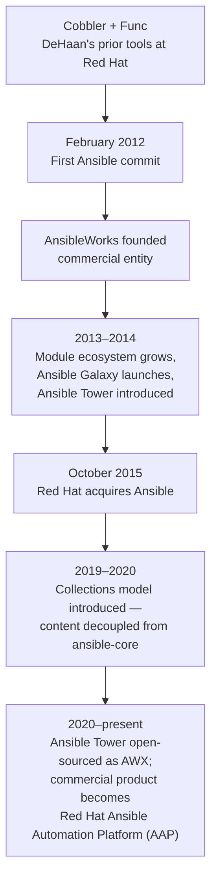

# History and Why Ansible Exists

## What You'll Learn

- What server automation looked like before Ansible, and specifically why it wasn't enough
- Who created Ansible, and the real frustrations that shaped its design
- The five deliberate design bets that define Ansible to this day, and why each one was chosen
- The timeline from a 2012 side project to a Red Hat product

## Why This Matters

Every "why does Ansible do X" question in this documentation eventually traces back to this page. Ansible's design isn't a neutral, default set of choices — it's a series of specific reactions to specific pain its creator had lived through. Understanding that turns a list of features into a coherent set of tradeoffs you can reason about.

## Infrastructure Before Ansible

Picture a company running five servers, configured by hand over SSH. It works. At fifty servers, it starts hurting — some machines quietly drift from what the others look like, because a fix applied to one was never applied everywhere. At five thousand, hand configuration is not just painful, it's impossible: nobody can hold "what state should every server be in" in their head, and nobody can prove any two servers actually match.

This failure mode has three names worth knowing precisely, because they show up constantly in production discussions:

- **Configuration drift** — servers that started out identical, slowly diverging as ad hoc changes accumulate unevenly.
- **Snowflake servers** — a machine so manually hand-tuned over time that nobody can safely rebuild it from scratch; its exact state exists only in that one running instance.
- **Manual deployment problems** — a deploy that "works" only because one specific engineer remembers an undocumented sequence of steps.

The tools that existed to fight this before Ansible each solved part of the problem, at a real cost:

| Tool | Model | What it got right | What it cost |
|---|---|---|---|
| Shell scripts | Imperative, ad hoc | Fast to write, zero setup | No state model, no idempotency, fragile error handling |
| **CFEngine** (1993) | Declarative, agent-based | First tool with real "promise theory" convergence — the intellectual ancestor of desired state | Steep learning curve, agent to manage |
| **Puppet** (2005) | Declarative, resource-graph, Ruby DSL | Real desired-state modeling at scale | Agent + master + certificate management overhead |
| **Chef** (2009) | "Infrastructure as code," Ruby DSL | Powerful, very flexible | Felt like writing a full program to configure a server; also agent-based |
| **Salt** (2011) | Agent-based, ZeroMQ pub/sub | Very fast, remote execution *and* config management in one tool | Still agent-first by default |
| **Fabric** (2009) | Python + SSH task runner | No agent — just SSH and Python | No state model at all; essentially "SSH for-loops with nice syntax" |

Every one of these traded agent overhead for state modeling, or state modeling for agent overhead — none combined "no agent to manage" with "a real declarative desired-state model." That gap is exactly what Ansible was built to close.

## Who Created Ansible, and Why

**Michael DeHaan** built Ansible out of specific frustration with the tools above, carried directly out of his prior work on **Cobbler** (a provisioning tool) and **Func** (a remote execution framework) at Red Hat and in the broader Fedora ecosystem. He'd seen, first-hand, what agent sprawl, certificate management, and DSLs-that-feel-like-programming-languages-but-aren't actually cost a team in practice.

The **name** itself is a science-fiction reference — Ursula K. Le Guin's *ansible*, a fictional device for instantaneous, distance-independent communication. The metaphor was deliberate: simple, instant communication with a remote machine, with nothing installed there beforehand.

### The Five Founding Design Bets

Ansible's architecture is not an abstract engineering exercise — it's five specific, traceable answers to five specific failures of what came before it.

1. **Why SSH** — reuse infrastructure every server already has and every administrator already trusts, instead of standing up a new daemon, a new network port, and a new PKI trust model just to run automation.
2. **Why agentless** — no agent installation, no agent upgrades, no agent as a standing attack surface. The tradeoff — a Python interpreter needs to exist on the managed node — is covered in [Architecture and Execution](02-architecture-and-execution.md).
3. **Why Python** — a mature standard library, strong SSH/JSON tooling, and already the dominant sysadmin scripting language by 2012 — readable enough for operations engineers who weren't full-time software developers.
4. **Why YAML** — human-readable, diffable cleanly in code review, no braces or semicolons to fight — the full reasoning (and the tradeoffs it costs) is its own page: [YAML Essentials](../yaml-and-execution-model/01-yaml-essentials.md).
5. **Why idempotency as a first-class principle** — playbooks describe a desired end state, not a one-time sequence of actions, so they're safe to run again and again. This is the throughline into [Idempotency](../core-concepts/11-idempotency.md), arguably the single most important mental model in the entire documentation.

None of these were the *only* possible choice — Salt made a different bet on agents for speed; Puppet made a different bet on a purpose-built DSL. Ansible's bets specifically optimized for **minimum infrastructure to get started** and **maximum readability for people who weren't primarily programmers** — and that's exactly the profile of engineer Ansible ended up winning over first.

## Timeline

The **Tower → AWX/AAP** naming split matters enough that it gets its own page once you're past the fundamentals: [ansible-core vs. ansible vs. AAP](../enterprise-platform/01-ansible-core-vs-ansible-vs-aap.md).

## Common Mistakes

- Assuming Ansible's design choices (SSH, Python, YAML) were arbitrary defaults rather than deliberate reactions to specific costs in prior tools — this makes later "why not just do X instead" questions harder to reason about.
- Conflating "Ansible the open-source project" with "Ansible Automation Platform the commercial product" — a distinction the next section covers exhaustively.

## Interview Questions

- Why did Ansible choose SSH instead of building a custom agent protocol?
- What does the word "Ansible" come from, and why is that meaningful for the tool's design goals?
- Name Ansible's five founding design bets, and the specific problem each one was a reaction to.

## Next

Continue to [What Is Ansible?](01-what-is-ansible.md) for a precise definition, or straight to [Architecture and Execution](02-architecture-and-execution.md) to see the agentless model in action.
