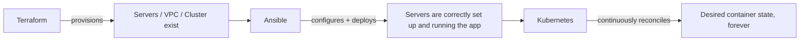

# What Is Ansible?

## What You'll Learn

- A definition of Ansible precise enough to use in an interview, not just a marketing tagline
- The difference between automation, provisioning, configuration management, orchestration, and deployment
- Where Ansible is strong, and where a different tool is the better default

## Why This Matters

"Ansible automates infrastructure" is true and useless — so does a cron job full of shell scripts. The useful question is *which* automation problem Ansible solves well, because that's what tells you when to reach for it instead of Terraform, Kubernetes, or a shell script.

## Mental Model

> Ansible is a tool that connects to machines you already have, and brings each one to a **described state** — packages installed, files in place, services running — using only SSH (or WinRM for Windows) and a Python interpreter on the target. No agent, no daemon, no master server.

Five terms get used interchangeably in job postings. They aren't the same thing:

| Term | Question it answers | Typical tool |
|---|---|---|
| **Provisioning** | Does the infrastructure exist yet? (a VM, a VPC, a cluster) | Terraform, CloudFormation |
| **Configuration management** | Is this existing machine set up correctly? | Ansible, Puppet, Chef |
| **Orchestration** | Are multiple steps/systems happening in the right order? | Ansible playbooks, Kubernetes |
| **Deployment** | Is the current application version actually running? | Ansible, CI/CD pipelines |
| **Automation** | The umbrella term — replacing a manual step with a tool | All of the above |

Ansible's home turf is **configuration management**, and it does **orchestration** at the task level (this task, then that task, in order, across these hosts). Modern Ansible playbooks also do light **provisioning** (via cloud modules) and **deployment** — which is exactly why "what is Ansible" gets blurry in practice: a single playbook can touch all four categories in one run.

## Where Ansible Sits Next to Terraform and Kubernetes

- **Terraform** answers "does this infrastructure exist, in this shape?" — it plans and applies against a state file, with an explicit diff before every change.
- **Ansible** answers "is this existing machine configured correctly, right now, based on the tasks I just ran?" — no persistent state file; each task checks the live system directly.
- **Kubernetes** answers "does the desired state of my containers still hold?" **continuously**, via a controller that never stops watching — unlike Ansible, which only reconciles when you explicitly run a playbook.

A well-run team typically uses all three together: Terraform provisions the VM, Ansible configures the OS and deploys the app onto it, and — if the workload is containerized — Kubernetes takes over continuous reconciliation from there.

## Common Mistakes

- Calling Ansible "just a deployment tool" — deployment is one thing it can do, not its core competency.
- Using Ansible to fully replace Terraform for complex cloud provisioning. It's possible with cloud collections, but you lose Terraform's plan/apply diffing and state-drift detection.
- Assuming Ansible behaves like Kubernetes — it does **not** continuously enforce state. If a human changes a file by hand after your last playbook run, Ansible has no idea until you run it again.

## Interview Questions

- What's the difference between configuration management and orchestration?
- Where does Ansible sit relative to Terraform and Kubernetes, and why would a team use all three?
- Give an example of a task that's provisioning vs. configuration management vs. deployment.

See [Interview Prep: Core Concepts](../interview-prep/01-core-concepts-questions.md) for full answers.

## Next

Continue to [Architecture and Execution](02-architecture-and-execution.md) to see exactly how Ansible reaches a machine with no agent installed on it.
