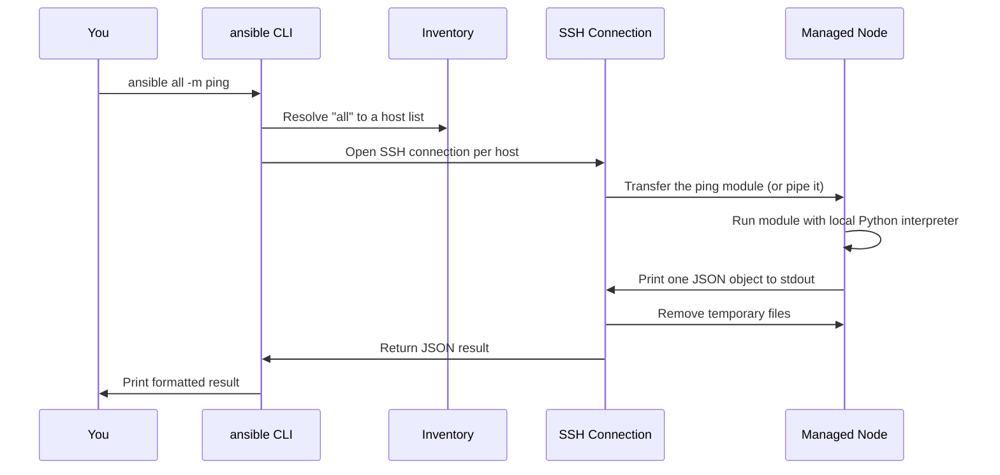

# Architecture and Execution

## What You'll Learn

- What "agentless" and "push-based" actually mean, mechanically
- The real sequence of events behind `ansible all -m ping`
- Why most managed nodes need Python, and what happens when they don't

## Why This Matters

"Agentless" is the word every Ansible pitch leads with, and it's usually left unexplained. Once you've seen the actual sequence of events for a single command, most confusing Ansible behavior — timeouts, "no module named X" errors, permission failures — stops being mysterious.

## Mental Model

Two architectural choices define Ansible, in contrast to Puppet/Chef/Salt:

- **Agentless** — no daemon or persistent process runs on managed nodes. Ansible connects on demand, over SSH (or WinRM for Windows), does its work, and disconnects. Nothing is "installed" on the target beyond an SSH server and Python.
- **Push-based** — the control node initiates every run. Compare to Puppet's default pull model, where agents periodically check in with a master. Ansible only acts when you tell it to.

## How `ansible all -m ping` Actually Executes



Step by step:

1. **Inventory resolution** — `all` (or any pattern) expands to a concrete list of hosts.
2. **Variable loading** — Ansible resolves every variable that applies to each host, following [variable precedence](../variables-and-data/02-variable-precedence.md).
3. **Connection** — an SSH connection opens per host (reused across tasks in the same run via `ControlPersist`, if enabled).
4. **Module transfer** — the module's Python source is copied to a temp directory on the managed node (`~/.ansible/tmp/` by default), or piped directly if **pipelining** is enabled.
5. **Remote execution** — the managed node's own Python interpreter runs the module as a standalone script.
6. **JSON result** — the module prints exactly one JSON object to stdout. This is the entire contract between a module and Ansible — it's why modules can, in principle, be written in any language that can emit that JSON, even though nearly all official modules are Python.
7. **Cleanup** — the temporary files are deleted (unless `ANSIBLE_KEEP_REMOTE_FILES=1` is set, which is genuinely useful for debugging).
8. **Display** — the result is rendered on the control node by a callback plugin (the default `default` callback, or alternatives like `yaml`/`json`/`minimal`).

None of this needs anything pre-installed on the managed node except an SSH server and a Python interpreter — no Ansible-specific software runs there before or after.

!!! tip "See it for yourself"
    Run `ANSIBLE_KEEP_REMOTE_FILES=1 ansible all -m ping -vvvv` against a test host, then SSH in and look under `~/.ansible/tmp/` before it's cleaned up on the next run. `-vvvv` prints the exact SSH commands Ansible ran, which is the single best debugging habit to build early.

## Why Managed Nodes Need Python

Because the module that runs on the managed node is a Python program, the managed node needs a Python 3 interpreter to run it — Ansible doesn't install one for you. By default, `interpreter_python: auto` probes a list of common paths on the managed node and picks the first Python 3 it finds.

If a target has no Python at all — a bare cloud image, a minimal container — normal modules fail outright. The escape hatch is the **`raw`** module, which runs a command over SSH with no Python dependency on either side, specifically to bootstrap Python itself:

```yaml
- name: Bootstrap Python on a bare image
  hosts: new_servers
  gather_facts: false
  tasks:
    - name: Install python3 with raw (no Python required yet)
      ansible.builtin.raw: apt-get update && apt-get install -y python3
```

After this runs once, every normal module works against that host. See [command vs. shell vs. raw vs. script](../modules/01-command-vs-shell-vs-raw-vs-script.md) for the full comparison.

## Common Mistakes

- Assuming a "connection failed" or "no module named X" error means something is wrong with the playbook, when it's actually a missing Python interpreter or SSH problem on the target — see [SSH and Connectivity](05-ssh-and-connectivity.md).
- Not realizing fact gathering (an implicit `setup` module call at the start of most plays) is itself a real remote execution step with real cost — this matters once you get to [Performance](../production-engineering/05-performance.md).
- Debugging a failure without `-vvvv` — it shows the exact command that ran, which is almost always faster than guessing.

## Interview Questions

- Walk through what happens internally when you run `ansible all -m ping`.
- What does "agentless" mean, mechanically — what's actually not running on the managed node?
- Why does Ansible need Python on the managed node, and what do you do when it's missing?

See [Interview Prep: Architecture & Performance](../interview-prep/02-architecture-and-performance-questions.md) for full answers.

## Next

Continue to [Control Node vs. Managed Nodes](03-control-node-vs-managed-nodes.md).
