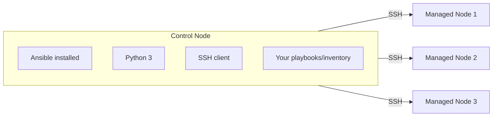

# Control Node vs. Managed Nodes

## What You'll Learn

- What a control node is, and what it needs installed
- What a managed node is, and why its requirements are much lighter
- Which platforms can and can't act as a control node

## Mental Model

Ansible has exactly two kinds of machine in any run:

- **Control node** — the machine you run `ansible-playbook` from. This is the only machine that needs Ansible itself installed.
- **Managed node** — anything Ansible connects to and configures. It needs an SSH server and (for most modules) a Python 3 interpreter — nothing Ansible-specific.

This asymmetry is the whole point of "agentless": you don't install or maintain anything on the 500 servers you manage, only on the one (or few) machines you run Ansible from.

## Requirements, Precisely

| | Control node | Managed node |
|---|---|---|
| Ansible installed | Required | Not needed |
| Python | Required (runs Ansible itself) | Required for most modules (not for `raw`) |
| SSH | Client | Server (`sshd`) |
| OS | Linux or macOS | Linux, Unix, network device, or Windows (via WinRM) |
| Persistent process | None between runs | None — no daemon |

!!! warning "Windows cannot be a control node"
    Ansible does not run natively on Windows as a control node. Windows machines can be **managed nodes** (via WinRM + PowerShell), but to drive Ansible from a Windows machine you run it inside WSL (Windows Subsystem for Linux), which is really a Linux control node.

## Common Mistakes

- Trying to install Ansible on every managed node "to be safe" — this defeats the agentless model and adds nothing; only the control node needs it.
- Assuming a managed node needs network access to the public internet — it only needs to be reachable from the control node over SSH (or WinRM), and vice versa.
- Forgetting that a bare cloud image or minimal container might not have Python 3 at all — covered in [YAML → Python Mental Model](../yaml-and-execution-model/02-yaml-to-python-mental-model.md) and the `raw` module comparison in [command vs. shell vs. raw vs. script](../modules/01-command-vs-shell-vs-raw-vs-script.md).

## Interview Questions

- What does a managed node need installed for Ansible to configure it?
- Can Windows be an Ansible control node? A managed node?
- Why is the control/managed-node split described as "asymmetric"?

## Next

Continue to [Installing Ansible](04-installing-ansible.md).
