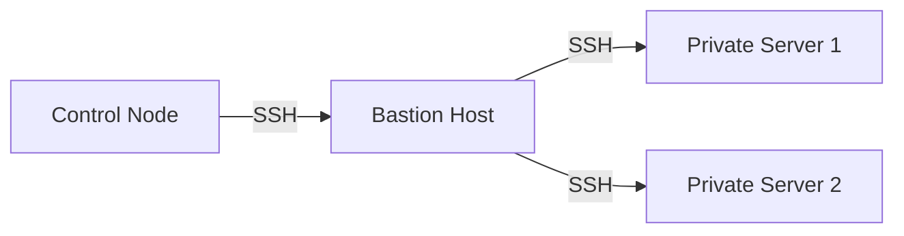

# SSH and Connectivity

SSH problems are the single most common reason a first Ansible run fails, and they have nothing to do with Ansible itself — Ansible is just the thing reporting the error. This page is the complete path: how connections are configured, how to bootstrap key-based auth, how to reach hosts behind a bastion, and exactly how to read a failure.

## What You'll Learn

- Password vs. key-based authentication, and why keys are the production default
- Every connection variable Ansible reads (`ansible_user`, `ansible_host`, `ansible_port`, `ansible_private_key_file`, `ansible_ssh_common_args`)
- How to reach hosts behind a bastion with `ProxyJump`
- The difference between SSH authentication and `become` privilege escalation
- How to read `-vvv` output to diagnose a connection failure fast

## Mental Model

Ansible does not have its own connection layer — the default `ssh` connection plugin shells out to your real, local `ssh` binary. Whatever authenticates you when you type `ssh user@host` by hand is exactly what authenticates Ansible. This is why the fastest way to debug an Ansible connection failure is almost always: **try the same connection manually first.**

## Authentication: Password vs. Keys

=== "Password (bootstrap only)"

    ```bash
    ansible all -m ping --ask-pass
    ```

    Works, but doesn't scale: someone has to type a password per run, it can't be automated in CI, and it's a weaker credential than a key. Use it only to bootstrap key-based access on a fresh host.

=== "SSH keys (production default)"

    ```bash
    ssh-keygen -t ed25519 -C "ansible-control-node"
    ssh-copy-id -i ~/.ssh/id_ed25519.pub deploy@web01.example.com
    ansible all -m ping
    ```

    No password prompt, works unattended in CI, and each key can be scoped, rotated, and revoked independently of any shared password.

## ssh-agent

Typing your key's passphrase on every connection defeats the point of automation. `ssh-agent` holds a decrypted key in memory for the session so you unlock it once:

```bash
eval "$(ssh-agent -s)"
ssh-add ~/.ssh/id_ed25519
ssh-add -l   # confirm it's loaded
```

## known_hosts and Host Key Verification

The first time you connect to a host, SSH records its public key fingerprint in `~/.ssh/known_hosts`. On every later connection it checks the fingerprint still matches — this is what protects you from a machine-in-the-middle silently swapping in a different server at the same address.

!!! danger "Don't disable host key checking globally in production"
    You'll see `ANSIBLE_HOST_KEY_CHECKING=False` or `host_key_checking = False` in a lot of tutorials, because it removes an annoying interactive prompt on freshly built lab hosts. In production this removes a real security control. Prefer pre-seeding `known_hosts` (many cloud providers publish host keys) or accepting new host keys deliberately, not blanket-disabling verification.

## Connection Variables

These are the inventory/host variables that control how Ansible connects to a specific host — set them in `inventory.ini`, `host_vars/`, or `group_vars/`:

```ini title="inventory.ini"
[web]
web01 ansible_host=10.0.1.15 ansible_user=deploy ansible_port=2222 ansible_private_key_file=~/.ssh/id_ed25519
```

| Variable | Purpose |
|---|---|
| `ansible_host` | The real address to connect to, if different from the inventory name |
| `ansible_user` | The remote SSH username |
| `ansible_port` | The SSH port, if not 22 |
| `ansible_private_key_file` | Path to a specific private key for this host |
| `ansible_ssh_common_args` | Extra raw arguments passed to every SSH invocation (used below for `ProxyJump`) |

## Bastion Hosts and ProxyJump

A common production topology: the control node can't reach private servers directly, only through a bastion (jump host).



```ini title="inventory.ini"
[private]
db01 ansible_host=10.0.2.10 ansible_user=deploy ansible_ssh_common_args='-o ProxyJump=bastion-user@bastion.example.com'
```

This tells the local `ssh` client to tunnel the connection through the bastion transparently — Ansible itself needs no special bastion support, because it's just passing arguments through to `ssh`.

## `become` Is Not SSH Authentication

These are two independent layers, and conflating them is a very common source of confusion:

- **SSH authentication** — proves *who you are connecting as* to the machine.
- **`become`** — privilege escalation (`sudo`, typically) *after* you've connected, to run a specific task as another user (usually root).

```yaml
- name: Install nginx
  hosts: web
  become: true        # escalate privileges for tasks in this play
  tasks:
    - name: Install nginx
      ansible.builtin.package:
        name: nginx
        state: present
```

You SSH in as `deploy` (a non-root user, by design — see [Security](../production-engineering/04-security.md)), and `become: true` runs this specific play's tasks with `sudo`. A working SSH connection with a `become` failure produces a *different* error than a broken SSH connection — knowing which one you're looking at saves real debugging time.

## Troubleshooting Connection Failures

```text
fatal: [web01]: UNREACHABLE! => {"changed": false, "msg": "Failed to connect to the host via ssh: Permission denied (publickey)."}
```

Read this literally: SSH connected to the host, offered your key(s), and the host rejected all of them. It is **not** a network/firewall problem (that would be a timeout, not `Permission denied`).

**Diagnose with the same command Ansible is wrapping:**

```bash
ssh -vvv deploy@web01.example.com
```

`-vvv` shows every key SSH tried and why each was rejected — the most common causes, in order of frequency:

1. The public key was never added to the target's `~/.ssh/authorized_keys`.
2. The wrong username (`ansible_user` doesn't match a real account on the host).
3. `~/.ssh` or `authorized_keys` has overly permissive file permissions on the target, so `sshd` refuses to trust it (SSH requires `700` on `~/.ssh` and `600` on `authorized_keys`).
4. `ssh-agent` isn't running, or the right key was never `ssh-add`-ed.

For a `UNREACHABLE` that's a timeout rather than a rejection, the cause is almost always network/firewall/security-group, not credentials — check that the port is reachable at all first (`nc -zv host 22`).

See the dedicated [SSH and Connection Problems](../troubleshooting/01-ssh-and-connection-problems.md) page for a fuller symptom-by-symptom table.

## Interview Questions

- What connection plugin does Ansible use by default, and what does it actually shell out to?
- What's the difference between SSH authentication and `become`?
- A task fails with `UNREACHABLE! Permission denied (publickey)` — what's your diagnostic process?

## Next

Continue to [Your First Playbook](06-your-first-playbook.md) — you now have everything needed for a real connection.
