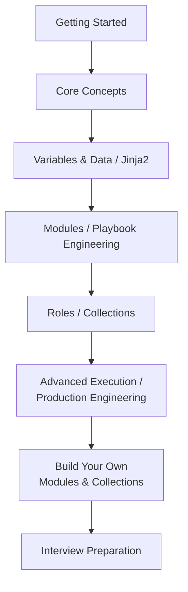

# Ansible

Ansible lets you describe the state a machine should be in — packages installed, files in place, services running — and repeatedly converge real machines toward that state over SSH, with nothing installed on them beforehand. This is a hands-on guide to using it well: writing production playbooks, understanding what's happening underneath them, debugging what breaks, and building your own modules and collections when nothing built-in fits.

It's built to work two ways: read it start to finish as a course, or jump straight to the one page that answers what you need right now.

## Start Here, Based on Where You Are

| You are... | Start at |
|---|---|
| New to Ansible entirely | [Getting Started](getting-started/index.md) |
| Comfortable with the basics, want the daily-driver skills | [Core Concepts](core-concepts/index.md) |
| Writing playbooks already, want to level up | [Playbook Engineering](playbook-engineering/index.md), [Modules](modules/index.md) |
| Managing a large fleet, run times are slow | [Advanced Execution](advanced-execution/index.md) |
| Setting up a real project from scratch | [Production Engineering](production-engineering/index.md) |
| Extending Ansible — a custom module or collection | [Build Your Own](build-your-own/index.md) |
| Evaluating or administering Red Hat AAP / AWX | [Enterprise Platform (AAP & AWX)](enterprise-platform/index.md) |
| Something's broken right now | [Troubleshooting](troubleshooting/index.md) |
| Prepping for an Ansible or DevOps interview | [Interview Preparation](interview-prep/index.md) |
| Already know Ansible, need a fast lookup | [Quick Reference](quick-reference/index.md) |

## The Learning Path

## Learn by Building

Each project uses only what the previous ones already taught you. Skip ahead if you're already past a stage.

1. **Ping three servers** — [Your First Playbook](getting-started/06-your-first-playbook.md)
2. **Install and start nginx idempotently** — [Idempotency](core-concepts/11-idempotency.md), [Modules](core-concepts/04-modules.md)
3. **Create users with individual SSH keys** — [Case Study: User and SSH Access](case-studies/04-user-and-ssh-access.md)
4. **Deploy a templated config file** — [Templates for Config Generation](jinja2-and-templates/03-templates-for-config-generation.md)
5. **Package it as a role** — [Role Structure](roles/01-role-structure.md)
6. **Split dev/staging/production cleanly** — [Case Study: Multi-Environment Inventory](case-studies/02-multi-environment-inventory.md)
7. **Roll out a change with a canary batch** — [Case Study: Rolling Nginx Deployment](case-studies/01-rolling-nginx-deployment.md)
8. **Encrypt a secret with Vault** — [Secrets and Vault](production-engineering/03-secrets-and-vault.md)
9. **Add CI linting and a `--check` gate** — [CI/CD and Linting](production-engineering/06-cicd-and-linting.md)
10. **Write a custom module** — [Build a Custom Module](build-your-own/01-build-a-custom-module.md)
11. **Package it into a collection** — [Build a Collection From Zero](build-your-own/03-build-a-collection-from-zero.md)
12. **Tune a slow playbook at scale** — [Forks, Serial, Strategy, and Throttle](advanced-execution/01-forks-serial-strategy-throttle.md), [Performance](production-engineering/05-performance.md)

## Every Section

- [Getting Started](getting-started/index.md) — history and origins, installation, SSH, your first connection and playbook
- [Core Concepts](core-concepts/index.md) — inventory, modules, variables, conditionals, loops, handlers, idempotency
- [YAML & Execution Model](yaml-and-execution-model/index.md) — what actually happens between YAML and remote execution
- [Variables & Data](variables-and-data/index.md) — every variable source, and the full precedence order
- [Jinja2 & Templates](jinja2-and-templates/index.md) — expressions, filters, and real config generation
- [Modules](modules/index.md) — command vs. shell, decision trees, module-by-category reference
- [Playbook Engineering](playbook-engineering/index.md) — blocks, error handling, imports vs. includes, delegation
- [Advanced Execution](advanced-execution/index.md) — forks, strategy, fact caching, dynamic inventory
- [Roles](roles/index.md) — structure, interfaces, production design
- [Collections](collections/index.md) — structure, installing, publishing
- [Build Your Own](build-your-own/index.md) — writing a module, building a collection from zero
- [Production Engineering](production-engineering/index.md) — project layout, `ansible.cfg`, security, performance, CI/CD, testing
- [Enterprise Platform (AAP & AWX)](enterprise-platform/index.md) — ansible-core vs. ansible vs. AWX vs. AAP, Controller, Mesh, licensing
- [Case Studies](case-studies/index.md) — full worked deployments, including the failure paths
- [Troubleshooting](troubleshooting/index.md) — a real debugging methodology, not just a symptom list
- [Interview Preparation](interview-prep/index.md) — by subject and by level, tied back to the concepts
- [Quick Reference](quick-reference/index.md) — cheat sheets, no prose

## Further Reading

- [Ansible Documentation](https://docs.ansible.com/)
- [Ansible Core on GitHub](https://github.com/ansible/ansible)
- [Ansible Galaxy](https://galaxy.ansible.com/)
