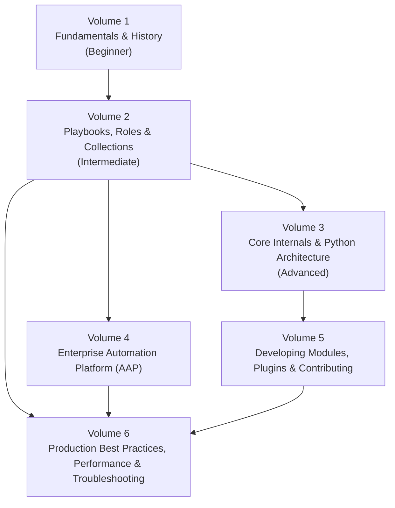

# The Ansible Book: A Complete Automation Series

This is a book-length Ansible series, not a cheat sheet. It is written for two very different readers at once: someone who has never opened a terminal, and someone who wants to read Ansible Core's executor source and send it a patch. Every chapter answers not just *what* a feature does, but *why it exists*, *what problem it replaced*, and *what tradeoffs its designers accepted*.

!!! info "How this series is organized"
    Six volumes, each buildable and readable on its own, but ordered so concepts compound: history and mental models first, then daily-driver skills, then internals, then the enterprise platform, then extending Ansible yourself, then running it at scale in production.

!!! note "Status of this section"
    This series is being written volume by volume. Right now every chapter exists as a **scoped outline** — the structure, the questions it will answer, and the topics it will cover — so the direction can be reviewed before full prose is written. Full chapter content is filled in volume by volume, starting with Volume 1.

## The Six-Volume Roadmap

## Who Should Start Where

| You are... | Start at | Why |
| --- | --- | --- |
| New to Linux and automation entirely | [Volume 1](volume-1-fundamentals-and-history/index.md) | Builds the mental model — history, agentless design, YAML, idempotency — before any command is typed |
| A sysadmin who already runs shell scripts and SSH by hand | [Volume 1, Chapter 5](volume-1-fundamentals-and-history/05-declarative-vs-imperative.md) then [Volume 2](volume-2-playbooks-roles-and-collections/index.md) | You already know *what* to automate; this reframes *how* declaratively |
| A DevOps/platform engineer writing playbooks daily | [Volume 2](volume-2-playbooks-roles-and-collections/index.md) | Inventory, variables, roles, collections — the day-to-day surface area |
| An engineer debugging weird Ansible behavior | [Volume 3](volume-3-core-internals/index.md) or [Volume 6, Troubleshooting](volume-6-production-and-performance/04-troubleshooting.md) | Internals explain *why* something behaves the way it does; troubleshooting gives flowcharts |
| Evaluating or administering Red Hat Ansible Automation Platform | [Volume 4](volume-4-enterprise-automation-platform/index.md) | Controller, Automation Mesh, Execution Environments, licensing |
| A Python developer who wants to write modules/plugins or contribute upstream | [Volume 5](volume-5-development-and-contributing/index.md) | Module and plugin architecture, testing, the contribution workflow |
| Running Ansible against hundreds or thousands of hosts in production | [Volume 6](volume-6-production-and-performance/index.md) | Performance tuning, security, Windows, real production playbooks |

## Volume Map

- [Volume 1 — Fundamentals & History](volume-1-fundamentals-and-history/index.md)
- [Volume 2 — Playbooks, Roles & Collections](volume-2-playbooks-roles-and-collections/index.md)
- [Volume 3 — Core Internals & Python Architecture](volume-3-core-internals/index.md)
- [Volume 4 — Enterprise Automation Platform (AAP)](volume-4-enterprise-automation-platform/index.md)
- [Volume 5 — Developing Modules, Plugins & Contributing](volume-5-development-and-contributing/index.md)
- [Volume 6 — Production Best Practices, Performance & Troubleshooting](volume-6-production-and-performance/index.md)

## What Every Chapter Covers

To keep 400+ pages consistent, every chapter in this series follows the same skeleton:

1. **Why This Exists** — the problem that motivated the feature
2. **Problem Statement** — concretely, what breaks without it
3. **History / Context** — what came before, and why it wasn't enough
4. **Internal Architecture** — how it's actually built
5. **Workflow** — the end-to-end sequence of events
6. **Step-by-Step Explanation** — hands-on, with real command output
7. **Production Best Practices** — how experienced teams actually use it
8. **Common Mistakes** — the failure modes beginners (and experts) hit
9. **Performance Considerations** — cost and scaling behavior
10. **Security Considerations** — what can go wrong, and how to prevent it
11. **Interview Questions** — how this topic gets tested in real interviews
12. **Hands-On Lab** — a runnable exercise
13. **Summary** — the two-minute recap

!!! tip "Read it like a book, use it like a reference"
    First pass: read a volume start to finish in order. After that: jump straight to the chapter you need — each one is self-contained enough to use as a reference.

## Further Learning

- [Ansible Documentation](https://docs.ansible.com/)
- [Ansible Core GitHub repository](https://github.com/ansible/ansible)
- [Ansible Galaxy](https://galaxy.ansible.com/)
