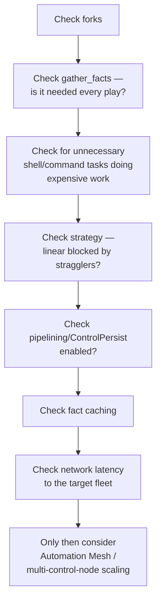

# Interview Prep: Scenario-Based Questions

Senior interviews test **reasoning**, not memorized definitions. Each scenario below is deliberately open-ended — the value is in the process, not a single "correct" answer.

## Scenario 1 — "500 servers, playbook takes two hours, go."

**Expected thought process:**

A strong answer names each lever **and** explains what evidence would confirm or rule it out — "I'd raise forks and measure, not just raise it and hope" — rather than reciting the list. Concept pages: [Forks, Serial, Strategy, and Throttle](../advanced-execution/01-forks-serial-strategy-throttle.md), [Performance](../production-engineering/05-performance.md).

## Scenario 2 — "A playbook that worked yesterday now fails halfway through, on a host that wasn't touched."

**Expected thought process:**

- First question: did the **playbook** change, the **inventory** change, or the **target host** change (drift)?
- If nothing in the repo changed: suspect the host itself — check `ansible all -m ping` against just that host, then `-vvv` on the failing task specifically.
- If it's an `UNREACHABLE` on a host that "wasn't touched": rule out an expired/rotated SSH key, a changed host key (rebuild), or a network path change (bastion, security group) before assuming Ansible itself is at fault.
- Concept pages: [SSH and Connection Problems](../troubleshooting/01-ssh-and-connection-problems.md), [Troubleshooting](../troubleshooting/index.md).

## Scenario 3 — "A junior engineer's playbook reports `changed` on every single run, and they don't understand why that's a problem."

**Expected thought process:**

- Identify the mechanism first: some task is using `command`/`shell` (or a poorly written custom module) that doesn't check state before acting.
- Explain the operational cost concretely: a service getting restarted on every run is an availability risk, not just cosmetic noise in the output.
- Prescribe the fix at the right level: replace with a real module where one exists; add `creates`/`removes`/`changed_when` where it genuinely doesn't.
- Concept pages: [Idempotency](../core-concepts/11-idempotency.md), [Command vs. Shell](../modules/01-command-vs-shell-vs-raw-vs-script.md).

## Scenario 4 — "You need to deploy a config change to production, but you're not fully confident it's correct. What do you do before running it for real?"

**Expected thought process:**

- `ansible-playbook --check --diff` against the real production inventory first — free, zero-risk, and shows exactly what would change.
- A stepped `serial` rollout (`[1, 5, "100%"]`) so a bad change only ever affects a canary batch, not the whole fleet — see [Case Study: Rolling Nginx Deployment](../case-studies/01-rolling-nginx-deployment.md) for a worked example including the failure path.
- A real post-deploy health check task (`uri` with `status_code:` and `retries`), not just "the task didn't error."

## Scenario 5 — "Two engineers, working independently, both need to add different config lines to the same file on the same fleet. How do you avoid conflicts?"

**Expected thought process:**

- The wrong instinct is two separate `shell: echo ... >> file` tasks — non-idempotent and directly conflict-prone (see [Idempotency](../core-concepts/11-idempotency.md)).
- The right instinct: **one** owner for the file, using `ansible.builtin.template` with both settings expressed as variables in one coherent config source — see [Templates for Config Generation](../jinja2-and-templates/03-templates-for-config-generation.md) and [Why Not lineinfile for Whole Files](../jinja2-and-templates/03-templates-for-config-generation.md#why-template-not-lineinfile-for-whole-files).
- If the file is genuinely owned by something else and only needs a surgical addition, `lineinfile`/`blockinfile` with distinct, well-scoped markers — not two separate append-only shell tasks.

## Next

Continue to [Roles, Collections & Modules](04-roles-collections-and-modules-questions.md).
