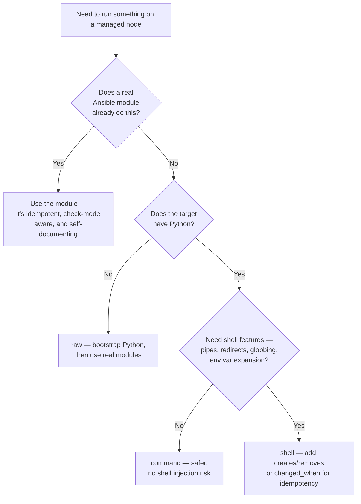

# Command vs. Shell vs. Raw vs. Script

## What You'll Learn

- What each of the four execution modules actually requires and provides
- Why none of them are idempotent by default, and how to make one safely so when you must use it
- A decision tree for choosing between them — and for choosing none of them

## The Four, Compared

| | Requires shell on target | Requires Python on target | Supports check mode | Idempotent by default |
|---|---|---|---|---|
| `command` | No | Yes | Partial (skipped, unless `creates`/`removes` lets Ansible decide) | No |
| `shell` | Yes | Yes | Partial (same) | No |
| `raw` | Yes | **No** | No | No |
| `script` | Yes (runs a local script file remotely) | No (script itself may need it) | No | No |

- **`command`** runs a program directly — no shell involved, so no pipes, redirects, or environment variable expansion. This is a deliberate safety property: `command` can't be broken by shell injection the way `shell` can.
- **`shell`** runs the argument through `/bin/sh` on the target — pipes, redirects, globbing, and `&&` chaining all work, at the cost of shell-injection risk if any part of the string comes from untrusted input.
- **`raw`** bypasses the module system entirely — no Python required on the target at all. Its only legitimate production use is bootstrapping Python itself on a bare image (see [Architecture and Execution](../getting-started/02-architecture-and-execution.md)).
- **`script`** copies a local script file to the target and executes it there — useful for a legacy shell/Python script you're not ready to convert to a real module yet, but it forfeits the module JSON-argument contract and (like `command`/`shell`) isn't idempotent.

## Bad, and the Better Alternative

```yaml
# Bad — non-idempotent, reports changed on every single run
- name: Restart nginx
  ansible.builtin.shell: systemctl restart nginx
```

```yaml
# Better — restart only when something changed, via a handler
- name: Deploy nginx configuration
  ansible.builtin.template:
    src: nginx.conf.j2
    dest: /etc/nginx/nginx.conf
    validate: nginx -t -c %s
  notify: Reload nginx

- name: Ensure nginx is running and enabled
  ansible.builtin.systemd_service:
    name: nginx
    state: started
    enabled: true

# handlers:
- name: Reload nginx
  ansible.builtin.systemd_service:
    name: nginx
    state: reloaded
```

The `shell` version restarts nginx **every single run**, forever, whether or not anything actually needs restarting — a real availability risk for a service under load. Swapping `shell` for `systemd_service: state=restarted` doesn't fix that on its own: `restarted` also restarts on every run. The fix is to express the desired state (`started`, `enabled`) as a normal task, and put the restart or reload in a [handler](../core-concepts/08-handlers.md) that only fires when the config actually changed.

## When `command`/`shell` Are Legitimate

Not every operation has a purpose-built module. When you do need `command`/`shell`, make the non-idempotency explicit instead of ignoring it:

```yaml
- name: Run a one-time database migration
  ansible.builtin.command:
    cmd: /opt/app/bin/migrate.py
    creates: /opt/app/.migrated   # skip if this file already exists
  register: migration

- name: Mark migration complete
  ansible.builtin.file:
    path: /opt/app/.migrated
    state: touch
  when: migration is changed
```

```yaml
- name: Check whether the certificate needs renewal
  ansible.builtin.command: certbot certificates
  register: cert_check
  changed_when: false          # this task only reads state, never changes it
  failed_when: "'ERROR' in cert_check.stdout"
```

- `creates:` / `removes:` — skip the task if a marker file already/doesn't exist. The single most common idempotency workaround for `command`/`shell`, and the only thing that lets these modules report a meaningful result under `--check`. They go directly under the module (as above); the older `args:` form still works.
- `changed_when: false` — tell Ansible this task never changes anything (a pure read/check), overriding the default (misleading) behavior of reporting `changed` on any zero exit code.
- `failed_when:` — define failure explicitly instead of relying on exit codes alone, when a tool's exit code doesn't map cleanly to success/failure.

## Decision Tree



## Common Mistakes

- Reaching for `shell` out of habit for something `ansible.builtin.package`, `service`, `copy`, or `template` already does correctly.
- Assuming `command`/`shell` tasks are idempotent because they're inside a playbook — they run unconditionally every time unless you add a guard yourself.
- Using `creates:`/`removes:` but pointing it at the wrong file — the task then silently stops running at all, which is worse than not being idempotent, because the failure is silent.
- Building shell strings from unsanitized variables in a `shell` task — a real command-injection risk if any input is user-controlled. Prefer `command` with an argument list, or sanitize explicitly.

## Interview Questions

- What's the practical difference between `command` and `shell`, and why does that difference matter for security?
- When is `raw` the only option, and why?
- How do you make a `command`/`shell` task idempotent when no real module exists for the job?

See [Interview Prep: Core Concepts](../interview-prep/01-core-concepts-questions.md) for the full leveled answers.

## Next

Continue to [Module Decision Trees](02-module-decision-trees.md) for more choices like this one.
