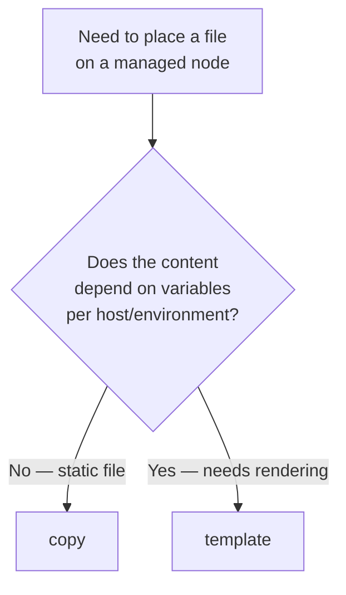
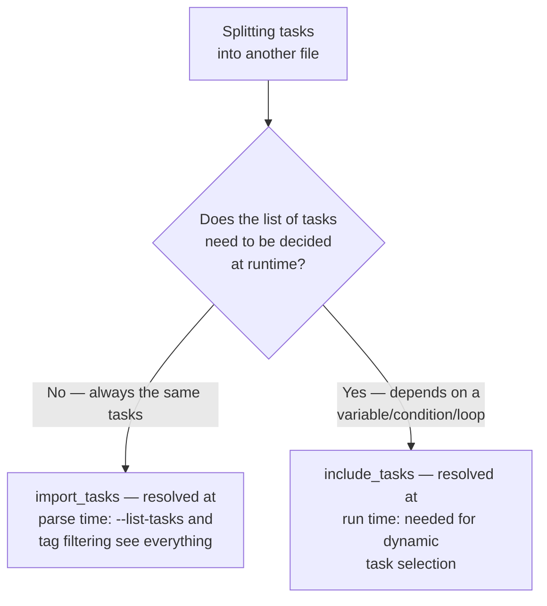
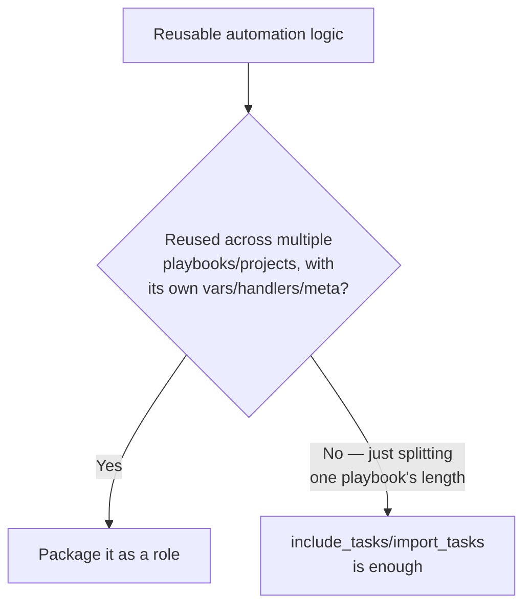
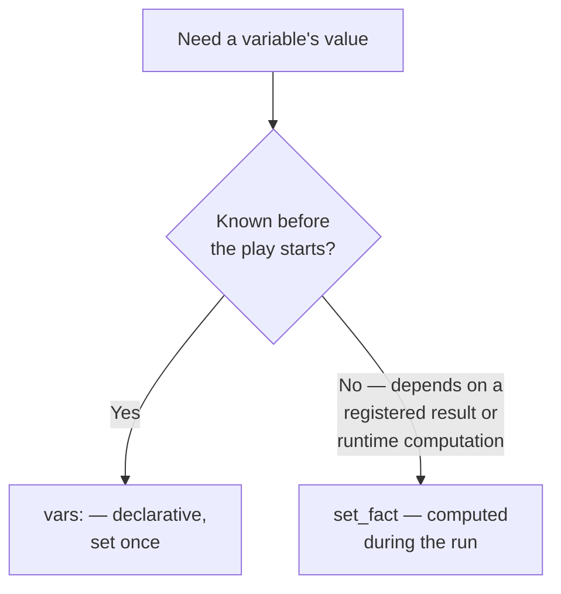
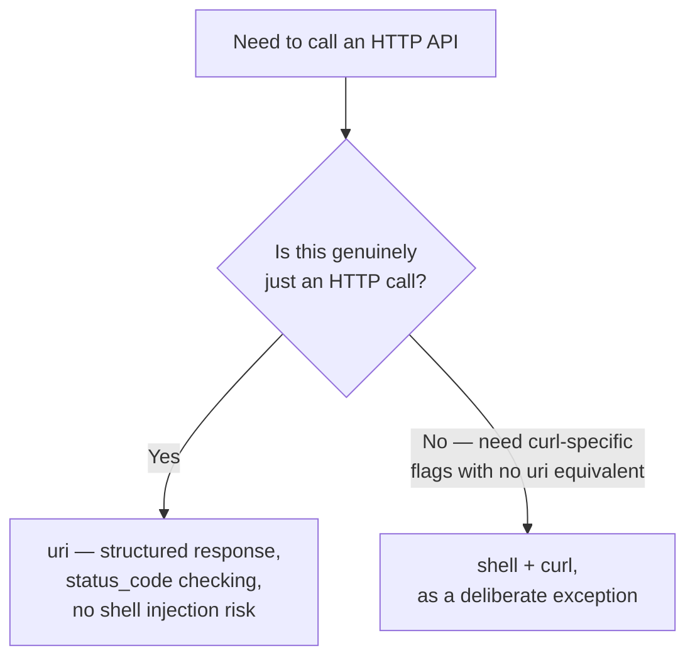

# Module Decision Trees

Each of these is a genuinely common "which one do I use" moment. Command vs. shell got [its own page](01-command-vs-shell-vs-raw-vs-script.md) because it's the biggest one — these are the rest.

## copy vs. template



`copy` moves a file byte-for-byte (optionally with `content:` inline). `template` renders a `.j2` file through Jinja2 first — the right choice the moment any part of the file needs to differ by host, environment, or variable. See [Templates for Config Generation](../jinja2-and-templates/03-templates-for-config-generation.md).

## import_tasks vs. include_tasks



This is one of the most common Ansible interview questions, and the answer is about **when** resolution happens, not just "static vs. dynamic" as a vague label:

- **`import_tasks`** is resolved when the playbook is parsed, before any host runs anything — `ansible-playbook --list-tasks` and `--tags` filtering can see every task inside it in advance. A `when:` on the `import_tasks` line itself applies to *every* task inside the imported file individually (each gets the same condition appended).
- **`include_tasks`** is resolved at the moment that task is reached during a real run — necessary when the file to include, or whether to include it at all, depends on a variable or loop. `--list-tasks` **cannot** see inside it ahead of time, because it genuinely doesn't know yet.

```yaml
# Static — always the same tasks, want full --list-tasks visibility
- ansible.builtin.import_tasks: configure_firewall.yml

# Dynamic — the filename itself depends on a variable
- ansible.builtin.include_tasks: "{{ os_family }}_setup.yml"
```

Default to `import_tasks` for anything with a fixed structure; reach for `include_tasks` only when the task list genuinely can't be known until run time.

## role vs. task include



A role is the unit of *reuse and distribution* (see [Roles](../roles/index.md)) — it bundles tasks with its own defaults, handlers, and metadata so it can be dropped into a different project unmodified. `include_tasks`/`import_tasks` are for keeping one playbook's own file readable, with no expectation of reuse elsewhere.

## loop vs. legacy with_*

Covered in full in [Loops](../core-concepts/07-loops.md) — short version: use `loop` in all new code; `with_items`/`with_dict`/etc. still work but are legacy.

## set_fact vs. vars



## uri vs. shell + curl



`ansible.builtin.uri` parses the response, checks `status_code` declaratively, and returns structured JSON you can `register` and branch on — see [URI and API Automation](04-uri-and-api-automation.md). `shell: curl ...` throws all of that away for a raw exit code and stdout blob.

## Interview Questions

- What's the practical difference between `import_tasks` and `include_tasks`, and what does that difference mean for `--list-tasks`?
- When would you write a role instead of just splitting a playbook with `include_tasks`?
- Why prefer `uri` over `shell: curl` for API automation?

## Next

Continue to [File, Package, Service, and User Modules](03-file-package-service-user-modules.md).
