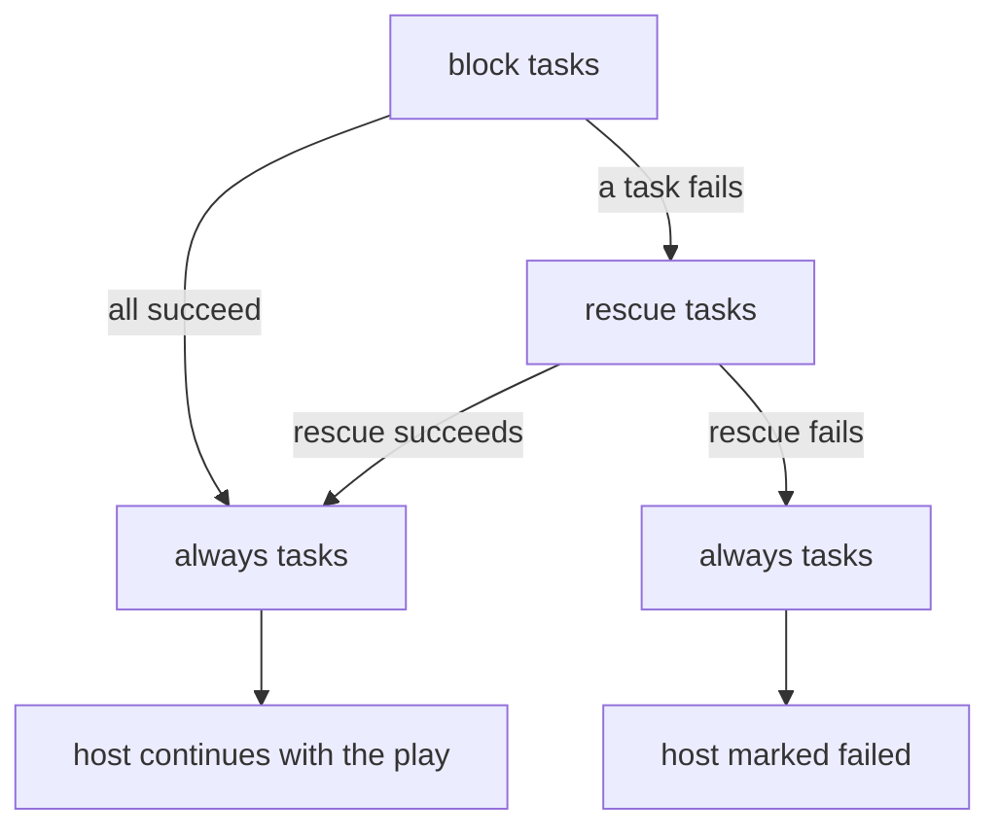

# Blocks, Rescue, and Always

`block` groups tasks, `rescue` runs only if a task inside the block fails, and `always` runs either way — Ansible's version of try/except/finally.

## What You'll Learn

- How `block:` groups tasks and shares keywords like `when`, `become`, and `tags`
- How `rescue:` and `always:` give you try/except/finally behavior, per host
- Which magic variables tell a `rescue` section what failed
- A complete deploy-with-rollback pattern you can adapt

## Why This Exists

A flat task list has no concept of "if any of these three tasks fail, do this instead" — `block`/`rescue`/`always` is Ansible's answer, modeled loosely on try/except/finally from general-purpose languages, but evaluated per host.

## Mental Model

> `block` is the *try*. If any task in it fails **on a host**, Ansible stops the block for that host and runs `rescue` (the *except*). `always` (the *finally*) runs afterwards whether the block succeeded, failed, or was rescued. If `rescue` completes successfully, the host is considered recovered and continues with the rest of the play.



## Grouping Without Error Handling

Even without `rescue`, a block saves repetition. Keywords on the block apply to every task inside:

```yaml
- name: Install and configure PostgreSQL on Debian hosts
  when: ansible_facts['os_family'] == 'Debian'
  become: true
  tags: [database]
  block:
    - name: Install PostgreSQL
      ansible.builtin.apt:
        name: postgresql-16
        state: present

    - name: Deploy pg_hba.conf
      ansible.builtin.template:
        src: pg_hba.conf.j2
        dest: /etc/postgresql/16/main/pg_hba.conf
      notify: Reload postgresql
```

The `when:` is evaluated **for each task** inside the block, not once for the block as a whole.

## rescue and always

```yaml
- name: Attempt a risky schema change
  block:
    - name: Apply migration
      ansible.builtin.command: /opt/checkout/bin/migrate --to 42
      register: migration

  rescue:
    - name: Show what failed
      ansible.builtin.debug:
        msg: >-
          Task '{{ ansible_failed_task.name }}' failed:
          {{ ansible_failed_result.msg | default(ansible_failed_result.stderr | default('no message')) }}

    - name: Roll the schema back
      ansible.builtin.command: /opt/checkout/bin/migrate --to 41

  always:
    - name: Remove the maintenance lock whatever happened
      ansible.builtin.file:
        path: /opt/checkout/shared/maintenance.lock
        state: absent
```

Inside `rescue:` you get:

| Variable | Contains |
|---|---|
| `ansible_failed_task` | The task object that failed (`.name`, `.action`) |
| `ansible_failed_result` | That task's result (`.msg`, `.rc`, `.stderr`) |

A rescued host shows up as `rescued=1` in the play recap instead of `failed=1`.

## Worked Example: Deploy, Roll Back, Always Notify

```yaml title="playbooks/deploy_checkout.yml"
- name: Deploy checkout with automatic rollback
  hosts: web
  become: true
  serial: 1
  vars:
    releases_dir: /opt/checkout/releases

  tasks:
    - name: Remember the release that's live right now
      ansible.builtin.command: readlink -f /opt/checkout/current
      register: previous_release
      changed_when: false

    - name: Deploy the new release
      block:
        - name: Unpack release {{ app_release }}
          ansible.builtin.unarchive:
            src: "files/checkout-{{ app_release }}.tar.gz"
            dest: "{{ releases_dir }}"
            creates: "{{ releases_dir }}/{{ app_release }}"

        - name: Switch the current symlink
          ansible.builtin.file:
            src: "{{ releases_dir }}/{{ app_release }}"
            dest: /opt/checkout/current
            state: link

        - name: Restart checkout now, not at the end of the play
          ansible.builtin.systemd_service:
            name: checkout
            state: restarted

        - name: Wait for the health check to pass
          ansible.builtin.uri:
            url: http://localhost:8080/healthz
            status_code: 200
          register: health
          retries: 10
          delay: 3
          until: health.status == 200

      rescue:
        - name: Point current back at the previous release
          ansible.builtin.file:
            src: "{{ previous_release.stdout }}"
            dest: /opt/checkout/current
            state: link

        - name: Restart on the previous release
          ansible.builtin.systemd_service:
            name: checkout
            state: restarted

        - name: Fail the host after rolling back, so the rollout stops
          ansible.builtin.fail:
            msg: "Release {{ app_release }} failed its health check on {{ inventory_hostname }}; rolled back."

      always:
        - name: Post the outcome to the deploy channel
          ansible.builtin.uri:
            url: "{{ deploy_webhook_url }}"
            method: POST
            body_format: json
            body:
              host: "{{ inventory_hostname }}"
              release: "{{ app_release }}"
              result: "{{ 'rolled back' if ansible_failed_task is defined else 'deployed' }}"
          delegate_to: localhost
          become: false
          no_log: true
```

Two deliberate choices:

- The restart is a **task**, not a handler. Handlers wait until the end of the play, so the health check would run against the old process.
- `rescue` ends with `fail`. Without it the host counts as recovered, and `serial: 1` would happily move on to the next host with the same broken release.

## Handlers and Blocks

If a block notifies a handler and a later task fails, the handler doesn't run for that host by default. To make sure a notified reload happens before `rescue` logic runs, flush handlers explicitly inside the block:

```yaml
    - name: Apply queued service reloads now
      ansible.builtin.meta: flush_handlers
```

## Limits of block

- You can't `loop:` over a block. Put the tasks in a file and `loop` over `include_tasks` instead.
- `rescue` catches task **failures**, not unreachable hosts or syntax errors.
- A block is not a transaction: tasks that already succeeded aren't undone unless your `rescue` undoes them.

## Common Mistakes

- Assuming a failure inside `rescue:` itself is silently swallowed — it isn't; an unhandled failure there still fails the host.
- Forgetting `always:` runs even on a host that never entered `rescue:` (the `block` fully succeeded) — it isn't only for the failure path.
- Rolling back in `rescue` without re-failing, so a rolling deploy continues to the next host as though nothing happened.
- Relying on a handler restart inside the block and health-checking before the handler has run.
- Expecting `rescue` to catch an `UNREACHABLE` host.

## Interview Questions

- What's the difference between `rescue:` and `always:`?
- How would you implement a deployment rollback using `block`/`rescue`?
- After `rescue` runs successfully, is the host considered failed? How do you change that?
- Why might a health check inside a block pass against the *old* version of a service?

## Next

Continue to [Error Handling](02-error-handling.md).
