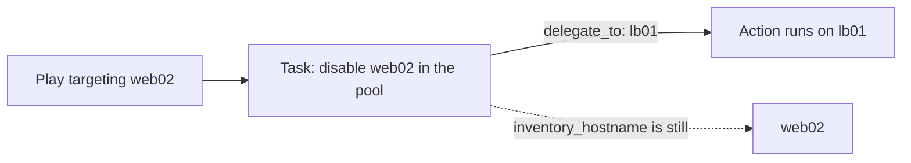

# Delegation and Become

## What You'll Learn

- How `delegate_to` runs a task somewhere else while keeping the original host's context
- How `run_once` and `delegate_facts` behave, including under `serial`
- How to run a task on the control node itself
- How `become`, `become_user`, and `become_method` work, and the non-root pitfall

## Why This Exists

Not every task should run on the host it's nominally "for" — the classic case is updating a load balancer's config on behalf of a web server being taken in or out of rotation. `delegate_to` and `run_once` handle this; `become` handles privilege escalation, a related but distinct concept covered in depth in [SSH and Connectivity](../getting-started/05-ssh-and-connectivity.md#become-is-not-ssh-authentication).

## Mental Model

> `delegate_to` changes **where the action executes**. It does not change **whose task it is**. Variables like `inventory_hostname` and `ansible_facts` still describe the original host; only the connection goes to the delegate.



## delegate_to: A Load Balancer Drain

```yaml
- name: Rolling update behind HAProxy
  hosts: web
  serial: 1
  become: true

  tasks:
    - name: Drain this web server from the pool
      community.general.haproxy:
        state: disabled
        host: "{{ inventory_hostname }}"      # web02 — the original host
        backend: web_pool
        socket: /run/haproxy/admin.sock
        wait: true
      delegate_to: "{{ item }}"
      loop: "{{ groups['lb'] }}"

    - name: Deploy the new release
      ansible.builtin.include_role:
        name: checkout

    - name: Put this web server back in the pool
      community.general.haproxy:
        state: enabled
        host: "{{ inventory_hostname }}"
        backend: web_pool
        socket: /run/haproxy/admin.sock
      delegate_to: "{{ item }}"
      loop: "{{ groups['lb'] }}"
```

Delegation isn't free:

- Ansible connects to the delegate using **the delegate's** connection variables (`ansible_host`, `ansible_user` from inventory), so the control node needs working SSH to `lb01`.
- `become: true` from the play applies on the delegate too, so the remote user needs sudo there.
- The original host's variables are still in scope. Use `hostvars[item]` when you need the delegate's own values.

## Running on the Control Node

```yaml
- name: Wait for the service to answer through the public load balancer
  ansible.builtin.uri:
    url: "https://shop.example.com/healthz"
    status_code: 200
  delegate_to: localhost
  become: false            # don't try to sudo on your laptop or CI runner
```

`delegate_to: localhost` is the everyday form. `local_action:` is an older shorthand for the same thing. If `localhost` isn't in your inventory, Ansible uses an implicit local connection.

## run_once: Exactly Once

```yaml
- name: Run database migrations once for the whole deployment
  ansible.builtin.command: /opt/checkout/bin/migrate
  run_once: true
  delegate_to: "{{ groups['web'] | first }}"
```

- Without `delegate_to`, `run_once` executes on the **first host in the current batch**. Pin the host explicitly when it matters.
- Under `serial`, "once" means **once per batch**. With `serial: 1` across 10 hosts, a `run_once` task runs 10 times. Put one-time work in its own play without `serial`, or guard it: `when: inventory_hostname == ansible_play_hosts_all | first`.
- The result registered by a `run_once` task is copied to every host in the play, so later tasks on any host can read it.

## delegate_facts: Where Gathered Facts Land

```yaml
- name: Gather facts for the database hosts from the web play
  ansible.builtin.setup:
  delegate_to: "{{ item }}"
  delegate_facts: true
  loop: "{{ groups['db'] }}"
  run_once: true
```

Without `delegate_facts: true`, facts gathered by a delegated `setup` are assigned to the *original* host, overwriting its own facts. With it, they're stored under the delegate in `hostvars`. See [Magic Variables and Hostvars](../variables-and-data/05-magic-variables-and-hostvars.md).

## become: Privilege Escalation

```yaml
- name: Manage the application
  hosts: app
  become: true                   # escalate for the whole play (to root by default)

  tasks:
    - name: Install system packages (as root)
      ansible.builtin.package:
        name: python3-venv
        state: present

    - name: Create the virtualenv as the application user
      ansible.builtin.command: python3 -m venv /opt/checkout/venv
      args:
        creates: /opt/checkout/venv/bin/python
      become_user: checkout

    - name: Read a user-owned file without escalating
      ansible.builtin.slurp:
        src: /home/deploy/.ssh/known_hosts
      become: false
```

| Keyword / variable | Purpose | Default |
|---|---|---|
| `become` | Turn escalation on or off | `false` |
| `become_user` | User to become | `root` |
| `become_method` | How: `sudo`, `su`, `doas`, `pbrun`, ... | `sudo` |
| `ansible_become_password` | Password, usually from Vault | none |

These resolve through normal [variable precedence](../variables-and-data/02-variable-precedence.md), so `ansible_become_method: su` in `group_vars/legacy.yml` changes the method for that group only.

### The non-root become_user pitfall

Becoming an **unprivileged** user (connect as `deploy`, become `checkout`) means the module file uploaded by `deploy` must be readable by `checkout`. On many systems this fails with an error about temporary files and permissions. Fixes, in order of preference:

1. Enable [pipelining](../advanced-execution/03-connection-plugins.md) so no temporary module file is written.
2. Install `acl` on the managed node so Ansible can grant access with `setfacl`.
3. As a last resort, `allow_world_readable_tmpfiles = True`, which makes module files readable by everyone on the host.

Deeper diagnosis is in [Become and Permission Problems](../troubleshooting/02-become-and-permission-problems.md).

## Common Mistakes

- Forgetting `delegate_to` changes *where* a task's action runs but not which host's variables are in scope by default — a common source of "wrong value used" bugs.
- Using `run_once` without also pinning which host runs it, when the "any host" default happens to pick one with different facts than expected.
- Using `run_once` under `serial` and being surprised it runs once per batch.
- Delegating to `localhost` with the play's `become: true` still active, so the control node or CI runner asks for a sudo password.
- Delegating `setup` without `delegate_facts: true` and overwriting the original host's facts.

## Interview Questions

- What does `delegate_to` change about a task's execution, and what does it not change?
- When would you use `run_once`, and how does `serial` change its behavior?
- What does `delegate_facts: true` do?
- Why can becoming a non-root user fail when becoming root works fine?

## Next

Continue to [Async and Poll](05-async-and-poll.md).
