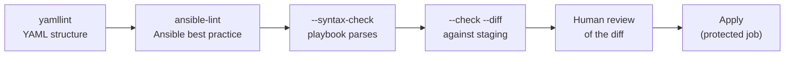

# CI/CD and Linting

## What You'll Learn

- What `yamllint` and `ansible-lint` each catch, and how to configure them
- A staged pipeline: lint → syntax → dry run → review → apply
- How to run a real `--check --diff` against a non-production inventory in CI
- A working GitHub Actions workflow you can copy
- How to keep CI reproducible with pinned dependencies

## Why This Exists

A playbook that only gets reviewed by a human reading YAML misses a class of mistakes a linter catches in seconds — and a playbook that's never dry-run in CI before a real apply is a production incident waiting for a busy afternoon.

`ansible-lint` and `tox-ansible` (for matrix testing across Python/`ansible-core` versions) both ship together in [ansible-dev-tools](08-ansible-dev-tools.md), so a single install covers most of what this page describes.

## Mental Model

> Each pipeline stage is cheaper and faster than the next, and catches a different class of problem. Fail as early as possible.



| Stage | Catches | Needs hosts? |
|---|---|---|
| `yamllint` | Indentation, duplicate keys, trailing spaces, truthy values | No |
| `ansible-lint` | Short module names, `command` where a module exists, missing task names, risky permissions, deprecated syntax | No |
| `--syntax-check` | Unknown keywords, missing roles or included files | No |
| `--check --diff` | Logic errors, wrong templates, unexpected changes | Yes |

## yamllint

```yaml title=".yamllint"
extends: default
rules:
  line-length:
    max: 160
  truthy:
    allowed-values: ["true", "false"]
  comments:
    min-spaces-from-content: 1
  octal-values:
    forbid-implicit-octal: true
    forbid-explicit-octal: true
ignore: |
  collections/ansible_collections/
  .venv/
```

The `truthy` rule is the important one: it rejects `yes`/`no`/`on` so booleans are always explicit.

## ansible-lint

```yaml title=".ansible-lint"
profile: production          # min → basic → moderate → safety → shared → production
exclude_paths:
  - collections/ansible_collections/
  - .github/
warn_list:
  - experimental
skip_list: []                # document every skip in code review
```

Profiles are cumulative. Start new repositories at `production`; for an existing repository, start at `basic`, fix, and raise it one step at a time.

```bash
ansible-lint                       # uses .ansible-lint
ansible-lint --fix                 # auto-fix what it safely can (FQCNs, YAML formatting)
ansible-lint playbooks/site.yml    # one file
```

Typical findings and fixes:

```yaml
# fqcn[action-core]: use FQCN for builtin module actions
- name: Install nginx
  package: { name: nginx }                     # before
- name: Install nginx
  ansible.builtin.package: { name: nginx }     # after

# no-changed-when: commands should not change things if nothing needs doing
- name: Read app version
  ansible.builtin.command: /opt/app/bin/app --version
  changed_when: false                          # added

# risky-file-permissions
- name: Write config
  ansible.builtin.template:
    src: app.conf.j2
    dest: /etc/app/app.conf
    mode: "0640"                               # added
```

Suppress a finding on one line only when you've justified it:

```yaml
- name: Run vendor installer that has no module
  ansible.builtin.shell: /opt/vendor/install.sh --unattended  # noqa: command-instead-of-shell
```

## Pre-commit: Catch It Before CI

```yaml title=".pre-commit-config.yaml"
repos:
  - repo: https://github.com/adrienverge/yamllint
    rev: v1.37.1
    hooks:
      - id: yamllint
  - repo: https://github.com/ansible/ansible-lint
    rev: v25.9.0
    hooks:
      - id: ansible-lint
```

Pin `rev` to the release your team has validated, and update it deliberately.

## Pinning for Reproducible CI

```text title="requirements-ci.txt"
ansible-core==2.19.3
ansible-lint==25.9.0
yamllint==1.37.1
```

```yaml title="collections/requirements.yml"
collections:
  - name: community.general
    version: "10.2.0"
  - name: ansible.posix
    version: "2.0.0"
```

If CI installs whatever is latest, a run that passed yesterday can fail today for reasons unrelated to the change under review — or pass with behavior nobody tested.

## A Complete GitHub Actions Workflow

```yaml title=".github/workflows/ansible.yml"
name: Ansible
on:
  pull_request:
  push:
    branches: [main]

jobs:
  lint:
    runs-on: ubuntu-latest
    steps:
      - uses: actions/checkout@v7
      - uses: actions/setup-python@v7
        with:
          python-version: "3.12"
          cache: pip
      - run: pip install -r requirements-ci.txt
      - run: ansible-galaxy collection install -r collections/requirements.yml -p ./collections
      - run: yamllint .
      - run: ansible-lint
      - run: ansible-playbook -i inventories/staging playbooks/site.yml --syntax-check

  dry-run:
    needs: lint
    runs-on: [self-hosted, staging-network]     # a runner that can reach staging hosts
    steps:
      - uses: actions/checkout@v7
      - uses: actions/setup-python@v7
        with:
          python-version: "3.12"
      - run: pip install -r requirements-ci.txt
      - run: ansible-galaxy collection install -r collections/requirements.yml -p ./collections
      - name: Check mode against staging
        env:
          ANSIBLE_HOST_KEY_CHECKING: "True"
          VAULT_STAGING_PASSWORD: ${{ secrets.VAULT_STAGING_PASSWORD }}
          SSH_PRIVATE_KEY: ${{ secrets.ANSIBLE_STAGING_SSH_KEY }}
        run: |
          umask 077
          printf '%s\n' "$SSH_PRIVATE_KEY" > "$RUNNER_TEMP/id_ed25519"
          printf '%s' "$VAULT_STAGING_PASSWORD" > "$RUNNER_TEMP/vault-staging"
          ansible-playbook -i inventories/staging playbooks/site.yml \
            --check --diff \
            --private-key "$RUNNER_TEMP/id_ed25519" \
            --vault-id "staging@$RUNNER_TEMP/vault-staging" | tee check-output.txt
      - uses: actions/upload-artifact@v4
        with:
          name: staging-diff
          path: check-output.txt
```

The apply job belongs in a separate workflow or a protected environment that requires approval, runs only on `main`, and uses production credentials that pull-request jobs can never access.

Keep `known_hosts` for your fleet in the repository or runner image, and leave host key checking **on** in CI — disabling it lets a man-in-the-middle impersonate a host.

## Validating Inventory

Broken inventory fails every stage in confusing ways. Add a fast check:

```bash
ansible-inventory -i inventories/staging --graph
ansible-inventory -i inventories/production --list > /dev/null
```

## Common Mistakes

- Running `ansible-lint` locally but not enforcing it in CI, so violations creep back in.
- No `--check --diff` gate before merge, catching logic errors only when they hit a real environment.
- CI installing unpinned collections, so a run that passed yesterday fails today for reasons unrelated to the actual change.
- Letting pull-request jobs access production inventory or credentials.
- Disabling `ANSIBLE_HOST_KEY_CHECKING` in CI "to make it work."
- Treating a green `--check` as proof: tasks guarded by `when: not ansible_check_mode`, or depending on earlier changes, aren't exercised.

## Interview Questions

- What would a CI pipeline for a playbook repository look like, stage by stage?
- Why pin collection and role versions in CI instead of always installing latest?
- What's the difference between what `yamllint` and `ansible-lint` catch?
- What are the limits of `--check --diff` as a pre-merge gate?

## Next

Continue to [Molecule Testing](07-molecule-testing.md).
