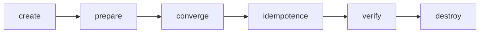

# Molecule Testing

## What You'll Learn

- What Molecule does, and the stages of `molecule test`
- How to set up a Docker-based scenario for a role
- How to write `verify.yml` assertions that check real state, not just task status
- How to test several distributions at once, and run it all in CI

## Why This Exists

A role that "worked when I ran it manually" isn't the same as a role that's actually tested — Molecule runs a role against a disposable test instance (usually a container) as part of a repeatable pipeline, including an explicit **idempotence** check.

Molecule ships as part of [ansible-dev-tools](08-ansible-dev-tools.md) alongside `pytest-ansible`, which can expose Molecule scenarios as pytest fixtures if your project's test suite already standardizes on pytest.

## Mental Model

> A Molecule **scenario** is a small, disposable test lab defined in files next to your role: which instances to create, a playbook that applies the role, and a playbook that checks the result. `molecule test` builds the lab, runs the role **twice**, checks the outcome, and tears everything down.



| Stage | What happens | Fails when |
|---|---|---|
| `create` | Start test instances | Image or driver problems |
| `prepare` | Optional pre-setup (e.g. install `python3`) | — |
| `converge` | Apply the role | Any task fails |
| `idempotence` | Apply the role **again** | Any task reports `changed` |
| `verify` | Run assertions | The resulting state is wrong |
| `destroy` | Remove instances | — |

## Install

```bash
pip install ansible-core molecule "molecule-plugins[docker]"
docker info    # Molecule's docker driver needs a working Docker daemon
```

## Create a Scenario

```bash
cd roles/nginx
molecule init scenario --driver-name docker default
```

```text
roles/nginx/molecule/default/
├── molecule.yml     # driver and platforms
├── converge.yml     # applies the role
└── verify.yml       # checks the result
```

## molecule.yml: Test on Two Distributions

Testing services such as nginx needs systemd inside the container, so use images built for that purpose and run them privileged with the cgroup filesystem mounted:

```yaml title="molecule/default/molecule.yml"
---
driver:
  name: docker

platforms:
  - name: ubuntu2404
    image: geerlingguy/docker-ubuntu2404-ansible:latest
    command: ""
    privileged: true
    cgroupns_mode: host
    volumes:
      - /sys/fs/cgroup:/sys/fs/cgroup:rw
    pre_build_image: true

  - name: rockylinux9
    image: geerlingguy/docker-rockylinux9-ansible:latest
    command: ""
    privileged: true
    cgroupns_mode: host
    volumes:
      - /sys/fs/cgroup:/sys/fs/cgroup:rw
    pre_build_image: true

provisioner:
  name: ansible
  inventory:
    host_vars:
      ubuntu2404:
        nginx_http_port: 8080

verifier:
  name: ansible
```

These community images are convenient for testing; pin them to a digest, or build your own base images, for pipelines that must be reproducible.

## converge.yml

```yaml title="molecule/default/converge.yml"
---
- name: Converge
  hosts: all
  become: true
  roles:
    - role: nginx
      vars:
        nginx_vhosts:
          - name: shop
            server_names: [shop.test]
            upstream: "127.0.0.1:9000"
```

## verify.yml: Assert Real State

Checking that tasks didn't fail isn't enough. Verify what a user of the server would observe:

```yaml title="molecule/default/verify.yml"
---
- name: Verify
  hosts: all
  become: true
  gather_facts: false
  tasks:
    - name: Collect service state
      ansible.builtin.service_facts:

    - name: nginx is running and enabled
      ansible.builtin.assert:
        that:
          - ansible_facts.services['nginx.service'].state == 'running'
          - ansible_facts.services['nginx.service'].status == 'enabled'

    - name: Configuration is valid
      ansible.builtin.command: nginx -t
      changed_when: false

    - name: The shop vhost file exists
      ansible.builtin.stat:
        path: /etc/nginx/conf.d/shop.conf
      register: vhost

    - name: Vhost was rendered
      ansible.builtin.assert:
        that: vhost.stat.exists

    - name: nginx answers on the configured port
      ansible.builtin.uri:
        url: "http://localhost:{{ nginx_http_port | default(80) }}/"
        status_code: [200, 404, 502]    # any HTTP answer proves it's listening
```

## Day-to-Day Commands

```bash
molecule create          # start instances, keep them
molecule converge        # apply the role (repeat while developing)
molecule login -h ubuntu2404   # shell into an instance to poke around
molecule verify          # run assertions
molecule idempotence     # re-run and fail on any change
molecule destroy         # clean up

molecule test            # the full sequence, as CI runs it
molecule test --destroy never   # keep instances after a failure to debug
```

The fast loop while writing a role is `converge` → `verify` → edit → `converge`, without recreating containers each time.

## Reading an Idempotence Failure

```text
CRITICAL Idempotence test failed because of the following tasks:
*  => nginx : Download GPG key
*  => nginx : Set worker_processes
```

Each listed task changed on the second run. Common causes and fixes are in [Idempotency](../core-concepts/11-idempotency.md): a `command` without `creates:` or `changed_when`, `get_url` without a `checksum`, a template rendering a timestamp, or `state: latest`.

## Additional Scenarios

Test variations in separate scenarios, each with its own `molecule.yml` and `converge.yml`:

```text
molecule/
├── default/      # plain HTTP on two distributions
└── tls/          # TLS enabled, self-signed test certificate
```

```bash
molecule test --scenario-name tls
molecule test --all
```

## Running in CI

```yaml title=".github/workflows/molecule.yml"
name: Molecule
on: [pull_request]

jobs:
  molecule:
    runs-on: ubuntu-latest
    strategy:
      matrix:
        role: [nginx, node_exporter, app_checkout]
    steps:
      - uses: actions/checkout@v7
      - uses: actions/setup-python@v7
        with:
          python-version: "3.12"
      - run: pip install ansible-core molecule "molecule-plugins[docker]"
      - name: Molecule test
        working-directory: roles/${{ matrix.role }}
        run: molecule test
        env:
          PY_COLORS: "1"
          ANSIBLE_FORCE_COLOR: "1"
```

Linting runs as its own stage (see [CI/CD and Linting](06-cicd-and-linting.md)); recent Molecule releases no longer include lint in `molecule test`.

## Common Mistakes

- Never running the `idempotence` stage — the single check most likely to catch a role that silently reports `changed` on every run.
- Testing only the "happy path" converge and skipping `verify` assertions entirely, so a role can converge to the wrong state and still pass.
- Using a plain `ubuntu` image and then failing on every `service` task because the container has no systemd.
- Testing on one distribution while declaring support for three in `meta/main.yml`.
- Writing verify checks that repeat the role's tasks (`file: state=directory`) instead of asserting on observed state.

## Interview Questions

- What does Molecule's `idempotence` stage actually check, and why is it meaningfully different from `converge` succeeding?
- How would you test a role against both Ubuntu and RHEL in the same CI pipeline?
- What makes a good `verify.yml` assertion?
- Why do service-managing roles need special container images for Molecule?

## Next

Continue to [Case Studies](../case-studies/index.md) to see these practices applied end to end.
