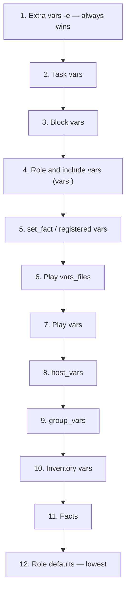

# Variable Precedence Cheat Sheet

| Rank | Source | File / Location |
|---|---|---|
| 1 (highest) | Extra vars | `-e` on the command line |
| 2 | Task vars | `vars:` on a task |
| 3 | Block vars | `vars:` on a block |
| 4 | Role/include vars | `roles/<role>/vars/main.yml` |
| 5 | `set_fact` / registered | Set at runtime |
| 6 | Play `vars_files` | Referenced file |
| 7 | Play vars | `vars:` on a play |
| 8 | `host_vars` | `host_vars/<host>.yml` |
| 9 | `group_vars` | `group_vars/<group>.yml` |
| 10 | Inventory vars | Set inline in the inventory file |
| 11 | Facts | Gathered from the host |
| 12 (lowest) | Role defaults | `roles/<role>/defaults/main.yml` |

**Verify, don't guess:** `ansible-inventory --host <name>` or `ansible-playbook ... -vvv`.

## Related

Full explanation: [Variable Precedence](../variables-and-data/02-variable-precedence.md)
