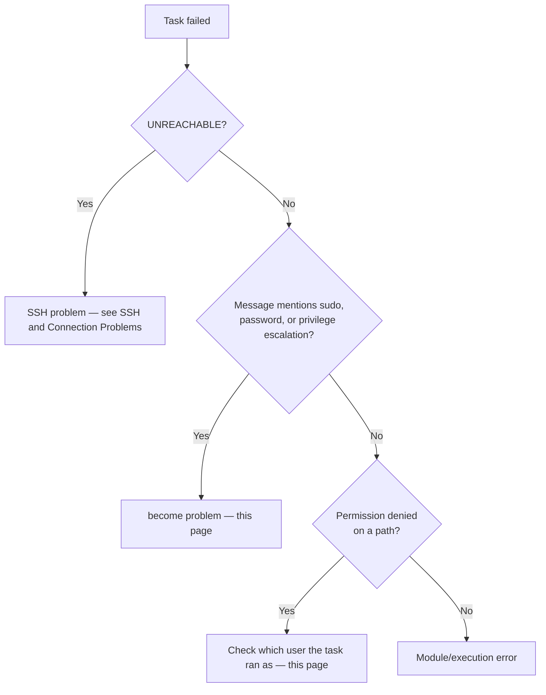

# Become and Permission Problems

## What You'll Learn

- How to tell a `become` failure apart from an SSH failure in seconds
- The exact error messages for the common cases, and the fix for each
- Why command-restricted sudo rules don't work for Ansible
- How to diagnose "Permission denied" when the connection and escalation both worked

## Why This Exists

SSH auth succeeding and `become` succeeding are two independent checks — a task can fail here with a working connection, and the fix is entirely different from an SSH fix.

## Mental Model

> Three separate identities are in play: **the SSH user** (who logs in), **the become user** (who the task runs as — root by default), and **the file or process owner** the task touches. "Permission denied" means one of those three doesn't line up.



First, confirm the connection itself is fine without escalation:

```bash
ansible web01 -m ansible.builtin.command -a whoami            # expect: deploy
ansible web01 -m ansible.builtin.command -a whoami --become   # expect: root
```

If the first works and the second fails, it's a `become` problem.

## "Missing sudo password"

```text
fatal: [web01]: FAILED! => {"msg": "Missing sudo password"}
```

The remote user's sudo requires a password and Ansible wasn't given one. Two fixes — choose by context:

| Context | Fix |
|---|---|
| A human running a playbook interactively | Prompt for it: `ansible-playbook site.yml -K` (`--ask-become-pass`) |
| CI or unattended automation | Give the automation account passwordless sudo, or supply `ansible_become_password` from [Vault](../production-engineering/03-secrets-and-vault.md) |

```text title="/etc/sudoers.d/ansible (edit with visudo -f)"
deploy ALL=(ALL) NOPASSWD: ALL
```

Manage that file with Ansible too, always with `validate: /usr/sbin/visudo -cf %s`.

!!! warning "Command-restricted sudo doesn't work for Ansible"
    A rule like `deploy ALL=(root) NOPASSWD: /usr/bin/systemctl` looks like least privilege, but Ansible doesn't run `systemctl` through sudo. It runs a shell that executes a Python module from a temporary path:

    ```text
    sudo -H -S -n -u root /bin/sh -c 'echo BECOME-SUCCESS-abc123 ; /usr/bin/python3 /home/deploy/.ansible/tmp/ansible-tmp-.../AnsiballZ_systemd.py'
    ```

    That never matches a command-specific rule. Restrict the automation account in other ways instead: a dedicated user, key-only login from known control nodes, `from=` restrictions in `authorized_keys`, and auditing of its sessions.

## "Incorrect sudo password"

```text
fatal: [web01]: FAILED! => {"msg": "Incorrect sudo password"}
```

Usually one of:

- `ansible_become_password` is set in `group_vars` for a different environment and overrides the value you meant — check with `ansible-inventory --host web01 | grep become`.
- The password differs between hosts, but one value is supplied for all of them.
- The account is locked or its password expired (`chage -l deploy` on the host).

## "Timeout waiting for privilege escalation prompt"

```text
fatal: [web01]: FAILED! => {"msg": "Timeout (12s) waiting for privilege escalation prompt: "}
```

Ansible expected a password prompt and didn't recognize what it got. Causes:

- A **customized sudo prompt** or a PAM module (MFA push, a lecture banner) that changes the prompt text.
- A slow directory service (LDAP/SSSD) lookup delaying sudo; increase `timeout` in `ansible.cfg` as a test.
- `become_method: su` against a host where `su` prints a localized prompt.

Test manually with the same user: `ssh deploy@web01 'sudo -S -n true'`. For automation accounts, passwordless sudo avoids prompt matching entirely.

## "sorry, you must have a tty to run sudo"

```text
fatal: [web01]: FAILED! => {"msg": "... sudo: sorry, you must have a tty to run sudo"}
```

This often appears **right after enabling pipelining**. The host's sudoers has `Defaults requiretty`; pipelining doesn't allocate a terminal. Fix it for the automation user only:

```text title="/etc/sudoers.d/ansible"
Defaults:deploy !requiretty
```

Modern distributions don't set `requiretty` by default, so this is mostly seen on older or custom-hardened images. Background: [Connection Plugins](../advanced-execution/03-connection-plugins.md#pipelining-the-biggest-free-speed-up).

## "Failed to set permissions on the temporary files"

```text
fatal: [web01]: FAILED! => {"msg": "Failed to set permissions on the temporary files Ansible needs to create when becoming an unprivileged user ... chmod: invalid mode: 'A+user:checkout:rx:allow'"}
```

You connect as `deploy` and `become_user: checkout` (not root). The module file written by `deploy` must be readable by `checkout`. Fixes, best first:

1. **Enable pipelining** — no temporary module file is written, so there's nothing to share.
2. **Install `acl`** on the managed node (`apt install acl` / `dnf install acl`) so Ansible can grant access with `setfacl`.
3. Last resort: `allow_world_readable_tmpfiles = True` in `ansible.cfg`, which makes module files readable by every local user.

## "Permission denied" After a Successful Escalation

```text
fatal: [web01]: FAILED! => {"changed": false, "msg": "Destination /opt/checkout/current not writable"}
```

Find out which user the task actually ran as:

```bash
ansible-playbook site.yml --limit web01 --start-at-task "Switch the current symlink" -vvv
```

In the output, look for the `sudo ... -u <user>` line. Then compare against the path:

```bash
ansible web01 -m ansible.builtin.command -a "namei -l /opt/checkout/current" --become
```

`namei -l` shows owner and permissions for **every** directory in the path — a common cause is a parent directory that the become user can't traverse, even though the file itself is writable.

Typical causes:

| Symptom | Cause |
|---|---|
| Works as root, fails with `become_user: checkout` | Path owned by root or another user |
| `become: true` set on the play, but the task still runs as `deploy` | `become: false` set on the task, block, or role — check with `-vvv` |
| Fails only on some hosts | Different ownership from a manual change; enforce it with a `file` task |
| Denied despite correct Unix permissions | SELinux context — check `ls -Z` and `ausearch -m avc -ts recent` |

## Common Mistakes

- Treating a `become` failure as an SSH problem and regenerating keys that were never the issue.
- Writing command-restricted sudo rules for the automation account and wondering why every task fails.
- Enabling pipelining fleet-wide without checking for `requiretty` on older images.
- Setting `allow_world_readable_tmpfiles` as the first fix instead of pipelining or `acl`.
- Ignoring SELinux denials because the Unix permissions look right.

## Interview Questions

- A task fails with `Missing sudo password` — what are the two possible fixes, and how do you choose between them?
- Why does enabling pipelining sometimes surface a previously hidden `become` failure?
- Why can't you restrict Ansible's sudo access to a list of specific commands?
- How do you find out which user a failing task actually ran as?

## Next

Continue to [YAML and Variable Errors](03-yaml-and-variable-errors.md).
