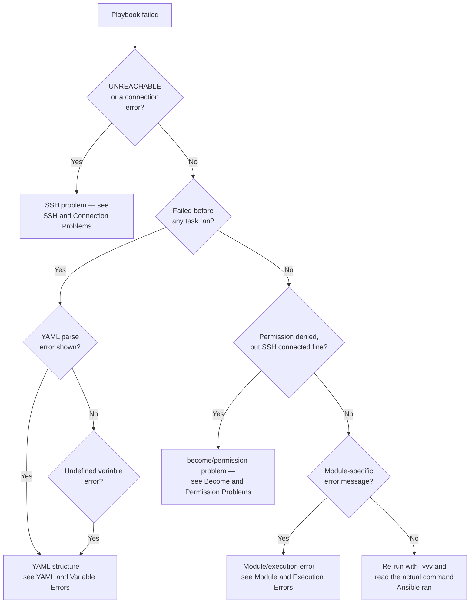

# Troubleshooting

A playbook failure message is rarely the actual problem — it's a symptom. This page is the methodology; the pages after it cover each failure category in depth.

## The Diagnostic Toolkit

| Command | What it actually tells you |
|---|---|
| `ansible-inventory --graph` | What hosts/groups Ansible resolved, structurally |
| `ansible-inventory --host <name>` | The fully-merged variable set for one host |
| `ansible all -m ping` | Whether SSH + Python work at all, before touching a playbook |
| `ansible-playbook --syntax-check` | Pure YAML/structure validation, no connection needed |
| `ansible-playbook --check --diff` | What *would* change, without changing anything |
| `ansible-playbook -vvv` | The exact SSH commands and module invocations — the single most useful flag for "why did this fail" |
| `ansible-config dump --only-changed` | Which config values are actually in effect, and from where |

## The Decision Tree

## Read Next

1. [SSH and Connection Problems](01-ssh-and-connection-problems.md)
2. [Become and Permission Problems](02-become-and-permission-problems.md)
3. [YAML and Variable Errors](03-yaml-and-variable-errors.md)
4. [Module and Execution Errors](04-module-and-execution-errors.md)

## Next

If the playbook runs but produces the wrong result, the issue is usually [Variable Precedence](../variables-and-data/02-variable-precedence.md) or [Idempotency](../core-concepts/11-idempotency.md), not a failure at all.
