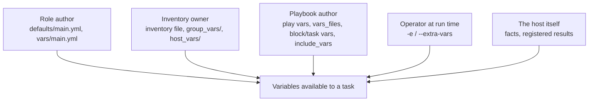

# Variable Types and Sources

## What You'll Learn

- Every place a variable can be defined, grouped by *who* usually owns that location
- The data types Ansible variables hold, and how YAML decides which type you actually got
- Which source to reach for first when you add a new variable to a project

## Why This Exists

Precedence ([next page](02-variable-precedence.md)) only makes sense once every source is named individually — this page is the inventory of *where* a value can live, before ranking them. Most "my variable isn't working" bugs are really "I defined it somewhere I forgot about."

## Mental Model

> Think of variable sources as layers owned by different people. **Role authors** own defaults. **Inventory owners** own per-group and per-host values. **Playbook authors** own play and task vars. **The person running the command** owns `-e`. Put a value in the layer owned by whoever should be allowed to change it.



## Every Source, With an Example

### Inventory variables

Defined inline in the inventory file:

```ini title="inventories/production/hosts.ini"
[web]
web01 ansible_host=10.0.1.11 http_port=8080

[web:vars]
nginx_worker_processes=4
```

Or, much more maintainably, in directories next to the inventory (or next to the playbook):

```text
inventories/production/
├── hosts.ini
├── group_vars/
│   ├── all.yml          # every host
│   └── web.yml          # hosts in [web]
└── host_vars/
    └── web01.yml        # one host
```

```yaml title="group_vars/web.yml"
nginx_worker_processes: 4
nginx_server_names:
  - shop.example.com
  - www.shop.example.com
```

`group_vars/` and `host_vars/` can also be *directories* (`group_vars/web/main.yml`, `group_vars/web/vault.yml`) — useful for keeping encrypted values in their own file.

### Play-level `vars:` and `vars_files:`

```yaml title="site.yml"
- name: Configure web tier
  hosts: web
  vars:
    app_release: "2.14.1"
  vars_files:
    - vars/common.yml
    - "vars/{{ ansible_facts['os_family'] }}.yml"
  roles:
    - nginx
```

### Role `defaults/` vs. `vars/`

```yaml title="roles/nginx/defaults/main.yml"
nginx_http_port: 80           # meant to be overridden
nginx_worker_connections: 1024
```

```yaml title="roles/nginx/vars/main.yml"
nginx_package_name: nginx     # internal constant, not meant to be overridden
```

Both load automatically when the role runs — the difference is precedence. `defaults/` is the lowest-precedence source in Ansible, so any inventory or play value beats it. `vars/` is high precedence, so consumers can barely override it. Treat `defaults/` as the role's public interface and `vars/` as its private constants.

### Block and task `vars:`

```yaml
- name: Configure the admin vhost
  vars:
    vhost_name: admin
  block:
    - name: Render admin vhost
      ansible.builtin.template:
        src: vhost.conf.j2
        dest: "/etc/nginx/conf.d/{{ vhost_name }}.conf"
      vars:
        vhost_port: 8443         # scoped to this one task
```

Scoped vars are useful for templates reused with different inputs. They disappear once the block or task ends.

### `include_vars` — loading a file mid-play

```yaml
- name: Load distribution-specific package names
  ansible.builtin.include_vars:
    file: "{{ ansible_facts['distribution'] }}.yml"
```

Unlike `vars_files`, this happens at run time, so the filename can depend on facts gathered earlier in the play.

### Extra vars on the command line

```bash
ansible-playbook site.yml -e "app_release=2.14.2"
ansible-playbook site.yml -e '{"feature_flags": {"new_checkout": true}}'
ansible-playbook site.yml -e @release.yml
```

Extra vars always win. That makes them perfect for deliberate one-off overrides and dangerous as a habit — a value that is always passed with `-e` belongs in inventory.

### Values Ansible creates for you

- **Facts** — discovered from the host by `setup`; see [Facts](03-facts.md).
- **Registered variables** — a task's result saved with `register:`; see [Registered Variables](04-registered-variables.md).
- **`set_fact`** — computed at run time; see [set_fact and combine](06-set-fact-and-combine.md).
- **Magic variables** — `inventory_hostname`, `groups`, `hostvars`; see [Magic Variables and Hostvars](05-magic-variables-and-hostvars.md).

## Data Types

Ansible variables are YAML values, which become Python objects:

```yaml
app_name: checkout            # string
replicas: 3                   # integer
cpu_limit: 1.5                # float
enable_tls: true              # boolean
listen_ports: [80, 443]       # list
database:                     # dictionary (nested)
  host: db01.internal
  port: 5432
  options:
    sslmode: require
```

Access nested values with either syntax:

```yaml
- ansible.builtin.debug:
    msg: "{{ database.host }}:{{ database['port'] }} ({{ database.options.sslmode }})"
```

Prefer bracket syntax when a key could collide with a Python method name (`items`, `keys`, `update`) or contains a dash.

!!! warning "YAML chooses the type, not you"
    Unquoted `yes`, `no`, `on`, and `off` can become booleans, and `1.10` becomes the float `1.1`. Quote version strings and anything that must stay a string: `app_release: "1.10"`. The full story is in [YAML Essentials](../yaml-and-execution-model/01-yaml-essentials.md).

Values passed with `-e key=value` are always **strings**. `-e replicas=3` gives you `"3"`; use the JSON form (`-e '{"replicas": 3}'`) or `| int` when the type matters.

## Where Should a New Variable Go?

| The value... | Put it in |
|---|---|
| is a sensible default a role consumer may change | role `defaults/main.yml` |
| is an internal constant of the role | role `vars/main.yml` |
| differs by environment (dev/staging/prod) | `group_vars/<environment>.yml` in that environment's inventory |
| differs by host role (web, db) | `group_vars/<group>.yml` |
| is unique to one machine | `host_vars/<host>.yml` |
| is a one-off override for a single run | `-e` |
| depends on data only known during the run | `set_fact` or `register` |

## Common Mistakes

- Assuming all "vars" sources are equal in precedence — they are emphatically not; see [Variable Precedence](02-variable-precedence.md).
- Putting environment-specific values in role `vars/main.yml` (hard to override) instead of `defaults/main.yml` (easy to override).
- Defining the same variable in both `group_vars/all.yml` and a role's `defaults/`, then editing the one that silently loses.
- Passing numbers or booleans with `-e key=value` and getting strings, so `when: replicas > 2` compares a string.
- Keeping inline inventory vars in `hosts.ini` for large fleets instead of `group_vars/`, making them hard to review.

## Interview Questions

- Name every place a variable can be defined in Ansible, without looking it up.
- What's the practical difference between role `defaults/main.yml` and `vars/main.yml`?
- Why is `include_vars` sometimes needed instead of `vars_files`?
- What type does `-e retries=5` produce, and how do you pass a real integer?

## Next

Continue to [Variable Precedence](02-variable-precedence.md).
