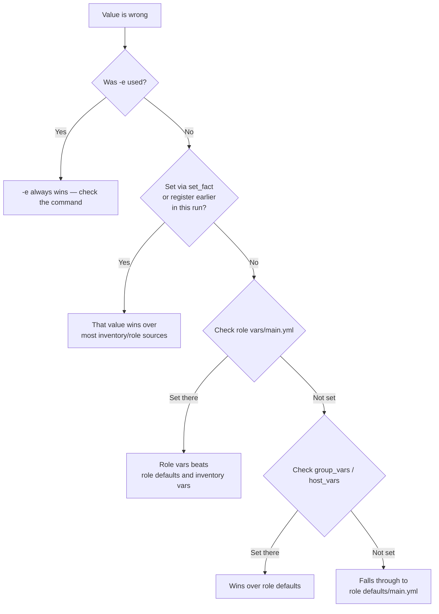

# Variable Precedence

"Why isn't my variable taking effect?" is the single most common Ansible question there is, and it almost always comes down to precedence. This page is the definitive answer.

## What You'll Learn

- The full precedence order, highest to lowest
- Why role defaults sit at the bottom, by design
- How to prove which source actually won, instead of guessing

## Why This Exists

Ansible deliberately lets the same variable name be set from more than a dozen places — that flexibility is only usable with a precise, memorizable order. `VariableManager` resolves the full stack fresh for **every host, at every task** — not once at the start of the playbook — so the "winner" can, in principle, differ task to task if something upstream changes it (via `set_fact`, for example).

## The Order, Highest to Lowest

This is Ansible's documented order, all 22 levels, with the highest precedence at the top:

| Rank | Source | Where it's set |
|---|---|---|
| 1 | **Extra vars** — always win | `-e key=value`, `-e @file.yml` |
| 2 | Include params | `vars:` on `include_tasks` / `include_role` |
| 3 | Role params | `vars:` on a role under `roles:`, or on `import_role` |
| 4 | `set_fact` and registered vars | `ansible.builtin.set_fact`, `register:` |
| 5 | `include_vars` | `ansible.builtin.include_vars` |
| 6 | Task vars | `vars:` on a task |
| 7 | Block vars | `vars:` on a block |
| 8 | Role vars | `roles/<role>/vars/main.yml` |
| 9 | Play `vars_files` | `vars_files:` on a play |
| 10 | Play `vars_prompt` | `vars_prompt:` on a play |
| 11 | Play vars | `vars:` on a play |
| 12 | Host facts and cached `set_fact` | `setup` / fact cache |
| 13 | Playbook `host_vars/*` | `host_vars/` next to the playbook |
| 14 | Inventory `host_vars/*` | `host_vars/` next to the inventory |
| 15 | Inventory file host vars | `web01 http_port=8080` in `hosts.ini` |
| 16 | Playbook `group_vars/*` | `group_vars/web.yml` next to the playbook |
| 17 | Inventory `group_vars/*` | `group_vars/web.yml` next to the inventory |
| 18 | Playbook `group_vars/all` | `group_vars/all.yml` next to the playbook |
| 19 | Inventory `group_vars/all` | `group_vars/all.yml` next to the inventory |
| 20 | Inventory file group vars | `[web:vars]` in `hosts.ini` |
| 21 | **Role defaults** — lowest real variable | `roles/<role>/defaults/main.yml` |
| 22 | Command-line values (not variables) | `-u deploy`, `--private-key` |

Rank 22 isn't really a variable. A connection option like `-u deploy` is the fallback, and `ansible_user` set anywhere above it wins. That surprises people who expect command-line flags to behave like `-e`.

You don't need to memorize 22 lines. Four rules cover almost every real question:

1. **`-e` beats everything**, including `set_fact`.
2. **Run-time values beat most file-based ones**: `set_fact`, `register`, and `include_vars` sit above task, block, role `vars/`, and play vars. Only role/include parameters and `-e` beat them.
3. **Host beats group, and a specific group beats `all`**: `host_vars` > `group_vars/web` > `group_vars/all`. Facts sit just above all of them.
4. **Role `vars/` beats inventory; role `defaults/` loses to everything.** That's why `defaults/` is a role's public interface and `vars/` is for constants.

The shape is deliberate: **broad and easily overridden** at the bottom (role defaults, meant to be sensible fallbacks) to **narrow and deliberate** at the top (`-e`, meant for intentional one-off overrides).

!!! note "Groups at the same level"
    When a host is in two groups that both set a variable (say `web` and `eu_west`), child groups win over parents, and groups at the same depth merge alphabetically, so the **last** name wins. Set `ansible_group_priority` in a group's vars to override that order explicitly.

## Proving It, Instead of Guessing

Set the same variable name in three places and watch which one wins:

```yaml title="group_vars/all.yml"
http_port: 80
```

```yaml title="roles/web/defaults/main.yml"
http_port: 8080
```

```bash
ansible-playbook site.yml -e "http_port=9090"
```

```bash
$ ansible-playbook site.yml -e "http_port=9090" -vvv
...
TASK [web : Show http_port] ***
ok: [web01] => {
    "http_port": "9090"
}
```

`-e` wins over both, exactly as the order predicts. Change the experiment — remove `-e`, and `group_vars/all.yml` (rank 18 or 19, depending on where the directory sits) beats the role's `defaults/main.yml` (rank 21).

## Debugging: "Where Is This Value Actually Coming From?"



Two tools answer it faster than reading files by hand:

```bash
ansible-inventory -i inventories/production --host web01 | jq '.http_port'
```

shows the merged **inventory-side** value for a host: inventory file, `group_vars`, and `host_vars`, after group precedence is applied. It knows nothing about play vars, role vars, `set_fact`, or `-e`.

For the value a task actually sees, ask the task itself. Put a debug task right before the one that misbehaves, and run just that part:

```yaml
- name: Show the value this task will use
  ansible.builtin.debug:
    var: http_port
```

```bash
ansible-playbook site.yml --limit web01 --start-at-task "Show the value this task will use"
```

`-vvv` does **not** print where a variable came from; it shows connection details and module arguments. The debug task is the reliable way.

## Production Best Practices

- Keep role **defaults** for anything a consumer of the role should be free to override; reserve role **vars** for values that genuinely shouldn't change per-environment.
- Use `-e` sparingly and intentionally — CI overrides, break-glass changes — not as the default way to configure a playbook run.
- Don't rely on precedence to "fix" a design problem. If three different layers are fighting over one variable, that's usually a sign the variable's scope needs rethinking, not a deeper precedence trick.

## Common Mistakes

- Setting a value in `group_vars/all.yml` and being confused when a role's `vars/main.yml` silently wins instead — role `vars` (rank 8) outranks every `group_vars` level (16–19).
- Forgetting `-e` overrides everything, including a value a later task tries to `set_fact` — `-e` still wins on the *next* task's resolution too.
- Naming your own variable like a fact (`ansible_hostname`, `ansible_distribution`) — facts sit at rank 12, above all inventory variables, so a gathered fact silently replaces the value you set in `group_vars`.
- Expecting `-u deploy` on the command line to override `ansible_user` from inventory — command-line connection options are rank 22, the very bottom. Use `-e ansible_user=deploy` if you really mean to override.
- Putting the same variable in `group_vars/web.yml` and `group_vars/eu_west.yml` and relying on which one wins — sibling groups resolve alphabetically, which nobody remembers six months later.

## Interview Questions

- What is Ansible's variable precedence order, from highest to lowest?
- Why are role defaults the lowest-precedence source, by design?
- How would you debug which source is actually setting a variable's value, without reading every file by hand?

See [Interview Prep: Core Concepts](../interview-prep/01-core-concepts-questions.md) for the full leveled answers.

## Related

- [Variable precedence cheat sheet](../quick-reference/03-variable-precedence-cheat-sheet.md)

## Next

Continue to [Facts](03-facts.md).
