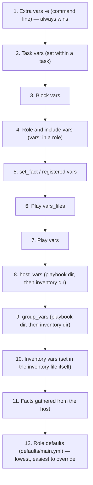
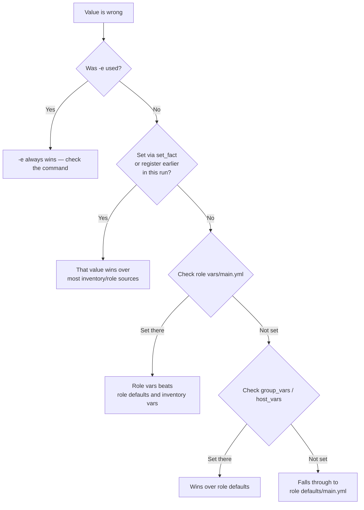

# Variable Precedence

"Why isn't my variable taking effect?" is the single most common Ansible question there is, and it almost always comes down to precedence. This page is the definitive answer.

## What You'll Learn

- The full precedence order, highest to lowest
- Why role defaults sit at the bottom, by design
- How to prove which source actually won, instead of guessing

## Why This Exists

Ansible deliberately lets the same variable name be set from more than a dozen places — that flexibility is only usable with a precise, memorizable order. `VariableManager` resolves the full stack fresh for **every host, at every task** — not once at the start of the playbook — so the "winner" can, in principle, differ task to task if something upstream changes it (via `set_fact`, for example).

## The Order, Highest to Lowest



Notice the shape: it moves from **broad and easily overridden** (role defaults, meant to be sensible fallbacks) to **narrow and deliberate** (`-e`, meant for intentional one-off overrides). That's not arbitrary — it's the design intent, and it's the fastest way to memorize the list instead of rote-learning twelve line items.

## Proving It, Instead of Guessing

Set the same variable name in three places and watch which one wins:

```yaml title="group_vars/all.yml"
http_port: 80
```

```yaml title="roles/web/defaults/main.yml"
http_port: 8080
```

```bash
ansible-playbook site.yml -e "http_port=9090"
```

```bash
$ ansible-playbook site.yml -e "http_port=9090" -vvv
...
TASK [web : Show http_port] ***
ok: [web01] => {
    "http_port": "9090"
}
```

`-e` wins over both, exactly as the order predicts. Change the experiment — remove `-e`, and `group_vars/all.yml` (an inventory-level `group_vars` file, rank 9) beats the role's `defaults/main.yml` (rank 12).

## Debugging: "Where Is This Value Actually Coming From?"



Two commands do this faster than reading files by hand:

```bash
ansible-inventory --host web01
```

shows the fully resolved variable set for a host — the actual merged result, not any single source.

```bash
ansible-playbook site.yml -vvv
```

shows task-level variable resolution as the play runs, which catches sources that only apply mid-run (`set_fact`, `register`).

## Production Best Practices

- Keep role **defaults** for anything a consumer of the role should be free to override; reserve role **vars** for values that genuinely shouldn't change per-environment.
- Use `-e` sparingly and intentionally — CI overrides, break-glass changes — not as the default way to configure a playbook run.
- Don't rely on precedence to "fix" a design problem. If three different layers are fighting over one variable, that's usually a sign the variable's scope needs rethinking, not a deeper precedence trick.

## Common Mistakes

- Setting a value in `group_vars/all.yml` and being confused when a role's `vars/main.yml` silently wins instead — role `vars` (rank 4) outranks `group_vars` (rank 9).
- Forgetting `-e` overrides everything, including a value a later task tries to `set_fact` — `-e` still wins on the *next* task's resolution too.
- Assuming facts (rank 11) beat role defaults (rank 12) meaningfully in practice — they're adjacent and both near the bottom; neither should be relied on to override the other intentionally.

## Interview Questions

- What is Ansible's variable precedence order, from highest to lowest?
- Why are role defaults the lowest-precedence source, by design?
- How would you debug which source is actually setting a variable's value, without reading every file by hand?

See [Interview Prep: Core Concepts](../interview-prep/01-core-concepts-questions.md) for the full leveled answers.

## Next

Continue to [Facts](03-facts.md).
