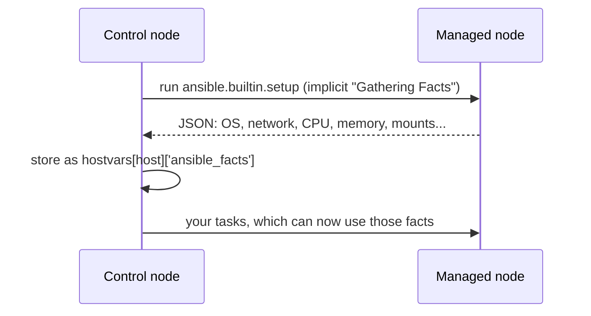

# Facts

## What You'll Learn

- What the implicit "Gathering Facts" step does, and what it costs
- How to read facts through the `ansible_facts` dictionary
- How to gather less, gather nothing, or add your own custom facts

## Why This Exists

Most plays begin with an implicit `setup` module run that discovers dozens of details about the host — OS family, IP addresses, memory, mounted disks — before your first real task even starts. Facts are how a playbook adapts to the machine it's actually running against instead of assuming.

## Mental Model

> A fact is a variable **the managed node reports about itself**. Ansible runs the `setup` module on each host, the module returns a big JSON document, and Ansible stores it per host as `ansible_facts`. It is ordinary data after that — it only refreshes when facts are gathered again.



## Seeing Facts

```bash
# Every fact for one host
ansible web01 -m ansible.builtin.setup

# Only matching keys
ansible web01 -m ansible.builtin.setup -a "filter=ansible_distribution*"
```

Abbreviated output:

```json
"ansible_facts": {
    "distribution": "Ubuntu",
    "distribution_version": "24.04",
    "os_family": "Debian",
    "default_ipv4": { "address": "10.0.1.11", "interface": "eth0" },
    "memtotal_mb": 3931,
    "processor_vcpus": 2
}
```

To print all facts from inside a playbook:

```yaml
- name: Print every fact Ansible gathered for this host
  ansible.builtin.debug:
    var: ansible_facts
```

## Commonly Used Facts

| Fact inside `ansible_facts` | Top-level variable | Example value |
|---|---|---|
| `hostname` | `ansible_hostname` | `web01` |
| `fqdn` | `ansible_fqdn` | `web01.example.internal` |
| `distribution`, `distribution_version` | `ansible_distribution`, `ansible_distribution_version` | `Ubuntu`, `24.04` |
| `os_family` | `ansible_os_family` | `Debian` |
| `default_ipv4.address` | `ansible_default_ipv4.address` | `10.0.1.11` |
| `all_ipv4_addresses` | `ansible_all_ipv4_addresses` | `["10.0.1.11", "172.17.0.1"]` |
| `memtotal_mb` | `ansible_memtotal_mb` | `3931` |
| `memfree_mb` | `ansible_memfree_mb` | `1210` |
| `swaptotal_mb` | `ansible_swaptotal_mb` | `2047` |
| `processor_vcpus` | `ansible_processor_vcpus` | `2` |
| `mounts` | `ansible_mounts` | A list of mount points with size and free space |

```yaml
- name: Report memory, swap, and primary IP
  ansible.builtin.debug:
    msg: >-
      {{ inventory_hostname }} has {{ ansible_facts['memtotal_mb'] }} MB RAM,
      {{ ansible_facts['swaptotal_mb'] }} MB swap,
      and IP {{ ansible_facts['default_ipv4']['address'] | default('none') }}
```

## Using Facts in Tasks

```yaml
- name: Install the web server package for this OS family
  ansible.builtin.package:
    name: "{{ 'apache2' if ansible_facts['os_family'] == 'Debian' else 'httpd' }}"
    state: present

- name: Size worker processes to the CPU count
  ansible.builtin.template:
    src: nginx.conf.j2
    dest: /etc/nginx/nginx.conf
  vars:
    nginx_worker_processes: "{{ ansible_facts['processor_vcpus'] }}"

- name: Only on hosts with at least 4 GB of RAM
  ansible.builtin.debug:
    msg: "Enough memory for the in-memory cache"
  when: ansible_facts['memtotal_mb'] >= 4096
```

Inside `ansible_facts`, keys have no `ansible_` prefix. Ansible also injects the same facts as top-level variables (`ansible_distribution`, `ansible_default_ipv4`) for backward compatibility. Newer `ansible-core` releases are moving away from that injection, so write new playbooks against `ansible_facts['...']`.

## Controlling What Gets Gathered

### Turn gathering off

```yaml
- name: Restart an app that never looks at facts
  hosts: app
  gather_facts: false
  tasks:
    - name: Restart the app service
      ansible.builtin.service:
        name: checkout
        state: restarted
```

On a 1,000-host fleet, skipping an unnecessary fact-gathering pass can save minutes per run.

### Gather only a subset

```yaml
- name: Configure networking
  hosts: all
  gather_facts: true
  gather_subset:
    - "!all"
    - "!min"
    - network
```

Subsets include `hardware`, `network`, `virtual`, `facter`, and `ohai`. `min` is a small default set that is always included unless you negate it.

### Gather later, explicitly

```yaml
- name: Gather network facts only when we need them
  ansible.builtin.setup:
    gather_subset:
      - network
  when: configure_network | default(false)
```

## Custom Facts

Drop a file into `/etc/ansible/facts.d/` on the managed node. It can be INI, JSON, or an **executable** that prints JSON:

```ini title="/etc/ansible/facts.d/app.fact"
[deploy]
release=2.14.1
owner=payments-team
```

After the next fact gathering, it appears under `ansible_local`:

```yaml
- ansible.builtin.debug:
    msg: "Deployed release: {{ ansible_facts['ansible_local']['app']['deploy']['release'] }}"
```

A common pattern: the deploy playbook writes this file at the end of a successful rollout, and later playbooks read it to know what is currently installed.

```yaml
- name: Record the deployed release as a local fact
  ansible.builtin.copy:
    dest: /etc/ansible/facts.d/app.fact
    content: |
      [deploy]
      release={{ app_release }}
    mode: "0644"
```

## Facts vs. Registered Variables

| | Fact | Registered variable |
|---|---|---|
| Produced by | `setup` (or a module returning `ansible_facts`) | `register:` on any task |
| Describes | The host | The result of one task |
| Lifetime | Whole run, and across runs with fact caching | Current run only |
| Access from other hosts | `hostvars['web01']['ansible_facts']` | `hostvars['web01']['my_result']` |

## Fact Caching

Fact caching (`fact_caching = jsonfile`/`redis`) avoids re-gathering on every run — previewed here, covered in full in [Fact Caching](../advanced-execution/02-fact-caching.md).

## Common Mistakes

- Leaving `gather_facts: true` (the default) on every play, including ones that never reference a fact — real cost at scale, covered in [Performance](../production-engineering/05-performance.md).
- Using the injected top-level `ansible_distribution` style instead of the namespaced `ansible_facts['distribution']` form in new playbooks.
- Disabling fact gathering, then referencing `ansible_facts['os_family']` later and getting an undefined variable error.
- Reading another host's facts through `hostvars` when that host wasn't part of the play, so its facts were never gathered.
- Treating facts as live values — a fact gathered at the start of a play does not update after a task changes the host, until you run `setup` again.

## Interview Questions

- What does `gather_facts` actually do, and when would you disable it?
- What's the difference between a fact and a registered variable?
- How does fact caching change the cost of repeated runs?
- How would you make "the currently deployed application version" available as a fact on every host?

## Next

Continue to [Registered Variables](04-registered-variables.md).
