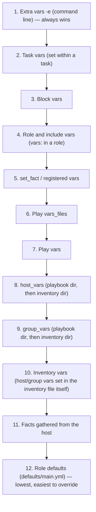

# Part 9 — Variables and Precedence

!!! info "Chapter status: outline"
    This chapter is scoped but not yet written in full prose. The sections below define what each part will cover.

"Why isn't my variable taking effect?" is the single most common Ansible support question, and it almost always comes down to precedence. This chapter is the definitive answer.

## Why This Exists

- Ansible deliberately allows the same variable name to be set from more than a dozen places, for flexibility — but that flexibility is meaningless without a precise, memorizable precedence order.

## Problem Statement

- A variable can be set in: role defaults, inventory file/group_vars/host_vars, playbook `vars:`, play `vars_files:`, role `vars/main.yml`, block vars, task vars, `include_vars`, `set_fact`, registered variables, facts, `extra_vars` (`-e`), and more — with no obvious ordering to a newcomer.

## Internal Architecture

- How `VariableManager` merges all sources into a single namespace per host, per task, right before execution — resolution happens fresh at each task, not once at playbook start.

## The Precedence Order (highest to lowest) — Visual Pyramid

## Decision Tree: "Where Is My Variable Actually Coming From?"

- A step-by-step troubleshooting flowchart: check `-e` first → check task/block scope → check role `vars/` → check `set_fact`/registered → check `group_vars`/`host_vars` → check inventory → check facts → check role `defaults/`. Paired with `ansible-inventory --host <name>` and `-vvv` output as the tools to confirm the winner.

## Step-by-Step Explanation

- **host_vars / group_vars**: file-based, resolved from both the inventory directory and the playbook directory (with the playbook directory taking precedence).
- **Play vars / role vars / defaults**: the different `vars:` blocks and why `defaults/main.yml` is intentionally the lowest-precedence, most-overridable layer.
- **Registered vars**: `register:` capturing a task's result for later use.
- **Facts**: auto-discovered host data (deferred fully to a future chapter on fact gathering internals in Volume 3).
- **Extra vars**: `-e` on the CLI or `-e @file.yml`, always highest precedence, ideal for one-off overrides.
- **set_fact**: runtime-defined variables, precedence-wise close to registered vars.
- **Magic vars**: `hostvars`, `group_names`, `groups`, `inventory_hostname`, `ansible_play_hosts` — special variables Ansible provides automatically, not user-set.
- **Environment variables**: `ANSIBLE_*` env vars affecting configuration (distinct from in-playbook `environment:` for remote task execution).

## Production Best Practices

- Keep `role defaults` for anything meant to be freely overridden by consumers of the role; reserve `role vars` for values that shouldn't normally change.
- Use `-e` sparingly and intentionally (CI pipelines, break-glass overrides) rather than as the default way to configure a playbook.

## Common Mistakes

- Setting a value in `group_vars` and being confused when a `role vars/main.yml` value silently wins instead.
- Forgetting that `-e` overrides everything, including values a task tries to `set_fact` afterward in the same run.

## Performance Considerations

- Large `host_vars`/`group_vars` trees and heavy `include_vars` usage add parse/merge overhead on big inventories — previewed here, covered fully in Volume 6.

## Security Considerations

- Precedence matters for secrets too: an `-e` passed insecurely on a CI command line can unintentionally override a vaulted, more carefully managed value.

## Interview Questions

- "What is Ansible's variable precedence order, from highest to lowest?"
- "Why are role defaults the lowest-precedence variable source, by design?"
- "How would you debug which source is actually setting a variable's value?"

## Hands-On Lab

- Set the same variable name in `group_vars/all.yml`, a role's `defaults/main.yml`, and via `-e` on the command line; run the playbook and use `-vvv` to confirm which value won and why.

## Summary

- Precedence isn't arbitrary — it moves from "broad and easily overridden" (role defaults) to "narrow and deliberate" (`-e`) — memorize the pyramid, and use `ansible-inventory`/`-vvv` to verify instead of guessing.

## Next

Continue to [Part 10 — ansible.cfg](04-ansible-cfg.md).
