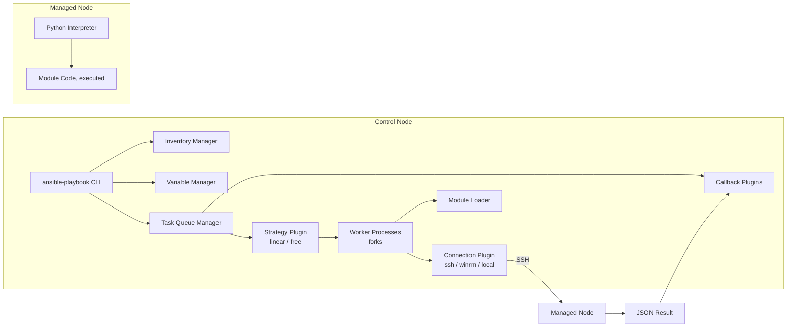

# Part 15 — Internal Architecture

!!! info "Chapter status: outline"
    This chapter is scoped but not yet written in full prose. The sections below define what each part will cover.

Every prior volume used these terms informally: control node, modules, plugins, the execution engine. This chapter defines each precisely and shows how they fit together.

## Why This Exists

- Troubleshooting Ansible effectively requires a mental model of its architecture, not just its YAML syntax — this chapter is that mental model, made explicit.

## Problem Statement

- Without knowing which component is responsible for what (inventory parsing vs. connection handling vs. module execution vs. result callbacks), errors get misdiagnosed — a connection-plugin failure looks identical to a module bug to someone without this map.

## Architecture Diagram

## Internal Architecture — Component by Component

- **Control node**: the machine running `ansible`/`ansible-playbook`; must have Python and Ansible installed. Not a server process — it exists only for the duration of a run.
- **Managed node**: any target host; needs only Python and SSH access (or WinRM for Windows), no permanent agent.
- **SSH**: the default transport connection plugin for Linux/Unix managed nodes.
- **Python**: required on the managed node to execute module code (full treatment in Part 17).
- **Inventory**: the source of truth for which hosts/groups exist (full treatment in Volume 2).
- **Modules**: the units of work (`package`, `copy`, `service`) — self-contained scripts sent to and executed on the managed node.
- **Plugins**: the extensibility points around modules — connection, lookup, filter, callback, strategy, inventory, vars, cache (full treatment in Part 20 of the series/Volume 5).
- **Collections**: the distribution/packaging unit for modules, plugins, and roles (full treatment in Volume 2).
- **Playbooks / roles**: the user-authored automation content that drives everything else.
- **Facts**: data auto-gathered from managed nodes at the start of a play via the `setup` module.
- **Vault**: the encryption subsystem for secrets at rest in playbook repositories.
- **Callbacks**: plugins that react to events (task started, task result, playbook stats) — this is how output formatting, logging integrations, and notifications hook in.
- **Strategy plugins**: control *how* the Task Queue Manager schedules tasks across hosts (`linear`, `free`, `debug`, `host_pinned`).
- **Task Queue Manager (TQM)**: the central orchestrator — owns worker processes, dispatches tasks per the active strategy, and collects results.
- **Forks**: the worker process pool size — how many hosts are actively being processed at once.
- **Execution engine**: the collective term for TQM + strategy + workers + connection/module execution — the thing that actually turns a parsed playbook into remote actions.

## Workflow

- How a single play flows through these components in sequence: Inventory Manager resolves hosts → Variable Manager resolves variables per host → TQM hands tasks to the active Strategy Plugin → Strategy Plugin dispatches to worker processes up to the fork limit → each worker uses a Connection Plugin to reach its host → Module Loader resolves and ships the right module code → results flow back through Callback Plugins.

## Production Best Practices

- Sizing `forks` to match real parallelism needs and control-node resources (previewed here, benchmarked in Volume 6).
- Choosing `strategy: free` deliberately, only when host independence is actually safe for the play (no cross-host ordering assumptions).

## Common Mistakes

- Assuming task execution is host-by-host sequential by default — it's task-by-task across a batch of hosts (`linear` strategy), which surprises people used to purely imperative scripting.
- Not realizing callback plugins are why output looks the way it does, and that custom callbacks can change it entirely.

## Performance Considerations

- Forks and strategy choice are the two biggest architectural levers on wall-clock run time — deferred fully to Volume 6.

## Security Considerations

- Connection plugins are the trust boundary between control and managed nodes; vault is the trust boundary for secrets at rest — both covered in depth in Volume 6's security chapter.

## Interview Questions

- "What is the Task Queue Manager and what does it own?"
- "What's the difference between a module and a plugin in Ansible's architecture?"
- "How do strategy plugins affect execution order across hosts?"

## Hands-On Lab

- Run a playbook with `-vvvv` and identify, from the verbose output, where inventory resolution ends and connection/module execution begins.

## Summary

- Ansible's architecture separates *what to do* (inventory, variables, playbooks) from *how it gets scheduled and executed* (TQM, strategy, forks, connection/module plugins) — this separation is what the next chapter traces through a real run.

## Next

Continue to [Part 16 — How Ansible Actually Executes](02-how-ansible-executes.md).
