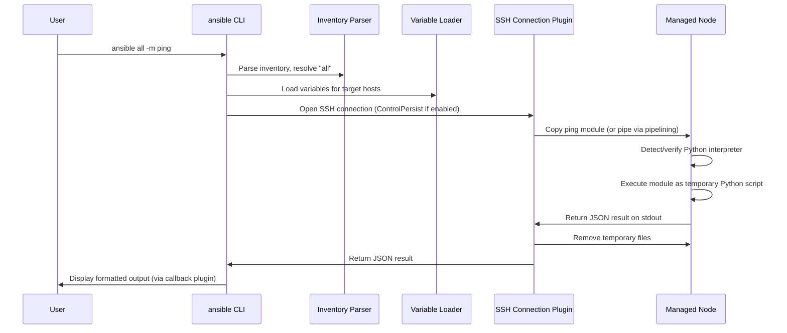

# Part 16 — How Ansible Actually Executes

!!! info "Chapter status: outline"
    This chapter is scoped but not yet written in full prose. The sections below define what each part will cover.

This chapter traces one command, `ansible all -m ping`, through every internal step, down to the temporary files created and deleted on the managed node.

## Why This Exists

- "It just works" is unsatisfying for engineers who need to debug it when it *doesn't* work — this chapter removes the black box.

## Problem Statement

- What actually has to happen, mechanically, for a Python module's code to run on a remote machine you only have SSH access to, and for its result to come back as structured data your playbook can act on.

## The Execution Sequence

## Step-by-Step Explanation

1. **CLI**: `ansible` parses arguments, loads `ansible.cfg`/env/CLI-flag configuration.
2. **Inventory parsing**: resolves the `all` pattern against the active inventory source(s).
3. **Variable loading**: Variable Manager resolves the full precedence stack per host (Volume 2, Part 9).
4. **SSH connection**: the SSH connection plugin opens a connection, reusing a multiplexed `ControlPersist` socket if one exists.
5. **Copy module**: without pipelining, the module's Python source is copied to a temporary directory on the managed node (`remote_tmp`, default under `~/.ansible/tmp/`).
6. **Execute temporary Python**: the managed node's Python interpreter executes the module as a standalone script.
7. **Return JSON**: the module prints a single JSON object to stdout as its result contract.
8. **Delete temp files**: the connection plugin cleans up the temporary directory after retrieving the result (unless `ANSIBLE_KEEP_REMOTE_FILES` is set for debugging).
9. **Display output**: the result flows back to the control node and is rendered by the active callback plugin (default `default` callback, or others like `yaml`, `json`, `minimal`).

## Internal Architecture — Supporting Mechanisms

- **Temporary files**: why Ansible stages module code as real files instead of purely piping bytecode — historical simplicity and debuggability, with pipelining as the optimized alternative.
- **JSON communication**: the module contract is "print exactly one JSON object to stdout" — this is what makes modules language-agnostic in principle, even though nearly all official modules are Python.
- **Python interpreter detection**: `interpreter_python = auto` probes the managed node for an available Python 3 binary (full mechanics in Part 17).
- **Connection plugins**: SSH is the default; `local`, `winrm`, `docker`, `paramiko` are alternatives with the same result contract.
- **ControlPersist**: SSH multiplexing that keeps a connection open across multiple tasks in the same run, avoiding repeated TCP/SSH handshake cost.
- **Pipelining**: skips the "copy module file, then execute it" step by piping the module directly into a remote Python process's stdin, reducing the number of SSH operations per task.
- **Become**: how `become: true` inserts a privilege-escalation wrapper (`sudo`, etc.) around the module execution step.
- **Fact gathering**: the implicit `setup` module run that happens automatically at the start of most plays unless `gather_facts: false`.
- **Module transfer**: the mechanics differ meaningfully between pipelining-enabled and disabled connections — worth a direct side-by-side.
- **Cleanup**: temp file removal, and how `-vvvv` / `ANSIBLE_KEEP_REMOTE_FILES=1` let you inspect what was actually sent and run.

## Production Best Practices

- Enabling pipelining (with its `requiretty` sudoers caveat) as one of the highest-value performance changes available (previewed here, quantified in Volume 6).
- Using `-vvvv` before assuming a "no such module" or connection error is mysterious — it shows the exact SSH commands and temp paths involved.

## Common Mistakes

- Debugging a failing task without ever running `-vvvv`, missing the actual SSH/Python error underneath Ansible's summarized failure message.
- Not realizing fact gathering itself is a real remote execution step with real cost, run before your first visible task.

## Performance Considerations

- Every task, by default, is a full connect-transfer-execute-cleanup cycle unless ControlPersist and pipelining reduce that overhead — the cost compounds across hosts and tasks (fully quantified in Volume 6).

## Security Considerations

- Temporary files on the managed node briefly contain module code and, depending on the module, potentially sensitive arguments — `remote_tmp` permissions and `no_log` on sensitive tasks matter here.

## Interview Questions

- "Walk through what happens internally when you run `ansible all -m ping`."
- "What is pipelining and how does it change the execution flow?"
- "Where are temporary module files stored on the managed node, and how would you inspect them for debugging?"

## Hands-On Lab

- Run `ANSIBLE_KEEP_REMOTE_FILES=1 ansible all -m ping -vvvv` against a test host, then SSH in manually and inspect the leftover files under `~/.ansible/tmp/` before cleaning them up.

## Summary

- `ansible all -m ping` is not one atomic action — it's inventory resolution, variable loading, a connection, a file transfer (or pipe), a remote Python execution, a JSON return, and cleanup, all visible with enough verbosity.

## Next

Continue to [Part 17 — Why Python?](03-why-python.md).
