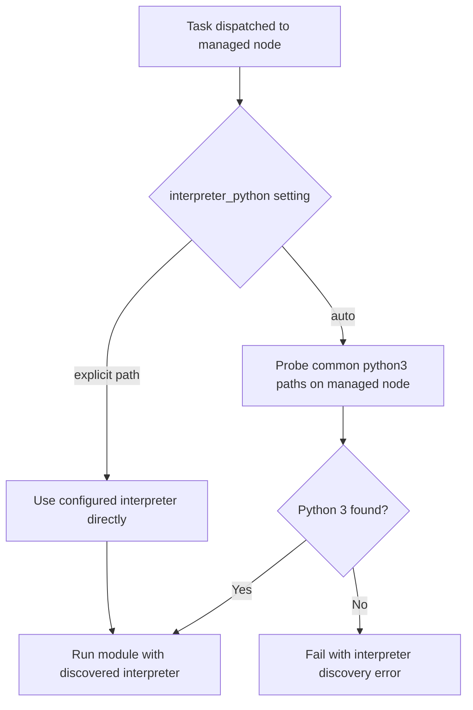

# Part 17 — Why Python?

!!! info "Chapter status: outline"
    This chapter is scoped but not yet written in full prose. The sections below define what each part will cover.

Volume 1 explained why Ansible's *control node* uses Python. This chapter explains the separate, often-confused question: why most managed nodes need Python too, and what to do when they don't have it.

## Why This Exists

- "No Python on the target" is one of the most common first-week Ansible errors (bare cloud images, network appliances, freshly imaged containers) — this chapter is the direct answer.

## Problem Statement

- Ansible modules (with rare exceptions) are Python programs. Running a Python program on a remote machine requires a Python interpreter to already exist there — Ansible doesn't install one for you by default.

## Internal Architecture

- **How Python executes modules**: the managed node's Python interpreter runs the module file (transferred or piped, per Part 16) as a standalone script; the module imports `AnsibleModule` from a boilerplate injected at build/transfer time (Ansiballz packaging, covered further in Volume 5's module-architecture chapter).
- **Interpreter discovery**: `interpreter_python = auto` (the default) probes a prioritized list of common Python 3 paths/commands on the managed node and picks the first that exists, caching the result as a fact (`ansible_python_interpreter`) for the rest of the run.

## Workflow

## Step-by-Step Explanation

- **What if Python doesn't exist**: the module-execution path fails outright — this is where `raw` and `script` become the escape hatches.
- **`raw` module**: executes a command over SSH with zero Python dependency on either side of the module contract — used to bootstrap Python itself on a bare image (e.g., `raw: apt-get install -y python3`).
- **`script` module**: runs a local script *file* on the remote host by copying and executing it directly, bypassing the standard module JSON-argument contract — useful for non-Python automation snippets, though it forfeits idempotency/check-mode support.
- **Windows execution**: Windows managed nodes don't use SSH+Python at all — they use **WinRM** as the transport and **PowerShell** as the execution language.
- **`pywinrm`**: the Python library the control node uses to speak WinRM to Windows hosts — installed as an extra dependency (`pip install pywinrm`), not part of core Ansible.

## Production Best Practices

- Pinning `ansible_python_interpreter` explicitly for fleets with a known, consistent Python path, instead of relying on `auto` discovery's probing cost on every run against unfamiliar images.
- Using `raw` deliberately and only for genuine bootstrap scenarios (installing Python itself), not as a general substitute for proper modules.

## Common Mistakes

- Running a normal module against a bare-bones container/cloud image with no Python installed and getting a confusing interpreter error instead of realizing Python simply isn't there yet.
- Using `shell`/`command` as a habitual workaround for missing Python instead of bootstrapping Python once with `raw` and then using real modules afterward.

## Performance Considerations

- `auto` interpreter discovery adds a small probing cost per host on first contact; pinning the interpreter avoids it at scale (quantified in Volume 6).

## Security Considerations

- WinRM authentication options (covered fully in Volume 6's Windows chapter) carry different risk profiles than SSH key-based auth — this chapter flags the difference, Volume 6 covers Kerberos/NTLM/CredSSP in depth.

## Interview Questions

- "Why does Ansible need Python on the managed node, and what happens if it's missing?"
- "What's the difference between the `raw`, `script`, and normal modules in terms of their requirements?"
- "How does Ansible connect to and execute code on Windows hosts, given they don't use SSH the same way?"

## Hands-On Lab

- Spin up a minimal container image with no Python installed, attempt an `ansible -m ping`, observe the failure, then use `ansible -m raw -a "apt-get update && apt-get install -y python3"` to bootstrap it, and re-run `ping` successfully.

## Summary

- Python is a hard requirement for standard module execution on Unix-like managed nodes, `raw`/`script` exist specifically to work around its absence, and Windows sidesteps the whole question with WinRM and PowerShell instead.

## Next

Continue to [Part 18 — Source Code Tour](04-source-code-tour.md).
