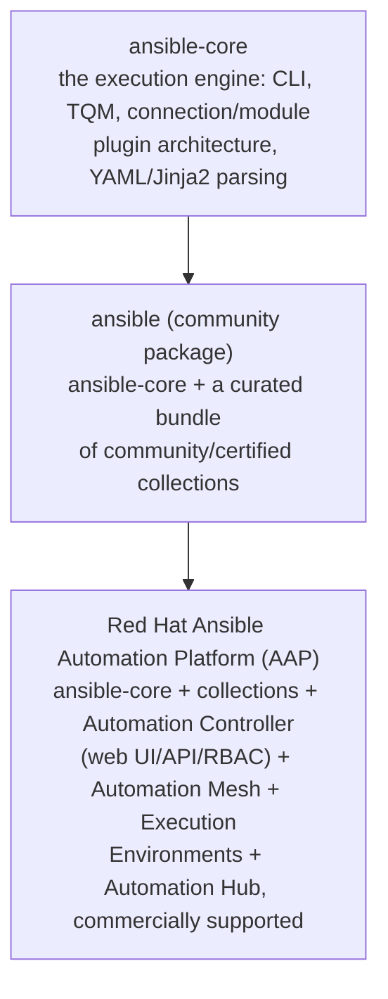

# Part 20 — ansible-core vs. ansible vs. AAP

!!! info "Chapter status: outline"
    This chapter is scoped but not yet written in full prose. The sections below define what each part will cover.

Three products share the word "Ansible" and get confused constantly, including by experienced engineers. This chapter draws hard lines between them.

## Why This Exists

- Job postings, vendor pitches, and documentation all say "Ansible" to mean three different things — precision here prevents both under- and over-scoping a project's tooling needs.

## Problem Statement

- Someone asked to "set up Ansible" for a team could reasonably end up installing `ansible-core` via pip, or provisioning a full AAP cluster — these are wildly different scopes of work, and the name alone doesn't disambiguate.

## Internal Architecture — The Three Layers

- **`ansible-core`**: the engine itself — the CLI tools, the Task Queue Manager, connection/module/plugin architecture. This is what Volume 3 describes internally.
- **`ansible` (the community package)**: `ansible-core` plus a curated set of community collections bundled together for convenience — what most beginners installing "Ansible" via `pip install ansible` actually get.
- **AAP (Ansible Automation Platform)**: Red Hat's commercial product — `ansible-core` and collections, plus a web-based control plane (Automation Controller), a scalable networking layer (Automation Mesh), containerized run environments (Execution Environments), a certified content registry (Automation Hub), RBAC, scheduling, and support contracts.

## History / Context

- How this layering emerged directly from the Collections split (Volume 2, Part 13) and the Ansible Tower → AWX/AAP rebrand (Volume 1, Part 2) — this chapter is where those two threads converge into the current three-tier naming.

## Workflow

- A decision flow: "do you need a CLI tool for a small number of engineers to run playbooks?" → `ansible-core` is enough. "Do you need shared scheduling, RBAC, and audit history across a team?" → you need Automation Controller (AAP or AWX). "Do you need vendor support and certified content?" → AAP specifically.

## Production Best Practices

- Standardizing on `ansible-core` version pins across a team even before adopting AAP, since AAP itself is built on top of a specific `ansible-core`/collection compatibility matrix.

## Common Mistakes

- Describing a project as "using Ansible" without specifying which layer, leading to mismatched expectations about UI, RBAC, or support availability.
- Assuming AAP replaces the need to understand `ansible-core`/playbooks — it's a control plane *around* the same playbooks, not a replacement for writing them.

## Performance Considerations

- N/A directly at this conceptual layer — deferred to the Execution Environments and Automation Mesh chapters.

## Security Considerations

- RBAC and audit logging exist at the AAP layer, not in `ansible-core` itself — teams needing access control and compliance audit trails need AAP (or AWX), not just the CLI.

## Interview Questions

- "What's the difference between ansible-core and the ansible package?"
- "What does Ansible Automation Platform add on top of open-source Ansible?"
- "If a company says they 'use Ansible,' what follow-up questions would clarify what they actually mean?"

## Hands-On Lab

- Run `ansible --version` and identify from its output whether `ansible-core` or the full `ansible` package is installed, and which collections are bundled.

## Summary

- `ansible-core` is the engine, `ansible` is the engine plus a curated collection bundle, and AAP is the engine plus collections plus an enterprise control plane — three real, distinct things worth naming precisely.

## Next

Continue to [Part 21 — Automation Controller and Automation Mesh](02-automation-controller-and-mesh.md).
